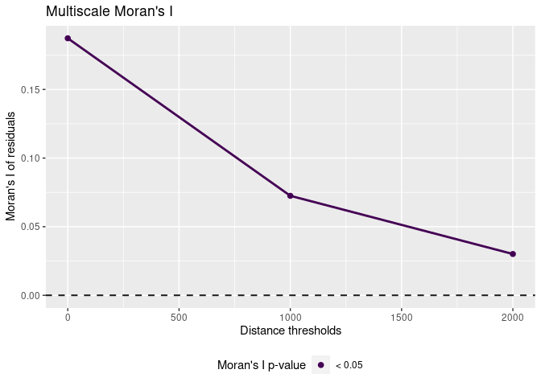

spatialRF: R package for spatial regression with Random Forest
================

-   [Introduction](#introduction)
-   [Installing the package](#installing-the-package)
-   [Fitting a spatial model with
    **spatialRF**](#fitting-a-spatial-model-with-spatialrf)

<!-- README.md is generated from README.Rmd. Please edit that file -->

## Introduction

The package **spatialRF** facilitates fitting spatial regression models
on regular or irregular data with Random Forest, using the **ranger**
package under the hood [(Wright and Ziegler
2017)](file:///tmp/mozilla_blas0/v77i01.pdf), and does so by generating
*spatial predictors* that allow the model to take into account the
spatial structure of the training data. The end goal is minimizing the
spatial autocorrelation of the model residuals as much as possible.
Spatial autocorrelation in the residuals indicate that there is a source
of spatial autocorrelation in the model variance that cannot be
explained by the model predictors, and it is a clear sign that there are
important variables missing from the model. In an ideal model, the
residuals are not autocorrelated, and should be centered around zero,
but this is rarely the case when working with spatial data.

This package implements two main methods to generate *spatial
predictors* from the distance matrix of the data points:

-   Principal coordinate analysis of neighbor matrices [(Dray, Legendre,
    and
    Peres-Neto 2006)](https://www.sciencedirect.com/science/article/abs/pii/S0304380006000925).
-   Distance matrix columns as explanatory variables [(Hengl et
    al. 2018)](https://peerj.com/articles/5518/).

The package provides as well a set of tools to identify variable
interactions, tune random forest hyperparameters, assess model
performance on spatially independent data folds, and examine the
resulting models via importance plots, and response curves and surfaces.

## Installing the package

The package is not yet in the CRAN repositories, so at the moment it
must be installed from GitHub as follows.

``` r
remotes::install_github(
  repo = "blasbenito/spatialRF", 
  ref = "main"
  )
```

    ## Using github PAT from envvar GITHUB_PAT

    ## Skipping install of 'spatialRF' from a github remote, the SHA1 (81fb01dc) has not changed since last install.
    ##   Use `force = TRUE` to force installation

``` r
library(spatialRF)
```

    ## 
    ## Attaching package: 'spatialRF'

    ## The following object is masked from 'package:stats':
    ## 
    ##     rf

## Fitting a spatial model with **spatialRF**

Let’s start with a simple example, to then unpack what is happening
inside the package functions.

### The data

The package includes an example dataset named **plant\_richness\_df**, a
data frame with plant species richness and predictor variables for 227
ecoregions in the Americas; a distance matrix among the ecoregion edges
named, well, **distance\_matrix**, and **plant\_richness\_sf**, an sf
file containing the centroids of the polygons represented in
**plant\_richness\_df**. Check

``` r
data(plant_richness_df)
data(plant_richness_sf)
data(distance_matrix)
help(plant_richness_df)
```

The response variable of **plant\_richness\_df** is
“richness\_species\_vascular”, with the total count of vascular plant
species found on each ecoregion, and the predictors (columns 5 to 21)
represent diverse factors such as sampling bias, climatic variables,
human presence and impact, topography, geographical fragmentation, and
features of the neighbors of each ecoregion.

To fit a Random Forest model we use the `rf()` function, that takes the
data, the names of the response and the predictors, the distance matrix,
and a vector of distance thresholds (in the same units as the distances
in **distance\_matrix**). These distance thresholds are the
neighborhoods at which the model with check the spatial autocorrelation
of the residuals.

``` r
m.non.spatial <- rf(
  data = plant_richness_df,
  dependent.variable.name = "richness_species_vascular",
  predictor.variable.names = colnames(plant_richness_df)[5:21],
  distance.matrix = distance_matrix,
  distance.thresholds = c(0, 1000, 2000),
  seed = 100,
  verbose = FALSE
)
```

The spatial autocorrelation of the residuals can be plotted with
`plot_moran()`

``` r
plot_moran(m.non.spatial)
```

<!-- -->

    ## Warning: Using size for a discrete variable is not advised.

<!-- -->
