`spatialRF`: Easy Spatial Regression with Random Forest
================

-   [Introduction](#introduction)
-   [Development and bugs](#development-and-bugs)
-   [Applications](#applications)
-   [Citation](#citation)
-   [Install](#install)
-   [Data requirements](#data-requirements)
-   [Example data](#example-data)
-   [Reducing multicollinearity in the
    predictors](#reducing-multicollinearity-in-the-predictors)
-   [Finding promising variable
    interactions](#finding-promising-variable-interactions)
-   [Fitting a non-spatial Random Forest model with
    `rf()`](#fitting-a-non-spatial-random-forest-model-with-rf)
    -   [Residuals](#residuals)
    -   [Variable importance](#variable-importance)
    -   [Response curves and surfaces](#response-curves-and-surfaces)
    -   [Model performance](#model-performance)
    -   [Spatial cross-validation](#spatial-cross-validation)
    -   [Other important things stored in the
        model](#other-important-things-stored-in-the-model)
-   [Quantile regression](#quantile-regression)
-   [Fitting a spatial model with
    `rf_spatial()`](#fitting-a-spatial-model-with-rf_spatial)
-   [Tuning Random Forest
    hyperparameters](#tuning-random-forest-hyperparameters)
-   [Repeating a model execution](#repeating-a-model-execution)
-   [Taking advantage of the `%>%` pipe](#taking-advantage-of-the--pipe)
-   [Comparing several models](#comparing-several-models)
-   [Working with a binomial
    response](#working-with-a-binomial-response)
-   [Generating spatial predictors for other modelling
    methods](#generating-spatial-predictors-for-other-modelling-methods)

<!---
[](https://github.com/BlasBenito/spatialRF/actions/workflows/R-CMD-check.yaml)
-->
<!-- badges: start -->

[](https://github.com/blasbenito/spatialRF)
[](https://lifecycle.r-lib.org/articles/stages.html)
[](https://www.gnu.org/licenses/gpl-3.0.en.html)
[](https://zenodo.org/badge/latestdoi/330962704)[](https://cran.r-project.org/package=spatialRF)[](https://CRAN.R-project.org/package=spatialRF)

<!-- badges: end -->

# Introduction

The package **spatialRF** facilitates fitting spatial regression models
on regular or irregular data with Random Forest. It does so by
generating *spatial predictors* that help the model “understand” the
spatial structure of the training data. Spatial predictors act as
proxies of spatio-temporal processes not represented in other
environmental predictors, minimized the spatial autocorrelation of the
model residuals, and offer more honest variable importance scores.

Two main methods to generate *spatial predictors* from the distance
matrix of the data points are implemented in the package:

-   Moran’s Eigenvector Maps [(Dray, Legendre, and
    Peres-Neto 2006)](https://www.sciencedirect.com/science/article/abs/pii/S0304380006000925).
-   Distance matrix columns as explanatory variables [(Hengl et
    al. 2018)](https://peerj.com/articles/5518/).

The package is designed to minimize the code required to fit a spatial
model from a training dataset, the names of the response and the
predictors, and a distance matrix, as shown below.

``` r
spatial.model <- spatialRF::rf_spatial(
  data = your_dataframe,
  dependent.variable.name = "your_response_variable",
  predictor.variable.names = c("predictor1", "predictor2", ..., "predictorN"),
  distance.matrix = your_distance_matrix
  )
```

**spatialRF** uses the fast and efficient `ranger` package under the
hood [(Wright and Ziegler 2017)](https://arxiv.org/abs/1508.04409), so
please, cite the `ranger` package when using `spatialRF`!

This pacakge also provides tools to select predictors while reducing
multicollinearity, identify potentially interesting variable
interactions, tune random forest hyperparameters, assess model
performance on spatially independent data folds, and examine the
resulting models via importance plots, response curves, and response
surfaces.

# Development and bugs

This package is reaching its final form, and big changes are not
expected at this stage. However, it has many functions, and even though
all them have been tested, only one dataset has been used for those
tests. You will find bugs, and something will go wrong almost surely. If
you have time to report bugs, please, do so in any of the following
ways:

-   Open a new issue in the [Issues GitHub page of the
    package](https://github.com/BlasBenito/spatialRF/issues).
-   Send me an email explaining the issue and the error messages with
    enough detail at blasbenito at gmail dot com.
-   Send a direct message to [my twitter
    account](https://twitter.com/blasbenito) explaining the issue.

I will do my best to solve any issues ASAP!

# Applications

The goal of `spatialRF` is to help fitting *explanatory spatial
regression* to understand how a set of predictors and the spatial
structure of the data influences the response variable. Therefore, the
spatial analyses implemented in the package can be applied to any
spatial dataset, regular or irregular, with a sample size between \~100
and \~5000 cases (the higher end will depend on the RAM memory
available), a quantitative or binary (values 0 and 1) response variable,
and a set of predictive variables.

All functions but `rf_spatial()` work with non-spatial data as well if
the arguments `ecoregions_distance_matrix` and `distance_thresholds` are
not provided. In such case, the number of training cases is no longer
limited by the size of the distance matrix, and models can be trained
with hundreds of thousands of rows. In such case, the spatial
autocorrelation of the model’s residuals is not assessed.

However, **when the focus is on fitting spatial models**, and due to the
nature of the *spatial predictors* used to represent the spatial
structure of the training data, **there are many things this package
cannot do** if you aim to use the spatial analyses implemented in it:

-   Predict model results over raster data.

-   Predict a model result over another region with a different spatial
    structure.

-   Work with “big data”, whatever that means.

-   Imputation or extrapolation (it can be done, but models based on
    spatial predictors are hardly transferable).

-   Take temporal autocorrelation into account (but this is something
    that might be implemented later on).

If after considering these limitations you are still interested, follow
me, I will show you how it works.

# Citation

There is a paper in the making about this package. In the meantime, if
you find it useful for your academic work, please cite the `ranger`
package as well, it is the true core of `spatialRF`!

*Marvin N. Wright, Andreas Ziegler (2017). ranger: A Fast Implementation
of Random Forests for High Dimensional Data in C++ and R. Journal of
Statistical Software, 77(1), 1-17. <doi:10.18637/jss.v077.i01>*

*Blas M. Benito (2021). spatialRF: Easy Spatial Regression with Random
Forest. R package version 1.1.0. doi: 10.5281/zenodo.4745208. URL:
<https://blasbenito.github.io/spatialRF/>*

# Install

The version 1.1.3 can be installed from CRAN:

``` r
install.packages("spatialRF")
```

The package can also be installed from GitHub as WELL There are several
branches in the repository:

-   `main`: latest stable version (1.1.3 currently).
-   `development`: development version (1.1.4 at this time), only for
    the brave.
-   `v.1.0.9` to `v.1.1.3`: archived versions.

``` r
remotes::install_github(
  repo = "blasbenito/spatialRF", 
  ref = "development",
  force = TRUE,
  quiet = TRUE
  )
```

There are a few other libraries that will be useful during this
tutorial.

``` r
library(spatialRF)
library(kableExtra)
library(rnaturalearth)
library(rnaturalearthdata)
library(tidyverse)
library(randomForestExplainer)
library(pdp)
```

# Data requirements

The data required to fit random forest models with `spatialRF` must
fulfill several conditions:

-   **The input format is data.frame**. At the moment, tibbles are not
    fully supported.
-   **The number of rows must be somewhere between 100 and \~5000**, at
    least if your target is fitting spatial models. This limitation
    comes from the fact that the distance matrix grows very fast with an
    increasing number of training records, so for large datasets, there
    might not be enough RAM in your machine.
-   **The number of predictors should be larger than 3**. Fitting a
    Random Forest model is moot otherwise.
-   **Factors in the response or the predictors are not explicitly
    supported in the package**. They may work, or they won’t, but in any
    case, I designed this package for quantitative data alone. However,
    binary responses with values 0 and 1 are partially supported.
-   **Must be free of `NA`**. You can check if there are NA records with
    `sum(apply(df, 2, is.na))`. If the result is larger than 0, then
    just execute `df <- na.omit(df)` to remove rows with empty cells.
-   **Columns cannot have zero variance**. This condition can be checked
    with `apply(df, 2, var) == 0`. Columns yielding TRUE should be
    removed (the functions `auto_vif()` and `auto_cor()` check for this
    condition).
-   **Columns must not yield `NaN` or `Inf` when scaled**. You can check
    each condition with `sum(apply(scale(df), 2, is.nan))` and
    `sum(apply(scale(df), 2, is.infinite))`. If higher than 0, you can
    find what columns are giving issues with
    `sapply(as.data.frame(scale(df)), function(x)any(is.nan(x)))` and
    `sapply(as.data.frame(scale(df)), function(x)any(is.infinite(x)))`.
    Any column yielding `TRUE` will generate issues while trying to fit
    models with `spatialRF`.

# Example data

The package includes an example dataset that fulfills the conditions
mentioned above, named
[`ecoregions_df`](https://blasbenito.github.io/spatialRF/reference/ecoregions_df.html).
It is a data frame with plant species richness and predictors for 225
ecoregions in the Americas.

It further includes:

-   A distance matrix among the ecoregion edges named, well,
    [`ecoregions_distance_matrix`](https://blasbenito.github.io/spatialRF/reference/ecoregions_distance_matrix.html).

-   The simplified ecoregion polygons are available as an “sf” data
    frame in the file
    [`ecoregions_polygons`](https://blasbenito.github.io/spatialRF/reference/ecoregions_polygons.html).

-   A character string named
    [`ecoregions_depvar_name`](https://blasbenito.github.io/spatialRF/reference/ecoregions_polygons.html)
    with the name of the response variable, and a character vector named
    [`ecoregions_predvar_names`](https://blasbenito.github.io/spatialRF/reference/ecoregions_predvar_names.html),
    with the names of the predictors. These two objects come in handy to
    simplify model fitting.

The package follows a convention throughout functions:

-   The argument `data` requires a training data frame. We will use the
    data frame `ecoregions_df`.
-   The argument `dependent.variable.name` is the column name of the
    response variable. We will use the character string
    `ecoregions_depvar_name`.
-   The argument `predictor.variable.names` contains the column names of
    the predictors. We will use the character vector
    `ecoregions_predvar_names`.
-   The argument `xy` takes a data frame or matrix with two columns
    named “x” and “y”, in that order, with the case coordinates.
-   The argument `distance.matrix` requires a matrix of distances
    between the cases in `data`. We will use the distance matrix
    `ecoregions_distance_matrix`.
-   The argument `distance.thresholds` is a numeric vector of distances
    at with spatial autocorrelation wants to be computed.

It is therefore convenient to define these arguments at the beginning of
the workflow.

``` r
#loading training data and distance matrix from the package
data(
  ecoregions_df,
  ecoregions_polygons,
  ecoregions_distance_matrix,
  ecoregions_depvar_name,
  ecoregions_predvar_names
  )

#coordinates of the cases
xy <- ecoregions_df[, c("x", "y")]

#distance thresholds (same units as distance_matrix)
distance_thresholds <- c(0, 1000, 2000, 4000, 8000)

#random seed for reproducibility
random.seed <- 1
```

The response variable of `ecoregions_df` is
“richness\_species\_vascular”, that represents the total count of
vascular plant species found on each ecoregion. The figure below shows
the centroids of each ecoregion along with their associated value of the
response variable.

``` r
temp.df <- data.frame(ecoregions_df, ecoregions_polygons)
sf::st_geometry(temp.df) <- "geom"

ggplot2::ggplot() +
  ggplot2::geom_sf(
    data = temp.df, 
    aes(fill = plant_richness),
    size = 0.1
    ) +
  ggplot2::scale_fill_viridis_c(
    direction = -1, 
    option = "F"
    ) +
  ggplot2::theme_bw() +
  ggplot2::labs(color = "Plant richness") +
  ggplot2::scale_x_continuous(limits = c(-170, -30)) +
  ggplot2::scale_y_continuous(limits = c(-58, 80))  +
  ggplot2::labs(
    title = "Plant richness of the American ecoregions",
    x = "Longitude",
    y = "Latitude",
    fill = "Plant richness"
  )
```

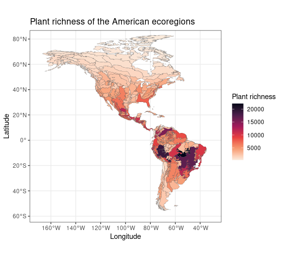<!-- -->

The predictors, named in `ecoregions_predvar_names`, represent diverse
factors that may influence plant richness such as sampling bias, the
area of the ecoregion, climatic variables, human presence and impact,
topography, geographical fragmentation, and features of the neighbors of
each ecoregion. The figure below shows the scatterplots of the response
variable (y axis) against each predictor (x axis).

**Note:** Every plotting function in the package now allows changing the
colors of their main features via specific arguments such as
`point.color`, `line.color`, or `fill.color`.

``` r
spatialRF::plot_training_df(
  data = ecoregions_df,
  dependent.variable.name = ecoregions_depvar_name,
  predictor.variable.names = ecoregions_predvar_names,
  ncol = 4,
  point.color = viridis::viridis(100, option = "F"),
  line.color = "gray30"
  )
```

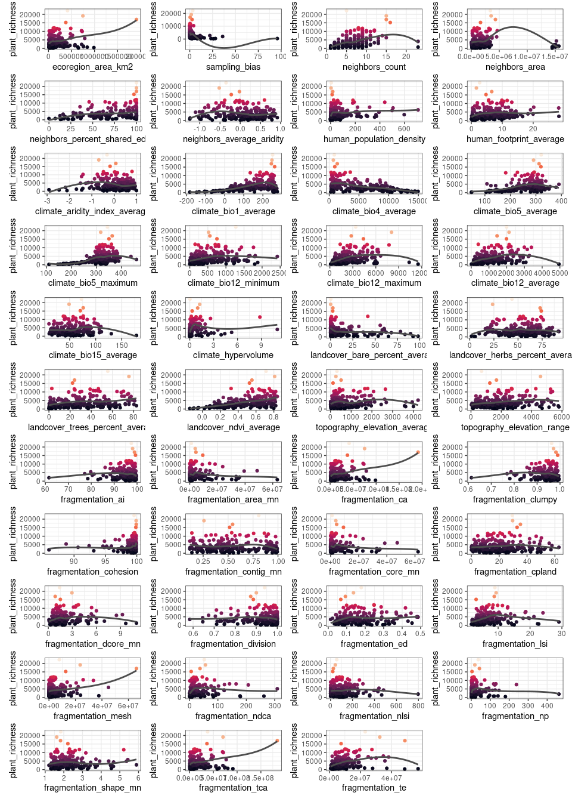<!-- -->

The function
[`plot_training_df_moran()`](https://blasbenito.github.io/spatialRF/reference/plot_training_df_moran.html)
helps assessing the spatial autocorrelation of the response variable and
the predictors across different distance thresholds. Low Moran’s I and
p-values equal or larger than 0.05 indicate that there is no spatial
autocorrelation for the given variable and distance threshold.

``` r
spatialRF::plot_training_df_moran(
  data = ecoregions_df,
  dependent.variable.name = ecoregions_depvar_name,
  predictor.variable.names = ecoregions_predvar_names,
  distance.matrix = ecoregions_distance_matrix,
  distance.thresholds = distance_thresholds,
  fill.color = viridis::viridis(
    100,
    option = "F",
    direction = -1
    ),
  point.color = "gray40"
)
```

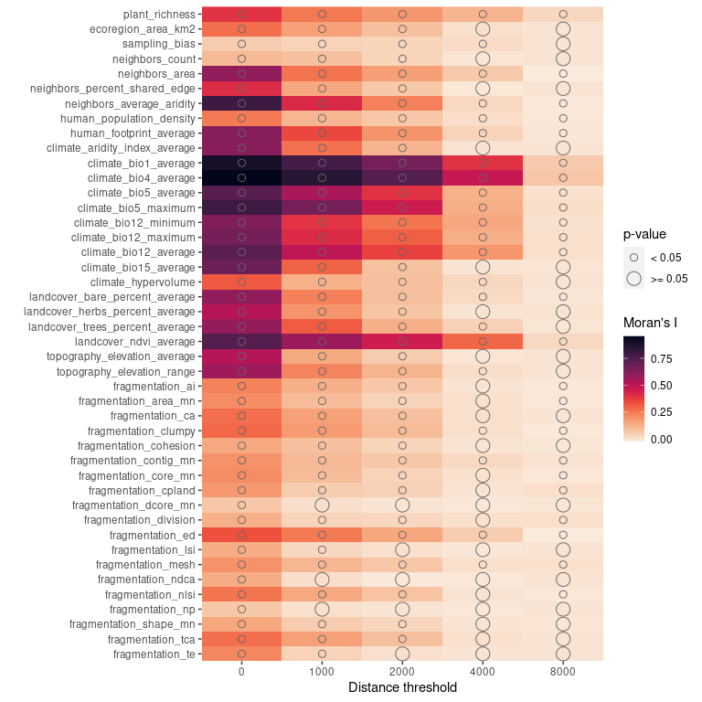<!-- -->

# Reducing multicollinearity in the predictors

The functions
[`auto_cor()`](https://blasbenito.github.io/spatialRF/reference/auto_cor.html)
and
[`auto_vif()`](https://blasbenito.github.io/spatialRF/reference/auto_vif.html)
help reduce redundancy in the predictors by using different criteria
(bivariate R squared vs. [variance inflation
factor](https://www.statisticshowto.com/variance-inflation-factor/)),
while allowing the user to define an *order of preference*, which can be
based either on domain expertise or on a quantitative assessment (e.g.,
order of preference based on variable importance scores or model
coefficients). The preference order is defined as a character vector in
the `preference.order` argument of both functions, and does not need to
include the names of all predictors, but just the ones the user would
like to keep in the analysis.

``` r
preference.order <- c(
    "climate_bio1_average_X_bias_area_km2",
    "climate_aridity_index_average",
    "climate_hypervolume",
    "climate_bio1_average",
    "climate_bio15_minimum",
    "bias_area_km2"
  )

multicollinearity.analysis <- spatialRF::auto_cor(
  x = ecoregions_df[, ecoregions_predvar_names],
  cor.threshold = 0.75,
  preference.order = preference.order
) %>% 
  spatialRF::auto_vif(
    vif.threshold = 5,
    preference.order = preference.order
  )
```

    ## [auto_cor()]: Removed variables: fragmentation_tca, fragmentation_np, fragmentation_nlsi, fragmentation_ndca, fragmentation_mesh, fragmentation_lsi, fragmentation_division, fragmentation_core_mn, fragmentation_cohesion, fragmentation_clumpy, fragmentation_ca, landcover_ndvi_average, climate_bio12_average, climate_bio12_maximum, climate_bio5_maximum, climate_bio5_average, climate_bio4_average, neighbors_average_aridity

    ## [auto_vif()]: Removed variables: landcover_trees_percent_average

The output of `auto_cor()` or `auto_vif()` has the class
“variable\_selection”, which can be used as input in every function
having the argument `ecoregions_predvar_names`.

``` r
names(multicollinearity.analysis)
```

    ## [1] "vif"                   "selected.variables"    "selected.variables.df"

The slot `selected.variables` contains the names of the selected
predictors.

``` r
multicollinearity.analysis$selected.variables
```

    ##  [1] "climate_aridity_index_average"   "climate_hypervolume"            
    ##  [3] "climate_bio1_average"            "ecoregion_area_km2"             
    ##  [5] "sampling_bias"                   "neighbors_count"                
    ##  [7] "neighbors_area"                  "neighbors_percent_shared_edge"  
    ##  [9] "human_population_density"        "human_footprint_average"        
    ## [11] "climate_bio12_minimum"           "climate_bio15_average"          
    ## [13] "landcover_bare_percent_average"  "landcover_herbs_percent_average"
    ## [15] "topography_elevation_average"    "topography_elevation_range"     
    ## [17] "fragmentation_ai"                "fragmentation_area_mn"          
    ## [19] "fragmentation_contig_mn"         "fragmentation_cpland"           
    ## [21] "fragmentation_dcore_mn"          "fragmentation_ed"               
    ## [23] "fragmentation_shape_mn"          "fragmentation_te"

The slot `selected.variables.df` contains a data frame with all the
selected predictors.

# Finding promising variable interactions

Random Forests already takes into account variable interactions of the
form “variable `a` becomes important when `b` is higher than x”.
However, Random Forest can also take advantage of variable interactions
of the form `a * b`, across the complete ranges of the predictors, as
they are commonly defined in regression models, and “interactions” (not
the proper name, but used here for simplicity) represented by the first
component of a PCA on the predictors `a` and `b`.

The function
[`the_feature_engineer()`](https://blasbenito.github.io/spatialRF/reference/the_feature_engineer.html)
tests all possible interactions of both types among the most important
predictors, and suggesting the ones not correlated among themselves and
with the other predictors inducing an increase in the model’s R squared
(or AUC when the response is binary) on independent data via spatial
cross-validation (see `rf_evaluate()`).

Since this function fits many alternative random forest models, it can
be run in parallel if a cluster is provided. The function does not
shutdown the cluster, but you can stop it with
`parallel::stopCluster(cl = cluster)`. However, we’ll leave it up for
other functions in this tutorial.

``` r
#starting cluster with n-1 cores
cluster <- spatialRF::make_cluster()

interactions <- spatialRF::the_feature_engineer(
  data = ecoregions_df,
  dependent.variable.name = ecoregions_depvar_name,
  predictor.variable.names = multicollinearity.analysis,
  xy = xy,
  importance.threshold = 0.50, #uses 50% best predictors
  cor.threshold = 0.60, #max corr between interactions and predictors
  seed = random.seed,
  repetitions = 100,
  cluster = cluster,
  verbose = TRUE
  )
```

    ## Fitting and evaluating a model without interactions.

    ## Testing 66 candidate interactions.

    ## Interactions identified: 7

    ##  ┌──────────────────┬──────────────────┬──────────────────┬──────────────────┐
    ##  │ Interaction      │ Importance (% of │        R-squared │     Max cor with │
    ##  │                  │             max) │      improvement │       predictors │
    ##  ├──────────────────┼──────────────────┼──────────────────┼──────────────────┤
    ##  │ fragmentation_te │             89.6 │           0.086  │            0.59  │
    ##  │ ..x..climate_bio │                  │                  │                  │
    ##  │ 12_minimum       │                  │                  │                  │
    ##  ├──────────────────┼──────────────────┼──────────────────┼──────────────────┤
    ##  │ climate_bio1_ave │             95.4 │           0.066  │            0.51  │
    ##  │ rage..pca..clima │                  │                  │                  │
    ##  │ te_bio12_minimum │                  │                  │                  │
    ##  ├──────────────────┼──────────────────┼──────────────────┼──────────────────┤
    ##  │ climate_bio12_mi │             96.9 │           0.039  │            0.47  │
    ##  │ nimum..x..topogr │                  │                  │                  │
    ##  │ aphy_elevation_r │                  │                  │                  │
    ##  │ ange             │                  │                  │                  │
    ##  ├──────────────────┼──────────────────┼──────────────────┼──────────────────┤
    ##  │ ecoregion_area_k │             63.6 │           0.026  │            0.59  │
    ##  │ m2..x..topograph │                  │                  │                  │
    ##  │ y_elevation_aver │                  │                  │                  │
    ##  │ age              │                  │                  │                  │
    ##  ├──────────────────┼──────────────────┼──────────────────┼──────────────────┤
    ##  │ human_population │             66.8 │           0.022  │            0.56  │
    ##  │ _density..x..eco │                  │                  │                  │
    ##  │ region_area_km2  │                  │                  │                  │
    ##  ├──────────────────┼──────────────────┼──────────────────┼──────────────────┤
    ##  │ fragmentation_te │             80.7 │           0.015  │            0.31  │
    ##  │ ..pca..topograph │                  │                  │                  │
    ##  │ y_elevation_rang │                  │                  │                  │
    ##  │ e                │                  │                  │                  │
    ##  ├──────────────────┼──────────────────┼──────────────────┼──────────────────┤
    ##  │ human_population │             20.1 │           0.0105 │            0.599 │
    ##  │ _density..x..lan │                  │                  │                  │
    ##  │ dcover_bare_perc │                  │                  │                  │
    ##  │ ent_average      │                  │                  │                  │
    ##  └──────────────────┴──────────────────┴──────────────────┴──────────────────┘

    ## Comparing models with and without interactions via spatial cross-validation.

    ## notch went outside hinges. Try setting notch=FALSE.

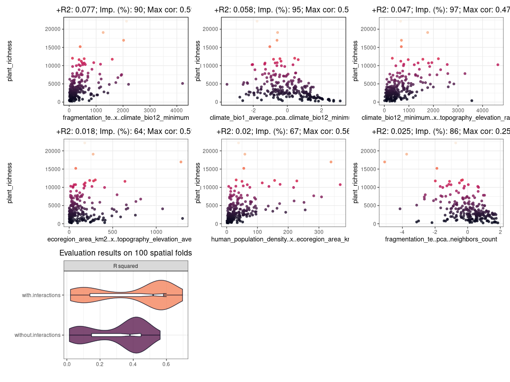<!-- -->

The upper panel in the plot plot above shows the relationship between
the interaction and the response variable. It also indicates the gain in
R squared (+R2), the importance, in percentage, when used in a model
along the other predictors (Imp. (%)), and the maximum Pearson
correlation of the interaction with the predictors. The violin-plot
shows a comparison of the model with and without the selected
interaction made via spatial cross-validation using 100 repetitions (see
[`rf_evaluate()`](https://blasbenito.github.io/spatialRF/reference/rf_evaluate.html)
and
[`rf_compare()`](https://blasbenito.github.io/spatialRF/reference/rf_compare.html)
for further details).

The function also returns a data frame with all the interactions
considered. The columns are:

-   `interaction.name`: Interactions computed via multiplication are
    named `a..x..b`, while interactions computed via PCA are named
    `a..pca..b`.
-   `interaction.importance`: Importance of the interaction expressed as
    a percentage. If `interaction.importance == 100`, that means that
    the interaction is the most important predictor in the model fitted
    with the interaction and the predictors named in
    `ecoregions_predvar_names`.
-   `interaction.metric.gain`: Difference in R squared (or AUC for
    models fitting a binary response) between a model with and a model
    without the interaction.
-   `max.cor.with.predictors`: The maximum Pearson correlation of the
    interaction with the predictors named in `ecoregions_predvar_names`.
    Gives an idea of the amount of multicollinearity the interaction
    introduces in the model.
-   `variable.a.name` and `variable.b.name`: Names of the predictors
    involved in the interaction.
-   `selected`: `TRUE` if the interaction fulfills the selection
    criteria (importance higher than a threshold, positive gain in R
    squared or AUC, and Pearson correlation with other predictors lower
    than a threshold). The selected interactions have a correlation
    among themselves always lower than the value of the argument
    `cor.threshold`.

``` r
kableExtra::kbl(
  head(interactions$screening, 10),
  format = "html"
) %>%
  kableExtra::kable_paper("hover", full_width = F)
```

<table class=" lightable-paper lightable-hover" style="font-family: &quot;Arial Narrow&quot;, arial, helvetica, sans-serif; width: auto !important; margin-left: auto; margin-right: auto;">
<thead>
<tr>
<th style="text-align:left;">
interaction.name
</th>
<th style="text-align:right;">
interaction.importance
</th>
<th style="text-align:right;">
interaction.metric.gain
</th>
<th style="text-align:right;">
max.cor.with.predictors
</th>
<th style="text-align:left;">
variable.a.name
</th>
<th style="text-align:left;">
variable.b.name
</th>
<th style="text-align:left;">
selected
</th>
</tr>
</thead>
<tbody>
<tr>
<td style="text-align:left;">
fragmentation\_te..x..climate\_bio12\_minimum
</td>
<td style="text-align:right;">
89.569
</td>
<td style="text-align:right;">
0.0865
</td>
<td style="text-align:right;">
0.5904151
</td>
<td style="text-align:left;">
fragmentation\_te
</td>
<td style="text-align:left;">
climate\_bio12\_minimum
</td>
<td style="text-align:left;">
TRUE
</td>
</tr>
<tr>
<td style="text-align:left;">
climate\_bio1\_average..pca..climate\_bio12\_minimum
</td>
<td style="text-align:right;">
95.405
</td>
<td style="text-align:right;">
0.0660
</td>
<td style="text-align:right;">
0.5070648
</td>
<td style="text-align:left;">
climate\_bio1\_average
</td>
<td style="text-align:left;">
climate\_bio12\_minimum
</td>
<td style="text-align:left;">
TRUE
</td>
</tr>
<tr>
<td style="text-align:left;">
climate\_bio12\_minimum..pca..neighbors\_count
</td>
<td style="text-align:right;">
84.058
</td>
<td style="text-align:right;">
0.0375
</td>
<td style="text-align:right;">
0.5450767
</td>
<td style="text-align:left;">
climate\_bio12\_minimum
</td>
<td style="text-align:left;">
neighbors\_count
</td>
<td style="text-align:left;">
TRUE
</td>
</tr>
<tr>
<td style="text-align:left;">
climate\_bio12\_minimum..x..topography\_elevation\_range
</td>
<td style="text-align:right;">
96.907
</td>
<td style="text-align:right;">
0.0390
</td>
<td style="text-align:right;">
0.4724763
</td>
<td style="text-align:left;">
climate\_bio12\_minimum
</td>
<td style="text-align:left;">
topography\_elevation\_range
</td>
<td style="text-align:left;">
TRUE
</td>
</tr>
<tr>
<td style="text-align:left;">
ecoregion\_area\_km2..x..topography\_elevation\_average
</td>
<td style="text-align:right;">
63.623
</td>
<td style="text-align:right;">
0.0265
</td>
<td style="text-align:right;">
0.5949299
</td>
<td style="text-align:left;">
ecoregion\_area\_km2
</td>
<td style="text-align:left;">
topography\_elevation\_average
</td>
<td style="text-align:left;">
TRUE
</td>
</tr>
<tr>
<td style="text-align:left;">
climate\_bio1\_average..pca..human\_population\_density
</td>
<td style="text-align:right;">
100.000
</td>
<td style="text-align:right;">
0.0395
</td>
<td style="text-align:right;">
0.3460177
</td>
<td style="text-align:left;">
climate\_bio1\_average
</td>
<td style="text-align:left;">
human\_population\_density
</td>
<td style="text-align:left;">
TRUE
</td>
</tr>
<tr>
<td style="text-align:left;">
human\_population\_density..x..ecoregion\_area\_km2
</td>
<td style="text-align:right;">
66.752
</td>
<td style="text-align:right;">
0.0225
</td>
<td style="text-align:right;">
0.5606119
</td>
<td style="text-align:left;">
human\_population\_density
</td>
<td style="text-align:left;">
ecoregion\_area\_km2
</td>
<td style="text-align:left;">
TRUE
</td>
</tr>
<tr>
<td style="text-align:left;">
climate\_bio1\_average..pca..neighbors\_count
</td>
<td style="text-align:right;">
100.000
</td>
<td style="text-align:right;">
0.0395
</td>
<td style="text-align:right;">
0.2857955
</td>
<td style="text-align:left;">
climate\_bio1\_average
</td>
<td style="text-align:left;">
neighbors\_count
</td>
<td style="text-align:left;">
TRUE
</td>
</tr>
<tr>
<td style="text-align:left;">
climate\_bio12\_minimum..x..topography\_elevation\_average
</td>
<td style="text-align:right;">
66.759
</td>
<td style="text-align:right;">
0.0305
</td>
<td style="text-align:right;">
0.4799178
</td>
<td style="text-align:left;">
climate\_bio12\_minimum
</td>
<td style="text-align:left;">
topography\_elevation\_average
</td>
<td style="text-align:left;">
TRUE
</td>
</tr>
<tr>
<td style="text-align:left;">
fragmentation\_te..pca..topography\_elevation\_range
</td>
<td style="text-align:right;">
80.711
</td>
<td style="text-align:right;">
0.0150
</td>
<td style="text-align:right;">
0.3116492
</td>
<td style="text-align:left;">
fragmentation\_te
</td>
<td style="text-align:left;">
topography\_elevation\_range
</td>
<td style="text-align:left;">
TRUE
</td>
</tr>
</tbody>
</table>

The function returns a data frame with the response variables, the
predictors, and the selected interactions that can be used right away as
a training data frame. However, the function cannot say whether an
interaction *makes sense*, and it is up to the user to choose wisely
whether to select an interaction or not. In this particular case, and
just for the sake of simplicity, we will be using the resulting data
frame as training data.

``` r
#adding interaction column to the training data
ecoregions_df <- interactions$data

#adding interaction name to predictor.variable.names
predictor.variable.names <- interactions$predictor.variable.names
```

# Fitting a non-spatial Random Forest model with `rf()`

The function
[`rf()`](https://blasbenito.github.io/spatialRF/reference/rf.html) is a
convenient wrapper for `ranger::ranger()` used in every modelling
function of the *spatialRF* package. It takes the training data, the
names of the response and the predictors, and optionally (to assess the
spatial autocorrelation of the residuals), the distance matrix, and a
vector of distance thresholds (in the same units as the distances in
**distance\_matrix**).

These distance thresholds are the neighborhoods at which the model will
check the spatial autocorrelation of the residuals. Their values may
depend on the spatial scale of the data, and the ecological system under
study.

Notice that here I plug the object `predictor.variable.names`, output of
`auto_cor()` and `auto_vif()`, directly into the
`predictor.variable.names` argument of the `rf()` function to fit a
random forest model.

``` r
model.non.spatial <- spatialRF::rf(
  data = ecoregions_df,
  dependent.variable.name = ecoregions_depvar_name,
  predictor.variable.names = predictor.variable.names,
  distance.matrix = ecoregions_distance_matrix,
  distance.thresholds = distance_thresholds,
  xy = xy, #not needed by rf, but other functions read it from the model
  seed = random.seed,
  verbose = FALSE
)
```

The output is a list with several slots containing the information
required to interpret the model. The information available in these
slots can be plotted (functions named `plot_...()`), printed to screen
(`print_...()`) and captured for further analyses (`get_...()`).

## Residuals

The slot **residuals** (`model.non.spatial$residuals`) stores the values
of the residuals and the results of the normality and spatial
autocorrelation tests, and its content can be plotted with
[`plot_residuals_diagnostics()`](https://blasbenito.github.io/spatialRF/reference/plot_residuals_diagnostics.html).

``` r
spatialRF::plot_residuals_diagnostics(
  model.non.spatial,
  verbose = FALSE
  )
```

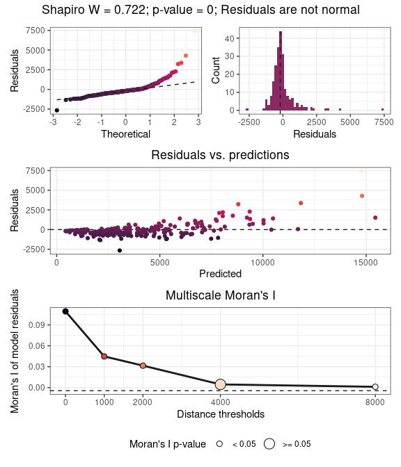<!-- -->

The upper panels show the results of the normality test (interpretation
in the title), the middle panel shows the relationship between the
residuals and the fitted values, important to understand the behavior of
the residuals, and the lower panel shows the Moran’s I of the residuals
across distance thresholds and their respective p-values (positive for 0
and 1000 km).

## Variable importance

### Global variable importance

The slot **importance** (`model.non.spatial$variable.importance`)
contains the variable importance scores. These can be plotted with
[`plot_importance()`](https://blasbenito.github.io/spatialRF/reference/plot_importance.html),
printed with
[`print_importance()`](https://blasbenito.github.io/spatialRF/reference/print_importance.html),
and the dataframe retrieved with
[`get_importance()`](https://blasbenito.github.io/spatialRF/reference/get_importance.html)

``` r
spatialRF::plot_importance(
  model.non.spatial,
  verbose = FALSE
  )
```

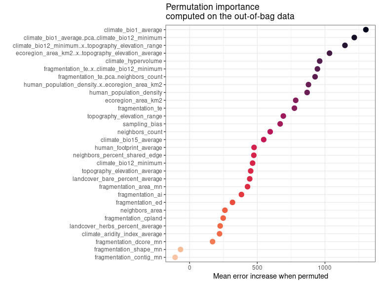<!-- -->

Variable importance represents the increase in mean error (computed on
the out-of-bag data) across trees when a predictor is permuted. Values
lower than zero would indicate that the variable performs worse than a
random one.

If the argument `scaled.importance = TRUE` is used, the variable
importance scores are computed from the scaled data, making the
importance scores easier to compare across different models.

The package
[`randomForestExplainer`](https://github.com/ModelOriented/randomForestExplainer)
offers a couple of interesting options to deepen our understanding on
variable importance scores. The first one is `measure_importance()`,
which analyzes the forest to find out the average minimum tree depth at
which each variable can be found (`mean_min_depth`), the number of nodes
in which a variable was selected to make a split (`no_of_nodes`), the
number of times the variable was selected as the first one to start a
tree (`times_a_root`), and the probability of a variable to be in more
nodes than what it would be expected by chance (`p_value`).

``` r
importance.df <- randomForestExplainer::measure_importance(
  model.non.spatial,
  measures = c("mean_min_depth", "no_of_nodes", "times_a_root", "p_value")
  )

kableExtra::kbl(
  importance.df %>% 
    dplyr::arrange(mean_min_depth) %>% 
    dplyr::mutate(p_value = round(p_value, 4)),
  format = "html"
) %>%
  kableExtra::kable_paper("hover", full_width = F)
```

<table class=" lightable-paper lightable-hover" style="font-family: &quot;Arial Narrow&quot;, arial, helvetica, sans-serif; width: auto !important; margin-left: auto; margin-right: auto;">
<thead>
<tr>
<th style="text-align:left;">
variable
</th>
<th style="text-align:right;">
mean\_min\_depth
</th>
<th style="text-align:right;">
no\_of\_nodes
</th>
<th style="text-align:right;">
times\_a\_root
</th>
<th style="text-align:right;">
p\_value
</th>
</tr>
</thead>
<tbody>
<tr>
<td style="text-align:left;">
fragmentation\_te..x..climate\_bio12\_minimum
</td>
<td style="text-align:right;">
3.190165
</td>
<td style="text-align:right;">
1461
</td>
<td style="text-align:right;">
67
</td>
<td style="text-align:right;">
0.0000
</td>
</tr>
<tr>
<td style="text-align:left;">
climate\_bio1\_average
</td>
<td style="text-align:right;">
3.276033
</td>
<td style="text-align:right;">
1577
</td>
<td style="text-align:right;">
53
</td>
<td style="text-align:right;">
0.0000
</td>
</tr>
<tr>
<td style="text-align:left;">
human\_population\_density..x..ecoregion\_area\_km2
</td>
<td style="text-align:right;">
3.473140
</td>
<td style="text-align:right;">
1570
</td>
<td style="text-align:right;">
31
</td>
<td style="text-align:right;">
0.0000
</td>
</tr>
<tr>
<td style="text-align:left;">
sampling\_bias
</td>
<td style="text-align:right;">
3.656033
</td>
<td style="text-align:right;">
1652
</td>
<td style="text-align:right;">
7
</td>
<td style="text-align:right;">
0.0000
</td>
</tr>
<tr>
<td style="text-align:left;">
climate\_bio1\_average..pca..climate\_bio12\_minimum
</td>
<td style="text-align:right;">
3.692562
</td>
<td style="text-align:right;">
1292
</td>
<td style="text-align:right;">
48
</td>
<td style="text-align:right;">
0.0026
</td>
</tr>
<tr>
<td style="text-align:left;">
climate\_bio12\_minimum..x..topography\_elevation\_range
</td>
<td style="text-align:right;">
3.742893
</td>
<td style="text-align:right;">
1278
</td>
<td style="text-align:right;">
72
</td>
<td style="text-align:right;">
0.0085
</td>
</tr>
<tr>
<td style="text-align:left;">
human\_population\_density
</td>
<td style="text-align:right;">
3.743388
</td>
<td style="text-align:right;">
1398
</td>
<td style="text-align:right;">
29
</td>
<td style="text-align:right;">
0.0000
</td>
</tr>
<tr>
<td style="text-align:left;">
climate\_hypervolume
</td>
<td style="text-align:right;">
3.964793
</td>
<td style="text-align:right;">
1322
</td>
<td style="text-align:right;">
43
</td>
<td style="text-align:right;">
0.0001
</td>
</tr>
<tr>
<td style="text-align:left;">
ecoregion\_area\_km2..x..topography\_elevation\_average
</td>
<td style="text-align:right;">
4.343802
</td>
<td style="text-align:right;">
1264
</td>
<td style="text-align:right;">
5
</td>
<td style="text-align:right;">
0.0236
</td>
</tr>
<tr>
<td style="text-align:left;">
fragmentation\_te..pca..topography\_elevation\_range
</td>
<td style="text-align:right;">
4.345868
</td>
<td style="text-align:right;">
1258
</td>
<td style="text-align:right;">
23
</td>
<td style="text-align:right;">
0.0351
</td>
</tr>
<tr>
<td style="text-align:left;">
fragmentation\_te
</td>
<td style="text-align:right;">
4.486529
</td>
<td style="text-align:right;">
1302
</td>
<td style="text-align:right;">
24
</td>
<td style="text-align:right;">
0.0010
</td>
</tr>
<tr>
<td style="text-align:left;">
ecoregion\_area\_km2
</td>
<td style="text-align:right;">
4.598264
</td>
<td style="text-align:right;">
1225
</td>
<td style="text-align:right;">
12
</td>
<td style="text-align:right;">
0.1970
</td>
</tr>
<tr>
<td style="text-align:left;">
neighbors\_count
</td>
<td style="text-align:right;">
4.600331
</td>
<td style="text-align:right;">
1043
</td>
<td style="text-align:right;">
34
</td>
<td style="text-align:right;">
1.0000
</td>
</tr>
<tr>
<td style="text-align:left;">
neighbors\_percent\_shared\_edge
</td>
<td style="text-align:right;">
4.745207
</td>
<td style="text-align:right;">
1229
</td>
<td style="text-align:right;">
2
</td>
<td style="text-align:right;">
0.1663
</td>
</tr>
<tr>
<td style="text-align:left;">
topography\_elevation\_range
</td>
<td style="text-align:right;">
4.841074
</td>
<td style="text-align:right;">
1169
</td>
<td style="text-align:right;">
5
</td>
<td style="text-align:right;">
0.7863
</td>
</tr>
<tr>
<td style="text-align:left;">
human\_footprint\_average
</td>
<td style="text-align:right;">
4.975785
</td>
<td style="text-align:right;">
1162
</td>
<td style="text-align:right;">
5
</td>
<td style="text-align:right;">
0.8416
</td>
</tr>
<tr>
<td style="text-align:left;">
topography\_elevation\_average
</td>
<td style="text-align:right;">
5.123140
</td>
<td style="text-align:right;">
1116
</td>
<td style="text-align:right;">
0
</td>
<td style="text-align:right;">
0.9912
</td>
</tr>
<tr>
<td style="text-align:left;">
climate\_bio15\_average
</td>
<td style="text-align:right;">
5.237273
</td>
<td style="text-align:right;">
1177
</td>
<td style="text-align:right;">
4
</td>
<td style="text-align:right;">
0.7112
</td>
</tr>
<tr>
<td style="text-align:left;">
landcover\_bare\_percent\_average
</td>
<td style="text-align:right;">
5.312727
</td>
<td style="text-align:right;">
1102
</td>
<td style="text-align:right;">
11
</td>
<td style="text-align:right;">
0.9974
</td>
</tr>
<tr>
<td style="text-align:left;">
neighbors\_area
</td>
<td style="text-align:right;">
5.398182
</td>
<td style="text-align:right;">
1128
</td>
<td style="text-align:right;">
2
</td>
<td style="text-align:right;">
0.9780
</td>
</tr>
<tr>
<td style="text-align:left;">
landcover\_herbs\_percent\_average
</td>
<td style="text-align:right;">
5.455620
</td>
<td style="text-align:right;">
1139
</td>
<td style="text-align:right;">
0
</td>
<td style="text-align:right;">
0.9541
</td>
</tr>
<tr>
<td style="text-align:left;">
fragmentation\_ed
</td>
<td style="text-align:right;">
5.480496
</td>
<td style="text-align:right;">
1124
</td>
<td style="text-align:right;">
4
</td>
<td style="text-align:right;">
0.9836
</td>
</tr>
<tr>
<td style="text-align:left;">
fragmentation\_area\_mn
</td>
<td style="text-align:right;">
5.569504
</td>
<td style="text-align:right;">
1065
</td>
<td style="text-align:right;">
0
</td>
<td style="text-align:right;">
1.0000
</td>
</tr>
<tr>
<td style="text-align:left;">
human\_population\_density..x..landcover\_bare\_percent\_average
</td>
<td style="text-align:right;">
5.605207
</td>
<td style="text-align:right;">
1011
</td>
<td style="text-align:right;">
1
</td>
<td style="text-align:right;">
1.0000
</td>
</tr>
<tr>
<td style="text-align:left;">
climate\_bio12\_minimum
</td>
<td style="text-align:right;">
5.677273
</td>
<td style="text-align:right;">
1025
</td>
<td style="text-align:right;">
6
</td>
<td style="text-align:right;">
1.0000
</td>
</tr>
<tr>
<td style="text-align:left;">
climate\_aridity\_index\_average
</td>
<td style="text-align:right;">
5.699339
</td>
<td style="text-align:right;">
1046
</td>
<td style="text-align:right;">
3
</td>
<td style="text-align:right;">
1.0000
</td>
</tr>
<tr>
<td style="text-align:left;">
fragmentation\_ai
</td>
<td style="text-align:right;">
5.719008
</td>
<td style="text-align:right;">
1003
</td>
<td style="text-align:right;">
1
</td>
<td style="text-align:right;">
1.0000
</td>
</tr>
<tr>
<td style="text-align:left;">
fragmentation\_shape\_mn
</td>
<td style="text-align:right;">
5.912727
</td>
<td style="text-align:right;">
1014
</td>
<td style="text-align:right;">
0
</td>
<td style="text-align:right;">
1.0000
</td>
</tr>
<tr>
<td style="text-align:left;">
fragmentation\_contig\_mn
</td>
<td style="text-align:right;">
5.991240
</td>
<td style="text-align:right;">
999
</td>
<td style="text-align:right;">
2
</td>
<td style="text-align:right;">
1.0000
</td>
</tr>
<tr>
<td style="text-align:left;">
fragmentation\_cpland
</td>
<td style="text-align:right;">
6.000992
</td>
<td style="text-align:right;">
978
</td>
<td style="text-align:right;">
1
</td>
<td style="text-align:right;">
1.0000
</td>
</tr>
<tr>
<td style="text-align:left;">
fragmentation\_dcore\_mn
</td>
<td style="text-align:right;">
6.065455
</td>
<td style="text-align:right;">
933
</td>
<td style="text-align:right;">
5
</td>
<td style="text-align:right;">
1.0000
</td>
</tr>
</tbody>
</table>

### Contribution of predictors to model transferability

The new function `rf_importance()` offers a way to assess to what extent
each predictor contributes to model transferability (predictive ability
on independent spatial folds measured with `rf_evaluate()`, see below).
It does so by comparing the performance of the full model with models
fitted without each one of the predictors. The difference in performance
between the full model and a model without a given predictor represents
the contribution of such predictor to model transferability.

``` r
model.non.spatial <- spatialRF::rf_importance(
  model = model.non.spatial,
  cluster = cluster
  )
```

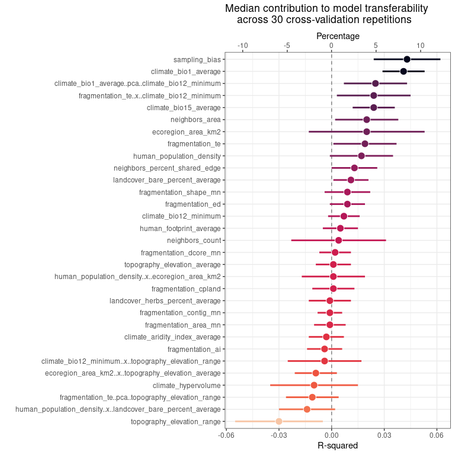<!-- -->

The function results are added to the “importance” slot of the model.

``` r
names(model.non.spatial$importance)
```

    ## [1] "per.variable"          "local"                 "oob.per.variable.plot"
    ## [4] "cv.per.variable.plot"

The data frame “per.variable” contains the columns “importance.cv”
(median importance), “importance.cv.mad” (median absolute deviation),
“importance.cv.percent” (median importance in percentage), and
“importance.cv.percent.mad” (median absolute deviation of the importance
in percent). The ggplot object “cv.per.variable.plot” contains the
importance plot with the median and the median absolute deviation shown
above.

The importance computed by random forest on the out-of-bag data by
permutating each predictor (as computed by `rf()`) and the contribution
of each predictor to model transferability (as computed by
`rf_importance()`) show a moderate correlation, indicating that both
importance measures capture different aspects of the effect of the
variables on the model results.

``` r
model.non.spatial$importance$per.variable %>% 
  ggplot2::ggplot() +
  ggplot2::aes(
    x = importance.oob,
    y = importance.cv
  ) + 
  ggplot2::geom_point(size = 3) + 
  ggplot2::theme_bw() +
  ggplot2::xlab("Importance (out-of-bag)") + 
  ggplot2::ylab("Contribution to transferability") + 
  ggplot2::geom_smooth(method = "lm", formula = y ~ x, color = "red4")
```

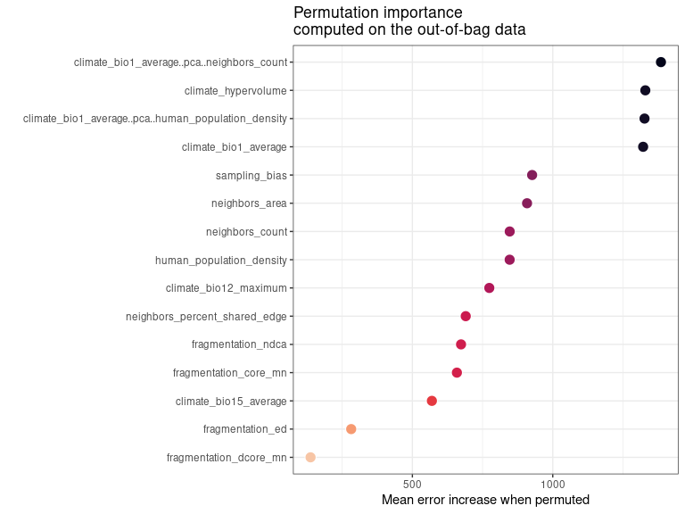<!-- -->

### Local variable importance

Random forest also computes the average increase in error when a
variable is permuted for each case. This is named “local importance”, is
stored in `model.non.spatial$importance$local` as a data frame, and can
be retrieved with
[`get_importance_local()`](https://blasbenito.github.io/spatialRF/reference/get_importance_local.html).

``` r
local.importance <- spatialRF::get_importance_local(model.non.spatial)
```

The table below shows the first few records and columns. Larger values
indicate larger average errors when estimating a case with the permuted
version of the variable, so more important variables will show larger
values.

``` r
kableExtra::kbl(
  round(local.importance[1:10, 1:5], 0),
  format = "html"
) %>%
  kableExtra::kable_paper("hover", full_width = F)
```

<table class=" lightable-paper lightable-hover" style="font-family: &quot;Arial Narrow&quot;, arial, helvetica, sans-serif; width: auto !important; margin-left: auto; margin-right: auto;">
<thead>
<tr>
<th style="text-align:right;">
climate\_aridity\_index\_average
</th>
<th style="text-align:right;">
climate\_hypervolume
</th>
<th style="text-align:right;">
climate\_bio1\_average
</th>
<th style="text-align:right;">
ecoregion\_area\_km2
</th>
<th style="text-align:right;">
sampling\_bias
</th>
</tr>
</thead>
<tbody>
<tr>
<td style="text-align:right;">
-631
</td>
<td style="text-align:right;">
-1127
</td>
<td style="text-align:right;">
-521
</td>
<td style="text-align:right;">
389
</td>
<td style="text-align:right;">
-327
</td>
</tr>
<tr>
<td style="text-align:right;">
100
</td>
<td style="text-align:right;">
556
</td>
<td style="text-align:right;">
-345
</td>
<td style="text-align:right;">
559
</td>
<td style="text-align:right;">
206
</td>
</tr>
<tr>
<td style="text-align:right;">
119
</td>
<td style="text-align:right;">
-87
</td>
<td style="text-align:right;">
1262
</td>
<td style="text-align:right;">
850
</td>
<td style="text-align:right;">
445
</td>
</tr>
<tr>
<td style="text-align:right;">
-186
</td>
<td style="text-align:right;">
565
</td>
<td style="text-align:right;">
588
</td>
<td style="text-align:right;">
-281
</td>
<td style="text-align:right;">
1017
</td>
</tr>
<tr>
<td style="text-align:right;">
-233
</td>
<td style="text-align:right;">
820
</td>
<td style="text-align:right;">
931
</td>
<td style="text-align:right;">
-812
</td>
<td style="text-align:right;">
-1139
</td>
</tr>
<tr>
<td style="text-align:right;">
579
</td>
<td style="text-align:right;">
959
</td>
<td style="text-align:right;">
317
</td>
<td style="text-align:right;">
767
</td>
<td style="text-align:right;">
673
</td>
</tr>
<tr>
<td style="text-align:right;">
603
</td>
<td style="text-align:right;">
620
</td>
<td style="text-align:right;">
-878
</td>
<td style="text-align:right;">
307
</td>
<td style="text-align:right;">
-1002
</td>
</tr>
<tr>
<td style="text-align:right;">
400
</td>
<td style="text-align:right;">
-552
</td>
<td style="text-align:right;">
536
</td>
<td style="text-align:right;">
201
</td>
<td style="text-align:right;">
823
</td>
</tr>
<tr>
<td style="text-align:right;">
-39
</td>
<td style="text-align:right;">
-412
</td>
<td style="text-align:right;">
958
</td>
<td style="text-align:right;">
442
</td>
<td style="text-align:right;">
249
</td>
</tr>
<tr>
<td style="text-align:right;">
789
</td>
<td style="text-align:right;">
894
</td>
<td style="text-align:right;">
-308
</td>
<td style="text-align:right;">
177
</td>
<td style="text-align:right;">
-274
</td>
</tr>
</tbody>
</table>

When case coordinates or polygons are joined with the local importance
scores, it is possible to draw maps showing how variable importance
changes over space.

``` r
#adding polygons
local.importance <- data.frame(
  ecoregions_polygons,
  local.importance
  )
sf::st_geometry(local.importance) <- "geom"

#colors
color.low <- viridis::viridis(
    3,
    option = "F"
    )[2]
color.high <- viridis::viridis(
    3,
    option = "F"
    )[1]

#plot of climate_bio1_average
p1 <- ggplot2::ggplot() +
  ggplot2::geom_sf(
    data = local.importance,
    aes(fill = climate_bio1_average),
    size = 0.1
  ) +
  ggplot2::scale_x_continuous(limits = c(-170, -30)) +
  ggplot2::scale_y_continuous(limits = c(-58, 80)) +
  ggplot2::scale_fill_gradient2(
    low = color.low, 
    high = color.high
    ) +
  ggplot2::theme_bw() +
  ggplot2::theme(legend.position = "bottom") + 
  ggplot2::ggtitle("Mean annual temperature") +
  ggplot2::theme(
    plot.title = ggplot2::element_text(hjust = 0.5),
    legend.key.width = ggplot2::unit(1,"cm")
    ) + 
  ggplot2::labs(color = "Importance") + 
  ggplot2::xlab("Longitude") + 
  ggplot2::ylab("Latitude")

p2 <- ggplot2::ggplot() +
  ggplot2::geom_sf(
    data = local.importance,
    aes(fill = climate_aridity_index_average),
    size = 0.1
  ) +
  ggplot2::scale_x_continuous(limits = c(-170, -30)) +
  ggplot2::scale_y_continuous(limits = c(-58, 80)) +
  ggplot2::scale_fill_gradient2(
    low = color.low, 
    high = color.high
    ) +
  ggplot2::theme_bw() +
  ggplot2::theme(legend.position = "bottom") +
  ggplot2::ggtitle("Aridity index") +
  ggplot2::theme(
    plot.title = ggplot2::element_text(hjust = 0.5),
    legend.key.width = ggplot2::unit(1,"cm")
    ) + 
  ggplot2::labs(color = "Importance") + 
  ggplot2::xlab("Longitude") + 
  ggplot2::ylab("Latitude")

p1 + p2
```

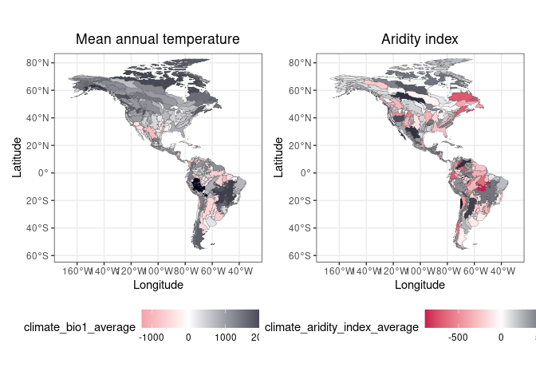<!-- -->

In these maps, values lower than 0 indicate that for a given record, the
permuted version of the variable led to an accuracy score even higher
than the one of the non-permuted variable, so again these negative
values can be interpreted as “worse than chance”.

## Response curves and surfaces

The variable importance scores are also used by the function
[`plot_response_curves()`](https://blasbenito.github.io/spatialRF/reference/plot_response_curves.html)
to plot partial dependence curves for the predictors (by default, only
the ones with an importance score above the median). Building the
partial dependency curve of a predictor requires setting the other
predictors to their quantiles (0.1, 0.5, and 0.9 by default). This helps
to understand how the response curve of a variable changes when all the
other variables have low, centered, or high values. The function also
allows to see the training data

``` r
spatialRF::plot_response_curves(
  model.non.spatial,
  quantiles = c(0.1, 0.5, 0.9),
  line.color = viridis::viridis(
    3, #same number of colors as quantiles
    option = "F", 
    end = 0.9
    ),
  ncol = 3,
  show.data = TRUE
  )
```

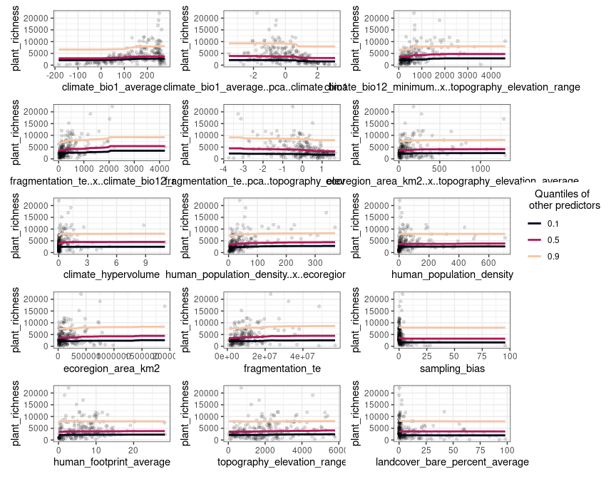<!-- -->

Setting the argument `quantiles` to 0.5 and setting `show.data` to
`FALSE` (default optioin) accentuates the shape of the response curves.

``` r
spatialRF::plot_response_curves(
  model.non.spatial,
  quantiles = 0.5,
  ncol = 3
  )
```

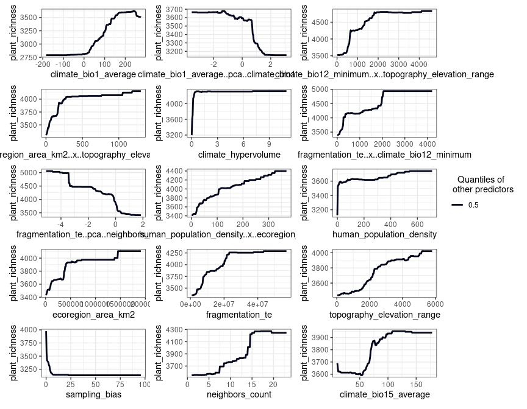<!-- -->

The package [`pdp`](https://bgreenwell.github.io/pdp/index.html)
provides a general way to plot partial dependence plots.

``` r
pdp::partial(
  model.non.spatial, 
  train = ecoregions_df, 
  pred.var = "climate_bio1_average", 
  plot = TRUE, 
  grid.resolution = 200
  )
```

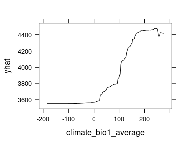<!-- -->

If you need to do your own plots in a different way, the function
[`get_response_curves()`](https://blasbenito.github.io/spatialRF/reference/get_response_curves.html)
returns a data frame with the required data.

``` r
reponse.curves.df <- spatialRF::get_response_curves(model.non.spatial)

kableExtra::kbl(
  head(reponse.curves.df, n = 10),
  format = "html"
) %>%
  kableExtra::kable_paper("hover", full_width = F)
```

<table class=" lightable-paper lightable-hover" style="font-family: &quot;Arial Narrow&quot;, arial, helvetica, sans-serif; width: auto !important; margin-left: auto; margin-right: auto;">
<thead>
<tr>
<th style="text-align:right;">
response
</th>
<th style="text-align:right;">
predictor
</th>
<th style="text-align:left;">
quantile
</th>
<th style="text-align:right;">
model
</th>
<th style="text-align:left;">
predictor.name
</th>
<th style="text-align:left;">
response.name
</th>
</tr>
</thead>
<tbody>
<tr>
<td style="text-align:right;">
2090.702
</td>
<td style="text-align:right;">
-183.8091
</td>
<td style="text-align:left;">
0.1
</td>
<td style="text-align:right;">
1
</td>
<td style="text-align:left;">
climate\_bio1\_average
</td>
<td style="text-align:left;">
plant\_richness
</td>
</tr>
<tr>
<td style="text-align:right;">
2090.702
</td>
<td style="text-align:right;">
-181.5008
</td>
<td style="text-align:left;">
0.1
</td>
<td style="text-align:right;">
1
</td>
<td style="text-align:left;">
climate\_bio1\_average
</td>
<td style="text-align:left;">
plant\_richness
</td>
</tr>
<tr>
<td style="text-align:right;">
2090.702
</td>
<td style="text-align:right;">
-179.1924
</td>
<td style="text-align:left;">
0.1
</td>
<td style="text-align:right;">
1
</td>
<td style="text-align:left;">
climate\_bio1\_average
</td>
<td style="text-align:left;">
plant\_richness
</td>
</tr>
<tr>
<td style="text-align:right;">
2090.702
</td>
<td style="text-align:right;">
-176.8841
</td>
<td style="text-align:left;">
0.1
</td>
<td style="text-align:right;">
1
</td>
<td style="text-align:left;">
climate\_bio1\_average
</td>
<td style="text-align:left;">
plant\_richness
</td>
</tr>
<tr>
<td style="text-align:right;">
2090.702
</td>
<td style="text-align:right;">
-174.5758
</td>
<td style="text-align:left;">
0.1
</td>
<td style="text-align:right;">
1
</td>
<td style="text-align:left;">
climate\_bio1\_average
</td>
<td style="text-align:left;">
plant\_richness
</td>
</tr>
<tr>
<td style="text-align:right;">
2090.702
</td>
<td style="text-align:right;">
-172.2675
</td>
<td style="text-align:left;">
0.1
</td>
<td style="text-align:right;">
1
</td>
<td style="text-align:left;">
climate\_bio1\_average
</td>
<td style="text-align:left;">
plant\_richness
</td>
</tr>
<tr>
<td style="text-align:right;">
2090.702
</td>
<td style="text-align:right;">
-169.9592
</td>
<td style="text-align:left;">
0.1
</td>
<td style="text-align:right;">
1
</td>
<td style="text-align:left;">
climate\_bio1\_average
</td>
<td style="text-align:left;">
plant\_richness
</td>
</tr>
<tr>
<td style="text-align:right;">
2090.702
</td>
<td style="text-align:right;">
-167.6509
</td>
<td style="text-align:left;">
0.1
</td>
<td style="text-align:right;">
1
</td>
<td style="text-align:left;">
climate\_bio1\_average
</td>
<td style="text-align:left;">
plant\_richness
</td>
</tr>
<tr>
<td style="text-align:right;">
2090.702
</td>
<td style="text-align:right;">
-165.3426
</td>
<td style="text-align:left;">
0.1
</td>
<td style="text-align:right;">
1
</td>
<td style="text-align:left;">
climate\_bio1\_average
</td>
<td style="text-align:left;">
plant\_richness
</td>
</tr>
<tr>
<td style="text-align:right;">
2090.702
</td>
<td style="text-align:right;">
-163.0343
</td>
<td style="text-align:left;">
0.1
</td>
<td style="text-align:right;">
1
</td>
<td style="text-align:left;">
climate\_bio1\_average
</td>
<td style="text-align:left;">
plant\_richness
</td>
</tr>
</tbody>
</table>

Interactions between two variables can be plotted with
[`plot_response_surface()`](https://blasbenito.github.io/spatialRF/reference/plot_response_surface.html)

``` r
spatialRF::plot_response_surface(
  model.non.spatial,
  a = "climate_bio1_average",
  b = "neighbors_count"
  )
```

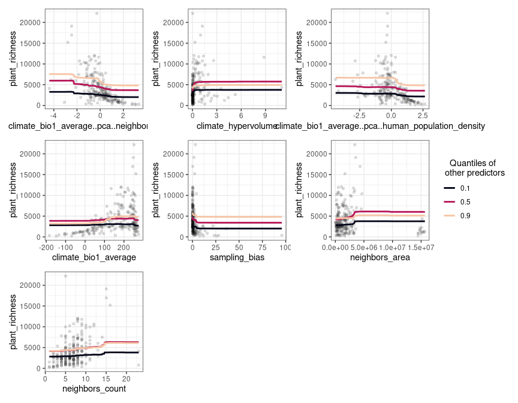<!-- -->

This can be done as well with the `pdp` package, that uses a slightly
different algorithm to plot interaction surfaces.

``` r
pdp::partial(
  model.non.spatial, 
  train = ecoregions_df, 
  pred.var = c("climate_bio1_average", "neighbors_count"), 
  plot = TRUE
  )
```

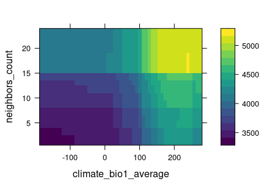<!-- -->

## Model performance

The **performance** slot (in `model.non.spatial$performance`) contains
the values of several performance measures. It be printed via the
function
[`print_performance()`](https://blasbenito.github.io/spatialRF/reference/print_performance.html).

``` r
spatialRF::print_performance(model.non.spatial)
```

    ## 
    ## Model performance 
    ##   - R squared (oob):                  0.6019326
    ##   - R squared (cor(obs, pred)^2):     0.9595841
    ##   - Pseudo R squared (cor(obs, pred)):0.9795836
    ##   - RMSE (oob):                       2126.084
    ##   - RMSE:                             909.2037
    ##   - Normalized RMSE:                  0.2633846

-   `R squared (oob)` and `RMSE (oob)` are the R squared of the model
    and its root mean squared error when predicting the out-of-bag data
    (fraction of data not used to train individual trees). From all the
    values available in the `performance` slot, probably these the most
    honest ones, as it is the closer trying to get a performance
    estimate on independent data. However, out-of-bag data is not fully
    independent, and therefore will still be inflated, especially if the
    data is highly aggregated in space.
-   `R squared` and `pseudo R squared` are computed from the
    observations and the predictions, and indicate to what extent model
    outcomes represent the input data. These values will usually be high
    the data is highly aggregated in space.
-   The `RMSE` and its normalized version are computed via
    [`root_mean_squared_error()`](https://blasbenito.github.io/spatialRF/reference/root_mean_squared_error.html),
    and are linear with `R squared` and `pseudo R squared`.

## Spatial cross-validation

The function
[rf\_evaluate()](https://blasbenito.github.io/spatialRF/reference/rf_evaluate.html)
overcomes the limitations of the performance scores explained above by
providing honest performance based on *spatial cross-validation*. The
function separates the data into a number of spatially independent
training and testing folds. Then, it fits a model on each training fold,
predicts over each testing fold, and computes statistics of performance
measures across folds. Let’s see how it works.

``` r
model.non.spatial <- spatialRF::rf_evaluate(
  model = model.non.spatial,
  xy = xy,                  #data coordinates
  repetitions = 30,         #number of spatial folds
  training.fraction = 0.75, #training data fraction on each fold
  metrics = "r.squared",
  seed = random.seed,
  cluster = cluster,
  verbose = FALSE
)
```

The function generates a new slot in the model named **evaluation**
(`model.non.spatial$evaluation`) with several objects that summarize the
spatial cross-validation results.

``` r
names(model.non.spatial$evaluation)
```

    ## [1] "metrics"           "training.fraction" "per.fold"         
    ## [4] "per.fold.long"     "per.model"         "aggregated"

The information available in this new slot can be accessed with the
functions
[`print_evaluation()`](https://blasbenito.github.io/spatialRF/reference/print_evaluation.html),
[`plot_evaluation()`](https://blasbenito.github.io/spatialRF/reference/plot_evaluation.html),
and
[`get_evaluation()`](https://blasbenito.github.io/spatialRF/reference/get_evaluation.html).

``` r
spatialRF::plot_evaluation(model.non.spatial)
```

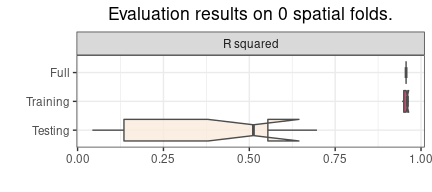<!-- -->

`Full` represents the R squared of the model trained on the full
dataset. `Training` are the R-squared of the models fitted on the
spatial folds (named `Training` in the maps above), and `Testing` are
the R-squared of the same models on “unseen” data (data not used to
train the model, named `Testing` in the maps above). The median, median
absolute deviation (MAD), minimum, and maximum R-squared values on the
testing folds can be printed with `print_evaluation()`.

``` r
spatialRF::print_evaluation(model.non.spatial)
```

    ## 
    ## Spatial evaluation 
    ##   - Training fraction:             0.75
    ##   - Spatial folds:                 0
    ## 
    ##     Metric Median   MAD Minimum Maximum
    ##  r.squared  0.507 0.125   0.032   0.652

## Other important things stored in the model

The model predictions are stored in the slot **predictions**, the
arguments used to fit the model in **ranger.arguments**, and the model
itself, used to predict new values (see code chunk below), is in the
**forest** slot.

``` r
predicted <- stats::predict(
  object = model.non.spatial,
  data = ecoregions_df,
  type = "response"
  )$predictions
```

# Quantile regression

The package ranger implements quantile regression, and you have access
to such feature through `spatialRF` by adding `quantreg = TRUE` to the
argument `ranger.arguments` available in most modeling functions of
`spatialRF` (you can fit spatial quantile regression with
`spatialRF::rf_spatial()` too!). The code chunk below fits a quantile
regression with random forest and predicts the response for the
quantiles 0.05, 0.5, and 0.95.

``` r
model.quantiles <- spatialRF::rf(
  data = ecoregions_df,
  dependent.variable.name = ecoregions_depvar_name,
  predictor.variable.names = predictor.variable.names,
  ranger.arguments = list(
    quantreg = TRUE
  ),
  verbose = FALSE
)

predicted.quantiles <- tpredicted <- stats::predict(
  object = model.quantiles,
  data = ecoregions_df,
  type = "quantiles",
  quantiles = c(0.05, 0.5, 0.95)
  )$predictions

kableExtra::kbl(predicted.quantiles[1:20, ]) %>% 
  kableExtra::kable_styling()
```

<table class="table" style="margin-left: auto; margin-right: auto;">
<thead>
<tr>
<th style="text-align:right;">
quantile= 0.05
</th>
<th style="text-align:right;">
quantile= 0.5
</th>
<th style="text-align:right;">
quantile= 0.95
</th>
</tr>
</thead>
<tbody>
<tr>
<td style="text-align:right;">
2494.70
</td>
<td style="text-align:right;">
4835.0
</td>
<td style="text-align:right;">
10306.60
</td>
</tr>
<tr>
<td style="text-align:right;">
1466.00
</td>
<td style="text-align:right;">
4360.0
</td>
<td style="text-align:right;">
7669.00
</td>
</tr>
<tr>
<td style="text-align:right;">
872.65
</td>
<td style="text-align:right;">
1362.0
</td>
<td style="text-align:right;">
3294.65
</td>
</tr>
<tr>
<td style="text-align:right;">
2692.95
</td>
<td style="text-align:right;">
7818.0
</td>
<td style="text-align:right;">
10738.00
</td>
</tr>
<tr>
<td style="text-align:right;">
2491.20
</td>
<td style="text-align:right;">
10394.0
</td>
<td style="text-align:right;">
22187.00
</td>
</tr>
<tr>
<td style="text-align:right;">
1352.10
</td>
<td style="text-align:right;">
2690.0
</td>
<td style="text-align:right;">
4866.00
</td>
</tr>
<tr>
<td style="text-align:right;">
2176.00
</td>
<td style="text-align:right;">
5109.0
</td>
<td style="text-align:right;">
11642.70
</td>
</tr>
<tr>
<td style="text-align:right;">
2397.00
</td>
<td style="text-align:right;">
6773.5
</td>
<td style="text-align:right;">
7669.00
</td>
</tr>
<tr>
<td style="text-align:right;">
1425.00
</td>
<td style="text-align:right;">
2766.0
</td>
<td style="text-align:right;">
4414.00
</td>
</tr>
<tr>
<td style="text-align:right;">
2397.00
</td>
<td style="text-align:right;">
4254.0
</td>
<td style="text-align:right;">
7372.00
</td>
</tr>
<tr>
<td style="text-align:right;">
1964.05
</td>
<td style="text-align:right;">
2610.0
</td>
<td style="text-align:right;">
4279.65
</td>
</tr>
<tr>
<td style="text-align:right;">
1863.65
</td>
<td style="text-align:right;">
2502.0
</td>
<td style="text-align:right;">
6084.00
</td>
</tr>
<tr>
<td style="text-align:right;">
233.00
</td>
<td style="text-align:right;">
492.0
</td>
<td style="text-align:right;">
5898.65
</td>
</tr>
<tr>
<td style="text-align:right;">
2121.00
</td>
<td style="text-align:right;">
6084.0
</td>
<td style="text-align:right;">
10394.00
</td>
</tr>
<tr>
<td style="text-align:right;">
2212.00
</td>
<td style="text-align:right;">
9973.0
</td>
<td style="text-align:right;">
10709.00
</td>
</tr>
<tr>
<td style="text-align:right;">
2954.00
</td>
<td style="text-align:right;">
7963.0
</td>
<td style="text-align:right;">
11637.00
</td>
</tr>
<tr>
<td style="text-align:right;">
1871.95
</td>
<td style="text-align:right;">
3976.0
</td>
<td style="text-align:right;">
6948.00
</td>
</tr>
<tr>
<td style="text-align:right;">
1871.95
</td>
<td style="text-align:right;">
4253.0
</td>
<td style="text-align:right;">
6103.00
</td>
</tr>
<tr>
<td style="text-align:right;">
1273.30
</td>
<td style="text-align:right;">
4110.0
</td>
<td style="text-align:right;">
15207.00
</td>
</tr>
<tr>
<td style="text-align:right;">
1233.00
</td>
<td style="text-align:right;">
2578.0
</td>
<td style="text-align:right;">
7684.05
</td>
</tr>
</tbody>
</table>

# Fitting a spatial model with `rf_spatial()`

The spatial autocorrelation of the residuals of a model like
`model.non.spatial`, measured with [Moran’s
I](https://en.wikipedia.org/wiki/Moran%27s_I), can be plotted with
[`plot_moran()`](https://blasbenito.github.io/spatialRF/reference/plot_moran.html).

``` r
spatialRF::plot_moran(
  model.non.spatial, 
  verbose = FALSE
  )
```

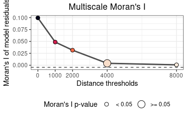<!-- -->

According to the plot, the spatial autocorrelation of the residuals of
`model.non.spatial` is highly positive for a neighborhood of 0 and 1000
km, while it becomes non-significant (p-value &gt; 0.05) at 2000, 4000,
and 8000 km. To reduce the spatial autocorrelation of the residuals as
much as possible, the non-spatial model can be transformed into a
*spatial model* very easily with the function
[`rf_spatial()`](https://blasbenito.github.io/spatialRF/reference/rf_spatial.html).
This function is the true core of the package!

``` r
model.spatial <- spatialRF::rf_spatial(
  model = model.non.spatial,
  method = "mem.moran.sequential", #default method
  verbose = FALSE,
  cluster = cluster,
  seed = random.seed
  )
```

**NOTE:** You can find the complete data (including the selected spatial
predictors) used to train this model in
`model.spatial$ranger.arguments$data`.

<table class="table" style="margin-left: auto; margin-right: auto;">
<thead>
<tr>
<th style="text-align:left;">
variable
</th>
<th style="text-align:left;">
class
</th>
<th style="text-align:left;">
values
</th>
</tr>
</thead>
<tbody>
<tr>
<td style="text-align:left;">
plant\_richness
</td>
<td style="text-align:left;">
double
</td>
<td style="text-align:left;">
4835, 4360, 1362, 7818, 10394, 2690
</td>
</tr>
<tr>
<td style="text-align:left;">
climate\_aridity\_index\_average
</td>
<td style="text-align:left;">
double
</td>
<td style="text-align:left;">
-1.27, 0.01, 0.05, -0.58, -0.51, -0.76
</td>
</tr>
<tr>
<td style="text-align:left;">
climate\_hypervolume
</td>
<td style="text-align:left;">
double
</td>
<td style="text-align:left;">
0.02, 0.52, 0.03, 0.69, 0.05, 0
</td>
</tr>
<tr>
<td style="text-align:left;">
climate\_bio1\_average
</td>
<td style="text-align:left;">
double
</td>
<td style="text-align:left;">
251.06, 261.09, 11.59, 173.21, 251.83, 255.8
</td>
</tr>
<tr>
<td style="text-align:left;">
ecoregion\_area\_km2
</td>
<td style="text-align:left;">
double
</td>
<td style="text-align:left;">
268444.41, 26658.41, 140062.77, 31915.27, 716681.87, 173261.4
</td>
</tr>
<tr>
<td style="text-align:left;">
sampling\_bias
</td>
<td style="text-align:left;">
double
</td>
<td style="text-align:left;">
3.7, 0.12, 1.18, 0.1, 4.13, 11.25
</td>
</tr>
<tr>
<td style="text-align:left;">
neighbors\_count
</td>
<td style="text-align:left;">
double
</td>
<td style="text-align:left;">
10, 13, 8, 4, 10, 8
</td>
</tr>
<tr>
<td style="text-align:left;">
neighbors\_area
</td>
<td style="text-align:left;">
double
</td>
<td style="text-align:left;">
2005112.54, 720242.4, 15661626.94, 284153.95, 4646036.58, 2801093.14
</td>
</tr>
<tr>
<td style="text-align:left;">
neighbors\_percent\_shared\_edge
</td>
<td style="text-align:left;">
double
</td>
<td style="text-align:left;">
100, 56.46, 100, 35.48, 100, 100
</td>
</tr>
<tr>
<td style="text-align:left;">
human\_population\_density
</td>
<td style="text-align:left;">
double
</td>
<td style="text-align:left;">
7.07, 42.59, 0.87, 218.82, 3.05, 0.75
</td>
</tr>
<tr>
<td style="text-align:left;">
human\_footprint\_average
</td>
<td style="text-align:left;">
double
</td>
<td style="text-align:left;">
0.43, 8.3, 0.57, 11.98, 1.97, 0.65
</td>
</tr>
<tr>
<td style="text-align:left;">
climate\_bio12\_minimum
</td>
<td style="text-align:left;">
double
</td>
<td style="text-align:left;">
1797, 652, 309, 1170, 987, 1506
</td>
</tr>
<tr>
<td style="text-align:left;">
climate\_bio15\_average
</td>
<td style="text-align:left;">
double
</td>
<td style="text-align:left;">
25.4, 59.66, 27.59, 34.79, 61.52, 50.98
</td>
</tr>
<tr>
<td style="text-align:left;">
landcover\_bare\_percent\_average
</td>
<td style="text-align:left;">
double
</td>
<td style="text-align:left;">
0.1, 2.04, 4.99, 0.3, 0.13, 0.06
</td>
</tr>
<tr>
<td style="text-align:left;">
landcover\_herbs\_percent\_average
</td>
<td style="text-align:left;">
double
</td>
<td style="text-align:left;">
16.22, 53.9, 42.67, 54.37, 28.22, 18.41
</td>
</tr>
<tr>
<td style="text-align:left;">
topography\_elevation\_average
</td>
<td style="text-align:left;">
double
</td>
<td style="text-align:left;">
86.81, 6.92, 1130.22, 1872.9, 166.79, 86.9
</td>
</tr>
<tr>
<td style="text-align:left;">
topography\_elevation\_range
</td>
<td style="text-align:left;">
double
</td>
<td style="text-align:left;">
891, 616, 2610, 3886, 1089, 404
</td>
</tr>
<tr>
<td style="text-align:left;">
fragmentation\_ai
</td>
<td style="text-align:left;">
double
</td>
<td style="text-align:left;">
98.24, 77.14, 98.71, 92.58, 99.1, 98.84
</td>
</tr>
<tr>
<td style="text-align:left;">
fragmentation\_area\_mn
</td>
<td style="text-align:left;">
double
</td>
<td style="text-align:left;">
3388500, 21241.27, 7006400, 640080, 14339440, 2166050
</td>
</tr>
<tr>
<td style="text-align:left;">
fragmentation\_contig\_mn
</td>
<td style="text-align:left;">
double
</td>
<td style="text-align:left;">
0.39, 0.39, 0.49, 0.36, 0.7, 0.51
</td>
</tr>
<tr>
<td style="text-align:left;">
fragmentation\_cpland
</td>
<td style="text-align:left;">
double
</td>
<td style="text-align:left;">
26.73, 0.44, 16.78, 14.34, 35.01, 25.48
</td>
</tr>
<tr>
<td style="text-align:left;">
fragmentation\_dcore\_mn
</td>
<td style="text-align:left;">
double
</td>
<td style="text-align:left;">
1.88, 0.97, 1, 2.2, 5.4, 1.62
</td>
</tr>
<tr>
<td style="text-align:left;">
fragmentation\_ed
</td>
<td style="text-align:left;">
double
</td>
<td style="text-align:left;">
0.12, 0.05, 0.06, 0.32, 0.08, 0.09
</td>
</tr>
<tr>
<td style="text-align:left;">
fragmentation\_shape\_mn
</td>
<td style="text-align:left;">
double
</td>
<td style="text-align:left;">
1.8, 1.77, 2.2, 2.49, 2.42, 1.51
</td>
</tr>
<tr>
<td style="text-align:left;">
fragmentation\_te
</td>
<td style="text-align:left;">
double
</td>
<td style="text-align:left;">
11598000, 12736000, 5062000, 5386000, 16208000, 5626000
</td>
</tr>
<tr>
<td style="text-align:left;">
fragmentation\_te..x..climate\_bio12\_minimum
</td>
<td style="text-align:left;">
double
</td>
<td style="text-align:left;">
1488.8, 608.4, 115.42, 441.37, 1162.89, 592.01
</td>
</tr>
<tr>
<td style="text-align:left;">
climate\_bio1\_average..pca..climate\_bio12\_minimum
</td>
<td style="text-align:left;">
double
</td>
<td style="text-align:left;">
-2.6, -0.87, 1.35, -1.09, -1.33, -2.17
</td>
</tr>
<tr>
<td style="text-align:left;">
climate\_bio12\_minimum..x..topography\_elevation\_range
</td>
<td style="text-align:left;">
double
</td>
<td style="text-align:left;">
1175.29, 305.91, 617.48, 3281.69, 793.2, 464.37
</td>
</tr>
<tr>
<td style="text-align:left;">
ecoregion\_area\_km2..x..topography\_elevation\_average
</td>
<td style="text-align:left;">
double
</td>
<td style="text-align:left;">
41.56, 1.87, 212.56, 95.81, 179.57, 27.33
</td>
</tr>
<tr>
<td style="text-align:left;">
human\_population\_density..x..ecoregion\_area\_km2
</td>
<td style="text-align:left;">
double
</td>
<td style="text-align:left;">
28.72, 12.96, 8.72, 67.49, 53.89, 10.5
</td>
</tr>
<tr>
<td style="text-align:left;">
fragmentation\_te..pca..topography\_elevation\_range
</td>
<td style="text-align:left;">
double
</td>
<td style="text-align:left;">
0.37, 0.42, 0.03, -0.65, -0.12, 1.12
</td>
</tr>
<tr>
<td style="text-align:left;">
human\_population\_density..x..landcover\_bare\_percent\_average
</td>
<td style="text-align:left;">
double
</td>
<td style="text-align:left;">
2.17, 21.14, 6.75, 40.86, 1.6, 1.17
</td>
</tr>
<tr>
<td style="text-align:left;">
spatial\_predictor\_0\_4
</td>
<td style="text-align:left;">
double
</td>
<td style="text-align:left;">
0.04, -0.38, 0, 0, 0.05, 0.03
</td>
</tr>
<tr>
<td style="text-align:left;">
spatial\_predictor\_0\_3
</td>
<td style="text-align:left;">
double
</td>
<td style="text-align:left;">
-0.04, -0.13, 0.04, -0.03, -0.02, -0.02
</td>
</tr>
<tr>
<td style="text-align:left;">
spatial\_predictor\_0\_1
</td>
<td style="text-align:left;">
double
</td>
<td style="text-align:left;">
0.03, 0.1, 0, 0.02, 0.02, 0.02
</td>
</tr>
<tr>
<td style="text-align:left;">
spatial\_predictor\_0\_5
</td>
<td style="text-align:left;">
double
</td>
<td style="text-align:left;">
-0.03, 0.21, -0.03, -0.01, 0.01, -0.01
</td>
</tr>
<tr>
<td style="text-align:left;">
spatial\_predictor\_0\_2
</td>
<td style="text-align:left;">
double
</td>
<td style="text-align:left;">
0, 0.05, -0.01, 0, 0, 0
</td>
</tr>
<tr>
<td style="text-align:left;">
spatial\_predictor\_1000\_3
</td>
<td style="text-align:left;">
double
</td>
<td style="text-align:left;">
0.07, -0.01, 0.1, 0.07, -0.01, 0.01
</td>
</tr>
<tr>
<td style="text-align:left;">
spatial\_predictor\_0\_10
</td>
<td style="text-align:left;">
double
</td>
<td style="text-align:left;">
0.01, -0.07, 0.04, 0, -0.05, -0.01
</td>
</tr>
<tr>
<td style="text-align:left;">
spatial\_predictor\_0\_13
</td>
<td style="text-align:left;">
double
</td>
<td style="text-align:left;">
0.19, 0.02, -0.03, -0.01, 0.16, 0.18
</td>
</tr>
<tr>
<td style="text-align:left;">
spatial\_predictor\_0\_7
</td>
<td style="text-align:left;">
double
</td>
<td style="text-align:left;">
0.01, -0.13, -0.08, 0, 0, 0.01
</td>
</tr>
<tr>
<td style="text-align:left;">
spatial\_predictor\_0\_8
</td>
<td style="text-align:left;">
double
</td>
<td style="text-align:left;">
0, 0.11, -0.05, 0.01, -0.02, -0.01
</td>
</tr>
<tr>
<td style="text-align:left;">
spatial\_predictor\_0\_9
</td>
<td style="text-align:left;">
double
</td>
<td style="text-align:left;">
0, 0.05, -0.03, 0, -0.02, -0.01
</td>
</tr>
<tr>
<td style="text-align:left;">
spatial\_predictor\_1000\_6
</td>
<td style="text-align:left;">
double
</td>
<td style="text-align:left;">
-0.03, 0.01, -0.01, -0.07, -0.01, -0.04
</td>
</tr>
<tr>
<td style="text-align:left;">
spatial\_predictor\_0\_11
</td>
<td style="text-align:left;">
double
</td>
<td style="text-align:left;">
0.01, -0.14, 0.03, -0.01, 0.01, 0.01
</td>
</tr>
<tr>
<td style="text-align:left;">
spatial\_predictor\_0\_6
</td>
<td style="text-align:left;">
double
</td>
<td style="text-align:left;">
0, 0.01, -0.02, 0, 0, 0
</td>
</tr>
<tr>
<td style="text-align:left;">
spatial\_predictor\_0\_12
</td>
<td style="text-align:left;">
double
</td>
<td style="text-align:left;">
0.02, 0.04, 0.11, 0, 0.01, 0.01
</td>
</tr>
<tr>
<td style="text-align:left;">
spatial\_predictor\_1000\_7
</td>
<td style="text-align:left;">
double
</td>
<td style="text-align:left;">
0.04, -0.04, -0.07, 0, 0.07, 0.08
</td>
</tr>
<tr>
<td style="text-align:left;">
spatial\_predictor\_1000\_8
</td>
<td style="text-align:left;">
double
</td>
<td style="text-align:left;">
0.07, -0.03, 0, 0, 0.13, 0.14
</td>
</tr>
<tr>
<td style="text-align:left;">
spatial\_predictor\_0\_16
</td>
<td style="text-align:left;">
double
</td>
<td style="text-align:left;">
0.12, 0.01, -0.02, -0.03, 0.11, 0.09
</td>
</tr>
<tr>
<td style="text-align:left;">
spatial\_predictor\_0\_17
</td>
<td style="text-align:left;">
double
</td>
<td style="text-align:left;">
0.16, 0.03, 0.01, -0.02, 0.01, 0.08
</td>
</tr>
<tr>
<td style="text-align:left;">
spatial\_predictor\_0\_15
</td>
<td style="text-align:left;">
double
</td>
<td style="text-align:left;">
0.02, 0.07, -0.06, -0.01, 0.02, 0.01
</td>
</tr>
<tr>
<td style="text-align:left;">
spatial\_predictor\_0\_18
</td>
<td style="text-align:left;">
double
</td>
<td style="text-align:left;">
0.01, 0.04, 0.05, -0.01, 0.05, 0.01
</td>
</tr>
<tr>
<td style="text-align:left;">
spatial\_predictor\_1000\_9
</td>
<td style="text-align:left;">
double
</td>
<td style="text-align:left;">
0.01, 0, -0.08, 0.02, -0.1, -0.1
</td>
</tr>
</tbody>
</table>

The plot below shows the Moran’s I of the residuals of the spatial
model, and indicates that the residuals are not autocorrelated at any
distance.

``` r
spatialRF::plot_moran(
  model.spatial, 
  verbose = FALSE
  )
```

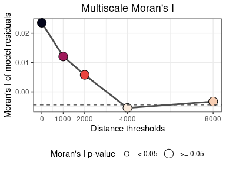<!-- -->

If we compare the variable importance plots of both models, we can see
that the spatial model has an additional set of dots under the name
“spatial\_predictors”, and that the maximum importance of a few of these
*spatial predictors* matches the importance of the most relevant
non-spatial predictors.

``` r
p1 <- spatialRF::plot_importance(
  model.non.spatial, 
  verbose = FALSE) + 
  ggplot2::ggtitle("Non-spatial model") 

p2 <- spatialRF::plot_importance(
  model.spatial,
  verbose = FALSE) + 
  ggplot2::ggtitle("Spatial model")

p1 | p2 
```

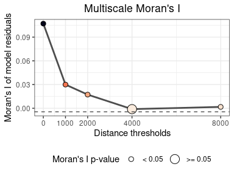<!-- -->

If we look at the ten most important variables in `model.spatial` we
will see that a few of them are *spatial predictors*. Spatial predictors
are named `spatial_predictor_X_Y`, where `X` is the neighborhood
distance at which the predictor has been generated, and `Y` is the index
of the predictor.

``` r
kableExtra::kbl(
  head(model.spatial$importance$per.variable, n = 10),
  format = "html"
) %>%
  kableExtra::kable_paper("hover", full_width = F)
```

<table class=" lightable-paper lightable-hover" style="font-family: &quot;Arial Narrow&quot;, arial, helvetica, sans-serif; width: auto !important; margin-left: auto; margin-right: auto;">
<thead>
<tr>
<th style="text-align:left;">
variable
</th>
<th style="text-align:right;">
importance
</th>
</tr>
</thead>
<tbody>
<tr>
<td style="text-align:left;">
climate\_bio12\_minimum..x..topography\_elevation\_range
</td>
<td style="text-align:right;">
1220.020
</td>
</tr>
<tr>
<td style="text-align:left;">
spatial\_predictor\_0\_2
</td>
<td style="text-align:right;">
1109.770
</td>
</tr>
<tr>
<td style="text-align:left;">
climate\_bio1\_average
</td>
<td style="text-align:right;">
1080.102
</td>
</tr>
<tr>
<td style="text-align:left;">
climate\_bio1\_average..pca..climate\_bio12\_minimum
</td>
<td style="text-align:right;">
978.201
</td>
</tr>
<tr>
<td style="text-align:left;">
climate\_hypervolume
</td>
<td style="text-align:right;">
915.576
</td>
</tr>
<tr>
<td style="text-align:left;">
fragmentation\_te..x..climate\_bio12\_minimum
</td>
<td style="text-align:right;">
894.737
</td>
</tr>
<tr>
<td style="text-align:left;">
ecoregion\_area\_km2..x..topography\_elevation\_average
</td>
<td style="text-align:right;">
881.102
</td>
</tr>
<tr>
<td style="text-align:left;">
fragmentation\_te..pca..topography\_elevation\_range
</td>
<td style="text-align:right;">
769.357
</td>
</tr>
<tr>
<td style="text-align:left;">
spatial\_predictor\_0\_6
</td>
<td style="text-align:right;">
760.547
</td>
</tr>
<tr>
<td style="text-align:left;">
human\_population\_density..x..ecoregion\_area\_km2
</td>
<td style="text-align:right;">
741.607
</td>
</tr>
</tbody>
</table>

But what are spatial predictors? Spatial predictors, as shown below, are
smooth surfaces representing neighborhood among records at different
spatial scales. They are computed from the distance matrix in different
ways. The ones below are the eigenvectors of the double-centered
distance matrix of weights (a.k.a, Moran’s Eigenvector Maps). They
represent the effect of spatial proximity among records, helping to
represent biogeographic and spatial processes not considered by the
non-spatial predictors.

``` r
spatial.predictors <- spatialRF::get_spatial_predictors(model.spatial)
pr <- data.frame(spatial.predictors, ecoregions_polygons)
sf::st_geometry(pr) <- "geom"

p1 <- ggplot2::ggplot() +
  ggplot2::geom_sf(
    data = pr, 
    aes(fill = spatial_predictor_0_4),
    size = 0.1
    ) +
  ggplot2::scale_fill_viridis_c(option = "F") +
  ggplot2::theme_bw() +
  ggplot2::labs(color = "Eigenvalue") +
  ggplot2::scale_x_continuous(limits = c(-170, -30)) +
  ggplot2::scale_y_continuous(limits = c(-58, 80))  +
  ggplot2::ggtitle("Variable: spatial_predictor_0_4") + 
  ggplot2::theme(legend.position = "bottom")+ 
  ggplot2::xlab("Longitude") + 
  ggplot2::ylab("Latitude")

p2 <- ggplot2::ggplot() +
  ggplot2::geom_sf(
    data = pr, 
    aes(fill = spatial_predictor_1000_6),
    size = 0.1
    ) +
  ggplot2::scale_fill_viridis_c(option = "F") +
  ggplot2::theme_bw() +
  ggplot2::labs(color = "Eigenvalue") +
  ggplot2::scale_x_continuous(limits = c(-170, -30)) +
  ggplot2::scale_y_continuous(limits = c(-58, 80))  +
  ggplot2::ggtitle("Variable: spatial_predictor_1000_6") + 
  ggplot2::theme(legend.position = "bottom") + 
  ggplot2::xlab("Longitude") + 
  ggplot2::ylab("")

p1 | p2
```

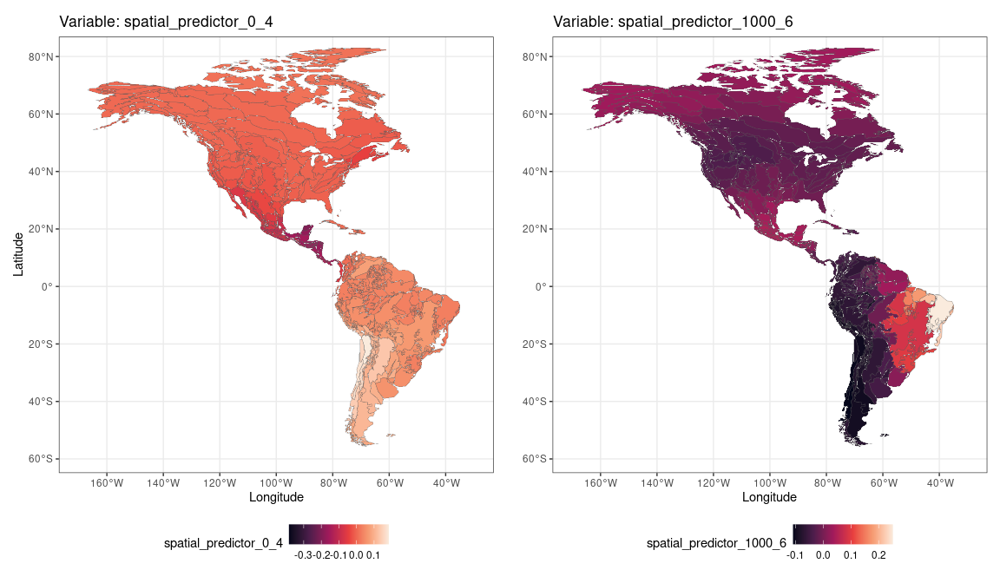<!-- -->

The spatial predictors are included in the model one by one, in the
order of their Moran’s I (spatial predictors with Moran’s I lower than 0
are removed). The selection procedure is performed by the function
[`select_spatial_predictors_sequential()`](https://blasbenito.github.io/spatialRF/reference/select_spatial_predictors_sequential.html),
which finds the smaller subset of spatial predictors maximizing the
model’s R squared, and minimizing the Moran’s I of the residuals. This
is shown in the optimization plot below (dots linked by lines represent
the selected spatial predictors).

``` r
p <- spatialRF::plot_optimization(model.spatial)
```

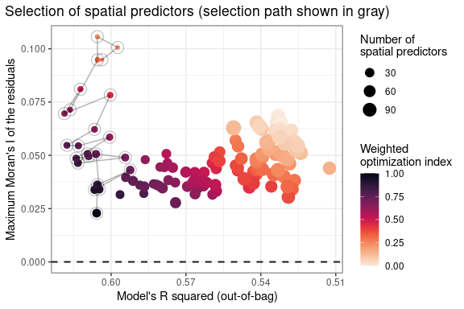<!-- -->

# Tuning Random Forest hyperparameters

The model fitted above was based on the default random forest
hyperparameters of `ranger()`, and those might not be the most adequate
ones for a given dataset. The function
[`rf_tuning()`](https://blasbenito.github.io/spatialRF/reference/rf_tuning.html)
helps the user to choose sensible values for three Random Forest
hyperparameters that are critical to model performance:

-   `num.trees`: number of regression trees in the forest.
-   `mtry`: number of variables to choose from on each tree split.
-   `min.node.size`: minimum number of cases on a terminal node.

These values can be modified in any model fitted with the package using
the `ranger.arguments` argument. The example below shows how to fit a
spatial model with a given set of hyperparameters.

``` r
model.spatial <- spatialRF::rf_spatial(
  model = model.non.spatial,
  method = "mem.moran.sequential", #default method
  ranger.arguments = list(
    mtry = 5,
    min.node.size = 20,
    num.trees = 1000
  ),
  verbose = FALSE,
  seed = random.seed,
  cluster = cluster
  )
```

The usual method for model tuning relies on a grid search exploring the
results of all the combinations of hyperparameters selected by the user.
In `spatialRF`, model tuning is done via spatial cross-validation, to
ensure that the selected combination of hyperparameters maximizes the
ability of the model to predict over data not used to train it.
**Warning**: model tuning consumes a lot of computational resources,
using it on large datasets might freeze your computer.

**WARNING**: model tuning is very RAM-hungry, but you can control RAM
usage by defining a lower value for the argument `n.cores`.

``` r
model.spatial <- spatialRF::rf_tuning(
  model = model.spatial,
  xy = xy,
  repetitions = 30,
  num.trees = c(500, 1000),
  mtry = seq(
    2,
    length(model.spatial$ranger.arguments$predictor.variable.names), #number of predictors
    by = 9),
  min.node.size = c(5, 15),
  seed = random.seed,
  cluster = cluster,
  verbose = FALSE
)
```

The function returns a tuned model only if the tuning finds a solution
better than the original model. Otherwise the original model is
returned. The results of the tuning are stored in the model under the
name “tuning”.

``` r
model.spatial$tuning$plot
```

    ## NULL

# Repeating a model execution

Random Forest is an stochastic algorithm that yields slightly different
results on each run unless a random seed is set. This particularity has
implications for the interpretation of variable importance scores and
response curves. The function
[`rf_repeat()`](https://blasbenito.github.io/spatialRF/reference/rf_repeat.html)
repeats a model execution and yields the distribution of importance
scores of the predictors across executions. **NOTE**: this function
works better when used at the end of a workflow

``` r
model.spatial.repeat <- spatialRF::rf_repeat(
  model = model.spatial, 
  repetitions = 30,
  seed = random.seed,
  cluster = cluster,
  verbose = FALSE
)
```

The importance scores of a model fitted with `rf_repeat()` are plotted
as a violin plot, with the distribution of the importance scores of each
predictor across repetitions.

``` r
spatialRF::plot_importance(
  model.spatial.repeat, 
  verbose = FALSE
  )
```

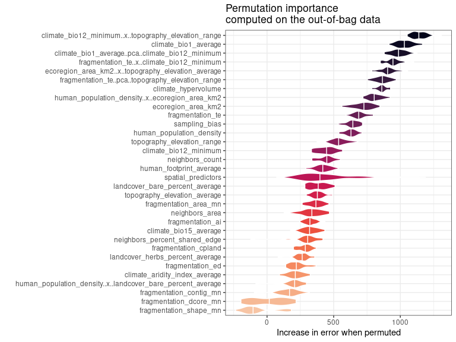<!-- -->

The response curves of models fitted with `rf_repeat()` can be plotted
with `plot_response_curves()` as well. The median prediction is shown
with a thicker line.

``` r
spatialRF::plot_response_curves(
  model.spatial.repeat, 
  quantiles = 0.5,
  ncol = 3
  )
```

<!-- -->

The function `print_performance()` generates a summary of the
performance scores across model repetitions. As every other function of
the package involving repetitions, the provided stats are the median,
and the median absolute deviation (mad).

``` r
spatialRF::print_performance(model.spatial.repeat)
```

    ## 
    ## Model performance (median +/- mad) 
    ##   - R squared (oob):              0.598 +/- 0.0032
    ##   - R squared (cor(obs, pred)^2): 0.96 +/- 0.0014
    ##   - Pseudo R squared:             0.98 +/- 7e-04
    ##   - RMSE (oob):                   2135.966 +/- 8.5185
    ##   - RMSE:                         905.49 +/- 14.8109
    ##   - Normalized RMSE:              0.262 +/- 0.0043

# Taking advantage of the `%>%` pipe

The modeling functions of `spatialRF` are designed to facilitate using
the pipe to combine them. The code below fits a spatial model, tunes its
hyperparameters, evaluates it using spatial cross-validation, and
repeats the execution several times, just by passing the model from one
function to another. Replace `eval = FALSE` with `eval = TRUE` if you
want to execute the code chunk. Notice that the tuning, evaluation, and
repetition functions make use of the cluster we created at the beginning
of this tutorial.

``` r
model.full <- rf_spatial(
  data = ecoregions_df,
  dependent.variable.name = ecoregions_depvar_name,
  predictor.variable.names = predictor.variable.names,
  distance.matrix = ecoregions_distance_matrix,
  distance.thresholds = distance_thresholds,
  xy = xy,
  verbose = FALSE
) %>%
  rf_tuning(cluster = cluster) %>%
  rf_evaluate(cluster = cluster) %>%
  rf_repeat(cluster = cluster)
```

To facilitate working with Beowulf clusters ([just several computers
connected via SSH](https://www.blasbenito.com/post/01_home_cluster/)),
the package provides the function `beowulf_cluster()`, that generates
the cluster definition from details such as the IPs of the machines, the
number of cores to be used on each machine, the user name, and the
connection port.

``` r
#creating and registering the cluster
beowulf.cluster <- spatialRF::make_cluster(
  cluster.ips = c(
    "10.42.0.1",
    "10.42.0.34",
    "10.42.0.104"
  ),
  cluster.cores = c(7, 4, 4),
  cluster.user = "blas",
  cluster.port = "11000"
)

#fitting, tuning, evaluating, and repeating a model
model.full <- rf_spatial(
  data = ecoregions_df,
  dependent.variable.name = ecoregions_depvar_name,
  predictor.variable.names = ecoregions_predvar_names,
  distance.matrix = ecoregions_distance_matrix,
  distance.thresholds = distance_thresholds,
  xy = xy
) %>%
  rf_tuning(cluster = beowulf.cluster) %>%
  rf_evaluate(cluster = beowulf.cluster) %>%
  rf_repeat(cluster = beowulf.cluster)

parallel::stopCluster(cl = beowulf.cluster)
```

# Comparing several models

The function
[`rf_compare()`](https://blasbenito.github.io/spatialRF/reference/rf_compare.html)
takes named list with as many models as the user needs to compare, and
applies `rf_evaluate()` to each one of them to compare their predictive
performances across spatial folds.

``` r
comparison <- spatialRF::rf_compare(
  models = list(
    non_spatial = model.non.spatial,
    spatial = model.spatial
  ),
  xy = xy,
  repetitions = 30,
  training.fraction = 0.8,
  metrics = "rmse",
  seed = random.seed,
  cluster = cluster
  )
```

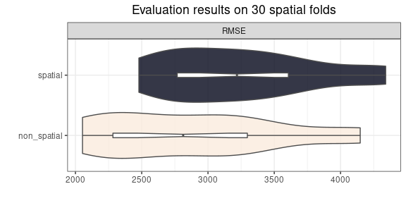<!-- -->

``` r
x <- comparison$comparison.df %>% 
    dplyr::group_by(model, metric) %>% 
    dplyr::summarise(value = round(median(value), 3)) %>% 
    dplyr::arrange(metric) %>% 
    as.data.frame()
colnames(x) <- c("Model", "Metric", "Median")
kableExtra::kbl(
  x,
  format = "html"
  ) %>%
  kableExtra::kable_paper("hover", full_width = F)
```

<table class=" lightable-paper lightable-hover" style="font-family: &quot;Arial Narrow&quot;, arial, helvetica, sans-serif; width: auto !important; margin-left: auto; margin-right: auto;">
<thead>
<tr>
<th style="text-align:left;">
Model
</th>
<th style="text-align:left;">
Metric
</th>
<th style="text-align:right;">
Median
</th>
</tr>
</thead>
<tbody>
<tr>
<td style="text-align:left;">
non\_spatial
</td>
<td style="text-align:left;">
rmse
</td>
<td style="text-align:right;">
2981.076
</td>
</tr>
<tr>
<td style="text-align:left;">
spatial
</td>
<td style="text-align:left;">
rmse
</td>
<td style="text-align:right;">
3370.326
</td>
</tr>
</tbody>
</table>

We can see that the prediction over independent data is worse in the
spatial model, and that makes sense, because spatial models use the
spatial structure of the training data to fit the model, and this
spatial structure is going to be different in training and testing folds
over evaluation repetitions. That’s why spatial models work better as
explanatory tools rather than predictive ones.

# Working with a binomial response

This package can also perform binomial regression on response variables
with zeros and ones. Let’s work on a quick example by turning the
response variable of the previous models into a binomial one.

``` r
ecoregions_df$response_binomial <- ifelse(
  ecoregions_df$plant_richness > 5000,
  1,
  0
)
```

The new response variable, `response_binomial`, will have ones where
`richness_species_vascular > 5000`, and zeros otherwise. This would be
equivalent to having the classes “high richness” (represented by the
ones) and “low richness”, represented by the zeros. The binomial
regression model would then have as objective to compute the probability
of each ecoregion to belong to the “high richness” class.

There is something important to notice before moving forward though. The
number of zeros in the new response variable is larger than the number
of ones.

``` r
table(ecoregions_df$response_binomial)
```

    ## 
    ##   0   1 
    ## 163  62

This means that there is **class imbalance**, and under this scenario,
any random forest model is going to get better at predicting the most
abundant class, while in our case the “target” is the less abundant one.
But the function `rf()` is ready to deal with this issue. Let’s fit a
model to see what am I talking about.

``` r
model.non.spatial <- spatialRF::rf(
  data = ecoregions_df,
  dependent.variable.name = "response_binomial",
  predictor.variable.names = predictor.variable.names,
  distance.matrix = ecoregions_distance_matrix,
  distance.thresholds = distance_thresholds,
  seed = random.seed,
  verbose = FALSE
)
```

The function detects that the response variable is binary (using the
function
[`is_binary()`](https://blasbenito.github.io/spatialRF/reference/is_binary.html)),
and computes *case weights* for the ones and the zeros. These case
weights are stored in the `ranger.arguments` slot of the model, and are
used to give preference to the cases with larger weights during the
selection of the out-of-bag data (check the `case.weights` argument in
`ranger::ranger()`). As a result, each individual tree in the forest is
trained with a similar proportion of zeros and ones, which helps
mitigate the class imbalance issue. This method is named *weighted
Random Forest*, and is very well explained in this [white
paper](https://statistics.berkeley.edu/sites/default/files/tech-reports/666.pdf)
that includes the father of Random Forest, Leo Breiman, as coauthor.

``` r
unique(model.non.spatial$ranger.arguments$case.weights)
```

    ## [1] 0.006134969 0.016129032

This model could be projected right away onto a raster stack with maps
of the predictors, so, in fact, `spatialRF` can be used to fit Species
Distribution Models, when it actually wasn’t really designed with such a
purpose in mind. And as an additional advantage, the model can be
evaluated with `rf_evaluate()`, which is way better than
cross-validation via random data-splitting ([this blog
post](https://methodsblog.com/2018/11/29/blockcv-english/) explains
explains why).

``` r
model.non.spatial <- spatialRF::rf_evaluate(
  model = model.non.spatial,
  xy = xy,
  metrics = "auc",
  cluster = cluster,
  verbose = FALSE
)

spatialRF::print_evaluation(model.non.spatial)
```

    ## 
    ## Spatial evaluation 
    ##   - Training fraction:             0.75
    ##   - Spatial folds:                 0
    ## 
    ##  Metric Median   MAD Minimum Maximum
    ##     auc  0.923 0.064   0.782   0.978

The **take away message** here is that you can work with a binomial
response with `spatialRF`, just as you would do with a continuous
response, as long as it is represented with zeros and ones. Just
remember that the class imbalance problem is tackled via case weights,
and that predictive performance is also measured using the Area Under
the ROC Curve (AUC).

# Generating spatial predictors for other modelling methods

You might not love Random Forest, but `spatialRF` loves you, and as
such, it gives you tools to generate spatial predictors for other models
anyway.

The first step requires generating Moran’s Eigenvector Maps (MEMs) from
the distance matrix. Here there are two options, computing MEMs for a
single neighborhood distance with
[`mem()`](https://blasbenito.github.io/spatialRF/reference/mem.html),
and computing MEMs for several neighborhood distances at once with
[`mem_multithreshold()`](https://blasbenito.github.io/spatialRF/reference/mem_multithreshold.html).

``` r
#single distance (0km by default)
mems <- spatialRF::mem(distance.matrix = ecoregions_distance_matrix)

#several distances
mems <- spatialRF::mem_multithreshold(
  distance.matrix = ecoregions_distance_matrix,
  distance.thresholds = distance_thresholds
)
```

In either case the result is a data frame with Moran’s Eigenvector Maps
(“just” the positive eigenvectors of the double-centered distance
matrix).

``` r
kableExtra::kbl(
  head(mems[, 1:4], n = 10),
  format = "html"
) %>%
  kableExtra::kable_paper("hover", full_width = F)
```

<table class=" lightable-paper lightable-hover" style="font-family: &quot;Arial Narrow&quot;, arial, helvetica, sans-serif; width: auto !important; margin-left: auto; margin-right: auto;">
<thead>
<tr>
<th style="text-align:right;">
spatial\_predictor\_0\_1
</th>
<th style="text-align:right;">
spatial\_predictor\_0\_2
</th>
<th style="text-align:right;">
spatial\_predictor\_0\_3
</th>
<th style="text-align:right;">
spatial\_predictor\_0\_4
</th>
</tr>
</thead>
<tbody>
<tr>
<td style="text-align:right;">
0.0259543
</td>
<td style="text-align:right;">
0.0042246
</td>
<td style="text-align:right;">
-0.0416785
</td>
<td style="text-align:right;">
0.0357732
</td>
</tr>
<tr>
<td style="text-align:right;">
0.0999191
</td>
<td style="text-align:right;">
0.0495412
</td>
<td style="text-align:right;">
-0.1268831
</td>
<td style="text-align:right;">
-0.3832895
</td>
</tr>
<tr>
<td style="text-align:right;">
0.0011341
</td>
<td style="text-align:right;">
-0.0130481
</td>
<td style="text-align:right;">
0.0437622
</td>
<td style="text-align:right;">
0.0028951
</td>
</tr>
<tr>
<td style="text-align:right;">
0.0165809
</td>
<td style="text-align:right;">
0.0040660
</td>
<td style="text-align:right;">
-0.0305486
</td>
<td style="text-align:right;">
-0.0009096
</td>
</tr>
<tr>
<td style="text-align:right;">
0.0226048
</td>
<td style="text-align:right;">
0.0011860
</td>
<td style="text-align:right;">
-0.0227708
</td>
<td style="text-align:right;">
0.0524098
</td>
</tr>
<tr>
<td style="text-align:right;">
0.0155338
</td>
<td style="text-align:right;">
0.0018491
</td>
<td style="text-align:right;">
-0.0198228
</td>
<td style="text-align:right;">
0.0337325
</td>
</tr>
<tr>
<td style="text-align:right;">
0.0229426
</td>
<td style="text-align:right;">
0.0031814
</td>
<td style="text-align:right;">
-0.0312615
</td>
<td style="text-align:right;">
0.0413502
</td>
</tr>
<tr>
<td style="text-align:right;">
-0.2438879
</td>
<td style="text-align:right;">
-0.1167852
</td>
<td style="text-align:right;">
-0.0722502
</td>
<td style="text-align:right;">
-0.0187702
</td>
</tr>
<tr>
<td style="text-align:right;">
0.0153009
</td>
<td style="text-align:right;">
-0.0150126
</td>
<td style="text-align:right;">
0.1046042
</td>
<td style="text-align:right;">
-0.0078199
</td>
</tr>
<tr>
<td style="text-align:right;">
-0.1188148
</td>
<td style="text-align:right;">
-0.0477448
</td>
<td style="text-align:right;">
-0.0327796
</td>
<td style="text-align:right;">
-0.0063627
</td>
</tr>
</tbody>
</table>

But not all MEMs are made equal, and you will need to rank them by their
Moran’s I. The function
[`rank_spatial_predictors()`](https://blasbenito.github.io/spatialRF/reference/rank_spatial_predictors.html)
will help you do so.

``` r
mem.rank <- spatialRF::rank_spatial_predictors(
  distance.matrix = ecoregions_distance_matrix,
  spatial.predictors.df = mems,
  ranking.method = "moran",
  cluster = cluster
)

#at this point we can stop the cluster
parallel::stopCluster(cl = cluster)
```

The output of `rank_spatial_predictors()` is a list with three slots:
“method”, a character string with the name of the ranking method;
“criteria”, an ordered data frame with the criteria used to rank the
spatial predictors; and “ranking”, a character vector with the names of
the spatial predictors in the order of their ranking (it is just the
first column of the “criteria” data frame). We can use this “ranking”
object to reorder or `mems` data frame.

``` r
mems <- mems[, mem.rank$ranking]

#also:
#mems <- mem.rank$spatial.predictors.df
```

From here, spatial predictors can be included in any model one by one,
in the order of the ranking, until the spatial autocorrelation of the
residuals becomes neutral, if possible. A little example with a linear
model follows.

``` r
#model definition
predictors <- c(
  predictor.variable.names[1:6]
)

model.formula <- as.formula(
  paste(
    ecoregions_depvar_name,
    " ~ ",
    paste(
      predictors,
      collapse = " + "
    )
  )
)

#scaling the predictors
scaled.predictors <- scale(ecoregions_df[,  predictors]) %>% 
  as.data.frame()

#adding the response
model.data <- data.frame(
  plant_richness = ecoregions_df[, ecoregions_depvar_name],
  scaled.predictors
)

#fitting the model
m <- lm(model.formula, data = model.data)

#Moran's I test of the residuals
moran.test <- spatialRF::moran(
  x = residuals(m),
  distance.matrix = ecoregions_distance_matrix,
  verbose = FALSE
)
moran.test$plot
```

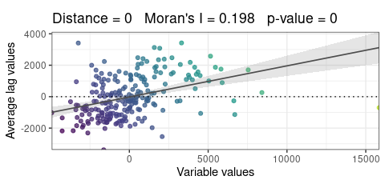<!-- -->

According to the Moran’s I test, the model residuals show spatial
autocorrelation. Let’s introduce MEMs one by one until the problem is
solved.

``` r
#add mems to the data and applies scale()
scaled.predictors <- data.frame(
  scaled.predictors,
  mems
) %>%
  scale() %>%
  as.data.frame()

#adding the response
model.data <- data.frame(
  plant_richness = ecoregions_df[, ecoregions_depvar_name],
  scaled.predictors
)

#initialize predictors.i
predictors.i <- predictors

#iterating through MEMs
for(mem.i in colnames(mems)){
  
  #add mem name to model definintion
  predictors.i <- c(predictors.i, mem.i)
  
  #generate model formula with the new spatial predictor
  model.formula.i <- as.formula(
    paste(
      ecoregions_depvar_name,
      " ~ ",
      paste(
        predictors.i,
        collapse = " + "
      )
    )
  )
  
  #fit model
  m.i <- lm(model.formula.i, data = model.data)
  
  #Moran's I test
  moran.test.i <- moran(
    x = residuals(m.i),
    distance.matrix = ecoregions_distance_matrix,
    verbose = FALSE
  )
  
  #stop if no autocorrelation
  if(moran.test.i$test$interpretation == "No spatial correlation"){
    break
  }
  
}#end of loop

#last moran test
moran.test.i$plot
```

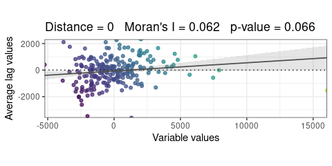<!-- -->

Now we can compare the model without spatial predictors `m` and the
model with spatial predictors `m.i`.

``` r
comparison.df <- data.frame(
  Model = c("Non-spatial", "Spatial"),
  Predictors = c(length(predictors), length(predictors.i)),
  R_squared = round(c(summary(m)$r.squared, summary(m.i)$r.squared), 2),
  AIC = round(c(AIC(m), AIC(m.i)), 0),
  BIC = round(c(BIC(m), BIC(m.i)), 0),
  `Moran I` = round(c(moran.test$test$moran.i, moran.test.i$test$moran.i), 2)
)

kableExtra::kbl(
  comparison.df,
  format = "html"
) %>%
  kableExtra::kable_paper("hover", full_width = F)
```

<table class=" lightable-paper lightable-hover" style="font-family: &quot;Arial Narrow&quot;, arial, helvetica, sans-serif; width: auto !important; margin-left: auto; margin-right: auto;">
<thead>
<tr>
<th style="text-align:left;">
Model
</th>
<th style="text-align:right;">
Predictors
</th>
<th style="text-align:right;">
R\_squared
</th>
<th style="text-align:right;">
AIC
</th>
<th style="text-align:right;">
BIC
</th>
<th style="text-align:right;">
Moran.I
</th>
</tr>
</thead>
<tbody>
<tr>
<td style="text-align:left;">
Non-spatial
</td>
<td style="text-align:right;">
6
</td>
<td style="text-align:right;">
0.44
</td>
<td style="text-align:right;">
4177
</td>
<td style="text-align:right;">
4204
</td>
<td style="text-align:right;">
0.20
</td>
</tr>
<tr>
<td style="text-align:left;">
Spatial
</td>
<td style="text-align:right;">
22
</td>
<td style="text-align:right;">
0.55
</td>
<td style="text-align:right;">
4162
</td>
<td style="text-align:right;">
4244
</td>
<td style="text-align:right;">
0.06
</td>
</tr>
</tbody>
</table>

According to the model comparison, it can be concluded that the addition
of spatial predictors, in spite of the increase in complexity, has
improved the model. In any case, this is just a simple demonstration of
how spatial predictors generated with functions of the `spatialRF`
package can still help you fit spatial models with other modeling
methods.

**That’s all folks!**
