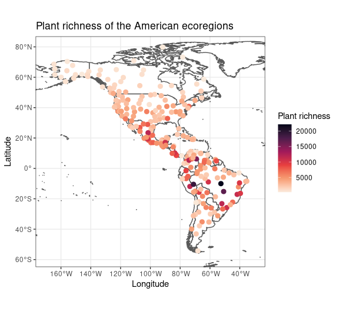
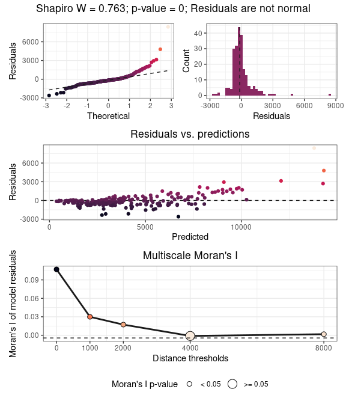
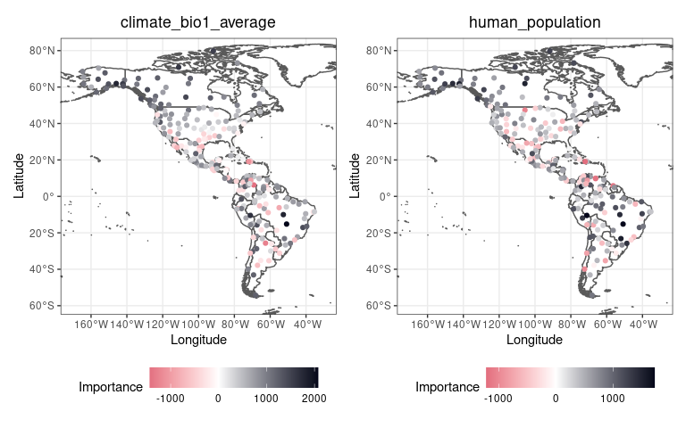
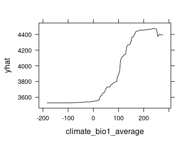

spatialRF: easy spatial regression with Random Forest
================

-   [Introduction](#introduction)
-   [Installing the package](#installing-the-package)
-   [Working with `spatialRF`](#working-with-spatialrf)
    -   [The data](#the-data)
    -   [The workflow](#the-workflow)

<!-- README.md is generated from README.Rmd. Please edit that file -->

# Introduction

The package **spatialRF** facilitates fitting spatial regression models
on regular or irregular data with Random Forest, using the **ranger**
package under the hood [(Wright and Ziegler
2017)](https://arxiv.org/abs/1508.04409), and does so by generating
*spatial predictors* that allow the model to take into account the
spatial structure of the training data. The end goal is minimizing the
spatial autocorrelation of the model residuals as much as possible.

This package implements two main methods to generate *spatial
predictors* from the distance matrix of the data points:

-   Principal coordinate analysis of neighbor matrices [(Dray, Legendre,
    and
    Peres-Neto 2006)](https://www.sciencedirect.com/science/article/abs/pii/S0304380006000925).
-   Distance matrix columns as explanatory variables [(Hengl et
    al. 2018)](https://peerj.com/articles/5518/).

The package also provides a set of tools to identify variable
interactions, tune random forest hyperparameters, assess model
performance on spatially independent data folds, and examine the
resulting models via importance plots, and response curves and surfaces.

# Installing the package

The package is not yet in the CRAN repositories, so at the moment it
must be installed from GitHub as follows.

``` r
remotes::install_github(
  repo = "blasbenito/spatialRF", 
  ref = "main",
  force = TRUE,
  quiet = TRUE
  )
library(spatialRF)
```

There are a few other libraries that will be useful during this
tutorial.

``` r
library(kableExtra)
library(ggplot2)
suppressMessages(library(dplyr))
# options(dplyr.summarise.inform = FALSE)
library(magrittr)
library(patchwork)
library(rnaturalearth)
library(rnaturalearthdata)
```

# Working with `spatialRF`

## The data

The package includes an example dataset named **plant\_richness\_df**, a
data frame with plant species richness and predictors for 227 ecoregions
in the Americas, a distance matrix among the ecoregion edges named,
well, **distance\_matrix**, and **plant\_richness\_sf**, an sf file
containing the centroids of the polygons represented in
**plant\_richness\_df**.

``` r
data(plant_richness_df)
help(plant_richness_df)
data(plant_richness_sf)
data(distance_matrix)

#names of the response variable and the predictors
dependent.variable.name <- "richness_species_vascular"
predictor.variable.names <- colnames(plant_richness_df)[5:21]
```

The response variable of **plant\_richness\_df** is
“richness\_species\_vascular”, with the total count of vascular plant
species found on each ecoregion. The figure below shows the centroids of
each ecoregion along with their associated value of the response
variable.

<!-- -->

The predictors (columns 5 to 21) represent diverse factors that may
influence plant richness such as sampling bias, the area of the
ecoregion, climatic variables, human presence and impact, topography,
geographical fragmentation, and features of the neighbors of each
ecoregion. The figure below shows the scatterplots of the response
variable (y axis) against each predictor (x axis).

<!-- -->

## The workflow

In this section I describe, step-by-step, a typical workflow built with
`spatialRF`.

### Completing the training dataset: finding relevant variable interactions

Random Forests already takes into account variable interactions of the
form “variable `a` becomes important when `b` is higher than x”.
However, Random Forest can also take advantage of variable interactions
of the form `a * b`, as they are commonly defined in regression models.

The function `rf_interactions()` tests all possible interactions among
predictors by using each one of them in a separate model, and suggesting
the ones with the higher potential contribution to the model’s R squared
and the higher relative importance (presented as a percentage of the
maximum importance of a variable in the model).

``` r
interactions <- rf_interactions(
  data = plant_richness_df,
  dependent.variable.name = dependent.variable.name,
  predictor.variable.names = predictor.variable.names
  )
```

    ## Testing 36 candidate interactions.

    ## 4 potential interactions identified.

    ##       ┌─────────────────────────┬───────────────────────┬────────────────┐
    ##       │ Interaction             │ Importance (% of max) │ R2 improvement │
    ##       ├─────────────────────────┼───────────────────────┼────────────────┤
    ##       │ climate_bio1_average_X_ │                  83.0 │         0.042  │
    ##       │ bias_area_km2           │                       │                │
    ##       ├─────────────────────────┼───────────────────────┼────────────────┤
    ##       │ bias_area_km2_X_bias_sp │                  54.1 │         0.043  │
    ##       │ ecies_per_record        │                       │                │
    ##       ├─────────────────────────┼───────────────────────┼────────────────┤
    ##       │ climate_bio1_average_X_ │                  47.2 │         0.013  │
    ##       │ bias_species_per_record │                       │                │
    ##       ├─────────────────────────┼───────────────────────┼────────────────┤
    ##       │ bias_area_km2_X_climate │                  41.9 │         0.0136 │
    ##       │ _aridity_index_average  │                       │                │
    ##       └─────────────────────────┴───────────────────────┴────────────────┘

Here \`rf\_interactions()\`\` suggests four candidate interactions
ordered by their impact on the model. The function cannot say whether an
interaction *makes sense*, and it is up to the user to choose wisely
whether to select an interaction or not.

As an example, I will choose `climate_bio1_average_X_bias_area_km2`
under the rationale that it is likely that ecoregions with higher area
(bias\_area\_km2) and energy (represented by the annual temperature,
climate\_bio1\_average) will have more species of vascular plants. The
data required to add it ot the dataset is inside the output of
`rf_interactions()`.

``` r
plant_richness_df[, "climate_bio1_average_X_bias_area_km2"] <- interactions$columns[, "climate_bio1_average_X_bias_area_km2"]
predictor.variable.names <- c(predictor.variable.names, "climate_bio1_average_X_bias_area_km2")
```

The relationship between the selected interaction and the response
variable, as shown below, indicates that there is an important threshold
above which plant richness increases dramatically, so it seems that
`rf_interactions()` made a good suggestion.

<!-- -->

### Assessing and reducing multicollinearity

The functions `auto_cor()` and `auto_vif()` help reduce redundancy in
the predictors by using different criteria (bivariate R squared
vs. [variance inflation
factor](https://www.statisticshowto.com/variance-inflation-factor/)),
while allowing the user to define an *order of preference*, which can be
based either on domain expertise or on a quantitative assessment. In the
example below I give preference to the interaction suggested by
`rf_interactions()` over it’s two components, and prioritize climate
over other types of predictors (any other choice would be valid, it just
depends on the scope of the study). These rules are applies to both
`auto_cor()` and `auto_vif()`, that are executed sequentially by using
the `%>%` pipe from the [magrittr](https://magrittr.tidyverse.org/)
package. Notice that I have set `cor.threshold` and `vif.threshold` to
low values because the predictors in `plant_richness_df` show little
multicollinearity. The default values (`cor.threshold = 0.75` and
`vif.threshold = 5`) should work well when combined together for any
other dataset.

``` r
preference.order <- c(
    "climate_bio1_average_X_bias_area_km2",
    "climate_aridity_index_average",
    "climate_hypervolume",
    "climate_bio1_average",
    "climate_bio15_minimum",
    "bias_area_km2"
  )

predictor.variable.names <- auto_cor(
  x = plant_richness_df[, predictor.variable.names],
  cor.threshold = 0.5,
  preference.order = preference.order
) %>% 
  auto_vif(
    vif.threshold = 2.5,
    preference.order = preference.order
  )
```

    ## [auto_cor()]: Removed variables: human_population, human_footprint_average

    ## [auto_vif()]: Removed variables: neighbors_area

The output of `auto_cor()` or `auto_vif()` is of the class
“variable\_selection”, that can be used as input for the argument
`predictor.variable.names` of any modeling function within the package.
An example is shown in the next section.

### Fitting a non-spatial Random Forest model

To fit basic Random Forest models `spatialRF` provides the `rf()`
function. It takes the training data, the names of the response and the
predictors, and optionally (to assess the spatial autocorrelation of the
residuals), the distance matrix, and a vector of distance thresholds (in
the same units as the distances in **distance\_matrix**).

These distance thresholds are the neighborhoods at which the model will
check the spatial autocorrelation of the residuals. Their values may
depend on the spatial scale of the data, and the ecological system under
study.

Notice that here I plug the object `predictor.variable.names`, output of
`auto_cor()` and `auto_vif()`, directly into the
`predictor.variable.names` argument.

``` r
model.non.spatial <- rf(
  data = plant_richness_df,
  dependent.variable.name = dependent.variable.name,
  predictor.variable.names = predictor.variable.names,
  distance.matrix = distance_matrix,
  distance.thresholds = c(0, 1500, 3000),
  seed = 100, #just for reproducibility
  verbose = FALSE
)
```

The model output can be printed or plotted with a plethora of functions
such as `print()`, `print_importance()`, `print_performance()`,
`plot_importance()`, `print_moran()`, `plot_response_curves()`,
`plot_response_surfaces)`, or `plot_moran()`, among others.

``` r
plot_response_curves(model.non.spatial)
```

<!-- -->

``` r
plot_response_surfaces(
  x = model.non.spatial,
  a = "climate_bio1_average",
  b = "neighbors_count"
  )
```

<!-- -->

``` r
plot_importance(model.non.spatial, verbose = FALSE)
```

<!-- -->

### Tuning Random Forest hyperparameters

The model fitted above was based on the default hyperparameter values
provided by `ranger()`, and those might not be the most adequate ones
for a given dataset. The function `rf_tuning()` helps the user to choose
sensible values for three Random Forest hyperparameters that are
critical to model performance:

-   `num.trees`: number of regression trees in the forest.
-   `mtry`: number of variables to choose from on each tree split.
-   `min.node.size`: minimum number of cases on a terminal node.

Model tuning can be done on out-of-bag (`method = "oob"`) or spatial
cross-validation (`method = "spatial.cv"`) R squared values. The example
below shows the out-of-bag approach because I will explain spatial
cross-validation with `rf_evaluate()` later in this document.

``` r
model.non.spatial.tuned <- rf_tuning(
  model = model.non.spatial,
  method = "oob",
  num.trees = c(500, 750, 1000),
  mtry = c(5, 10, 15),
  min.node.size = c(5, 10, 15)
)
```

    ## Exploring 27 combinations of hyperparameters.

    ## Best hyperparameters:

    ##   - num.trees:     500

    ##   - mtry:          15

    ##   - min.node.size: 5

<!-- -->

    ## 
    ## Model performance 
    ##   - R squared (OOB):                 0.62
    ##   - Pseudo R squared:                0.787
    ##   - RMSE:                            2156.059
    ##   - Normalized RMSE:                 0.622

    ## 
    ## Model performance 
    ##   - R squared (OOB):                 0.639
    ##   - Pseudo R squared:                0.799
    ##   - RMSE:                            2031.77
    ##   - Normalized RMSE:                 0.587

Model tuning has helped to improve performance measures across the
board, so from here, we can keep working with `model.non.spatial.tuned`.

### Fitting a spatial model

The spatial autocorrelation of the residuals of
`model.non.spatial.tuned`, measured with [Moran’s
I](https://en.wikipedia.org/wiki/Moran%27s_I), can be plotted with
`plot_moran()`

``` r
plot_moran(model.non.spatial.tuned, verbose = FALSE)
```

<!-- -->

According to the plot, the spatial autocorrelation of the residuals is
highly positive a neighborhood of 0 km, while it becomes non-significant
(p-value &gt; 0.05, whatever that means) at the distances 1500 and 3000
km. To reduce the spatial autocorrelation of the residuals, the
non-spatial tuned model fitted above can be converted into a spatial
model easily with `rf_spatial()`.

``` r
model.spatial <- spatialRF::rf_spatial(
  model = model.non.spatial.tuned,
  method = "mem.moran.sequential", #default method
  verbose = FALSE
  )
```

The plot below compares the Moran’s I of the residuals of the spatial
(green) and non spatial (purple) models. It shows that `rf_spatial()`
has managed to remove the spatial autocorrelation of the model
residuals.

``` r
plot_moran(model.spatial, verbose = FALSE)
```

<!-- -->

If we compare the variable importance plots of both models, we can see
that the spatial model has an additional set of dots under the name
“spatial\_predictors”, and that the maximum importance of a few of these
spatial predictors matches the importance of the most relevant
non-spatial predictors.

``` r
p1 <- plot_importance(
  model.non.spatial.tuned, 
  verbose = FALSE) + 
  ggplot2::ggtitle("Non-spatial model") 

p2 <- plot_importance(
  model.spatial,
  verbose = FALSE) + 
  ggplot2::ggtitle("Spatial model")

p1 | p2 
```

<!-- -->

If we take a look to the five most important variables in
**model.spatial** we will see that a few of them are spatial predictors.

| variable                                   | importance |
|:-------------------------------------------|-----------:|
| climate\_bio1\_average\_X\_bias\_area\_km2 |      0.433 |
| climate\_bio1\_average                     |      0.388 |
| climate\_hypervolume                       |      0.342 |
| spatial\_predictor\_0\_2                   |      0.209 |
| spatial\_predictor\_0\_6                   |      0.206 |
| bias\_species\_per\_record                 |      0.132 |
| spatial\_predictor\_0\_7                   |      0.123 |
| bias\_area\_km2                            |      0.109 |
| human\_population\_density                 |      0.109 |
| neighbors\_count                           |      0.075 |

Spatial predictors, as shown below, are smooth surfaces representing
neighborhood among records at different spatial scales.

<!-- -->

The spatial predictors have been generated and included in the model
using the method “mem.moran.sequential” (function’s default), that
mimics the Moran’s Eigenvector Maps method described in [(Dray,
Legendre, and Peres-Neto
2006)](https://www.sciencedirect.com/science/article/abs/pii/S0304380006000925).
In brief, the method consist on transforming the distance matrix into a
double-centered matrix of normalized weights, to then compute the
positive eigenvectors of the weights matrix (a.k.a, Moran’s Eigenvector
Maps, or MEMs). The MEMs are included in the model one by one in the
order of their Moran’s I, and finally, the subset of MEMs maximizing the
model’s R squared and minimizing the Moran’s I of the residuals are
selected, as optimization plot below shows.

<!-- -->

### Assessing model performance on spatially independent folds

The function `rf_evaluate()` separates the training data into a number
of spatially independent training and testing folds, fits a model on
each training fold, predicts over each testing fold, and computes
performance measures, to finally aggregate them across model
repetitions. Let’s see how it works.

``` r
model.spatial <- rf_evaluate(
  model = model.spatial,
  xy = plant_richness_df[, c("x", "y")], #data coordinates
  repetitions = 30,                      #number of folds
  training.fraction = 0.8,               #training data fraction
  verbose = FALSE
)
```

The function generates a new slot in the model named “evaluation” with
several objects that summarize the spatial cross-validation results.

``` r
names(model.spatial$evaluation)
```

    ## [1] "training.fraction" "spatial.folds"     "per.fold"         
    ## [4] "per.fold.long"     "per.model"         "aggregated"

The slot “spatial.folds”, produced by `make_spatial_folds()` contains
the indices of the training and testing cases for each cross-validation
repetition. The maps below show two sets of training and testing spatial
folds.

<!-- -->

The functions `plot_evaluation()` and `print_evaluation()` allow to see
the evaluation results as a plot or as a table. The plot below shows the
performance scores of the “Full” model (original model introduced into
`rf_evaluate()`), the model fitted on the training data (“Training”),
and the results of the Training model predicted over the “Testing” data.
From these performance scores, only the ones labeled as “Testing”
represent model performance on unseen data.

``` r
plot_evaluation(model.spatial, notch = FALSE)
```

<!-- -->

### Comparing two models

The function `rf_evaluate()` only assesses the predictive performance of
one model at a time. If the goal is to compare two models,
`rf_evaluate()` can be ran twice, but `spatialRF` offers a more
convenient option with the function `rf_compare()`.

``` r
comparison <- rf_compare(
  models = list(
    `Non-spatial` = model.non.spatial.tuned,
    `Spatial` = model.spatial
  ),
  xy = plant_richness_df[, c("x", "y")],
  metrics = c("r.squared", "rmse"),
  notch = FALSE
  )
```

<!-- -->

| model       | metric    |    value |
|:------------|:----------|---------:|
| Non-spatial | r.squared |    0.469 |
| Spatial     | r.squared |    0.425 |
| Non-spatial | rmse      | 2452.922 |
| Spatial     | rmse      | 2664.577 |
