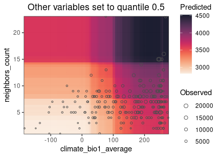
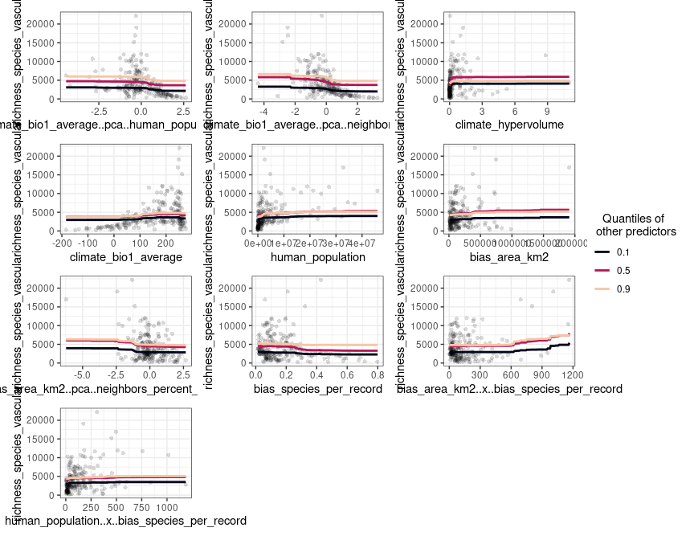
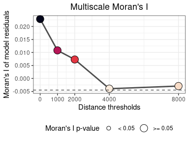
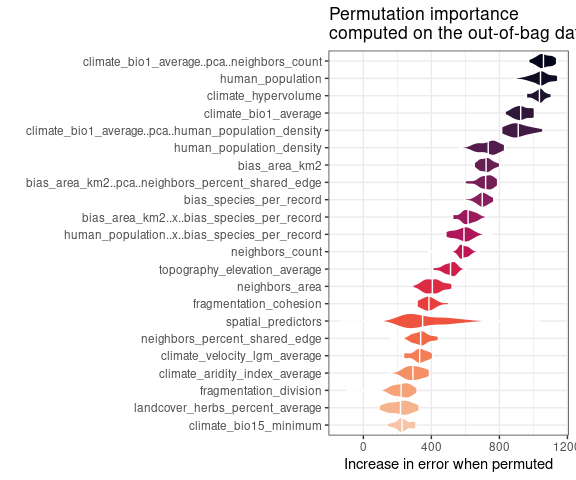

`spatialRF`: Easy Spatial Regression with Random Forest
================

-   [Introduction](#introduction)
-   [Development](#development)
-   [Applications](#applications)
-   [Install](#install)
-   [Data requirements](#data-requirements)
-   [Example data](#example-data)
-   [Finding promising variable
    interactions](#finding-promising-variable-interactions)
-   [Reducing multicollinearity in the
    predictors](#reducing-multicollinearity-in-the-predictors)
-   [Fitting a non-spatial Random Forest
    model](#fitting-a-non-spatial-random-forest-model)
-   [Tuning Random Forest
    hyperparameters](#tuning-random-forest-hyperparameters)
-   [Fitting a spatial model](#fitting-a-spatial-model)
-   [Assessing model performance on spatially independent
    folds](#assessing-model-performance-on-spatially-independent-folds)
-   [Comparing several models](#comparing-several-models)
-   [Generating spatial predictors for other
    models](#generating-spatial-predictors-for-other-models)

<!---
[](https://github.com/BlasBenito/spatialRF/actions/workflows/R-CMD-check.yaml)
-->
<!-- badges: start -->

[](https://github.com/blasbenito/spatialRF)
[](https://lifecycle.r-lib.org/articles/stages.html)
[](https://github.com/blasbenito/spatialRF)
[](https://www.gnu.org/licenses/gpl-3.0.en.html)

<!-- badges: end -->

# Introduction

The package **spatialRF** facilitates fitting spatial regression models
on regular or irregular data with Random Forest by generating *spatial
predictors* that allow the model to take into account the spatial
structure of the training data. The end goal is minimizing the spatial
autocorrelation of the model residuals as much as possible.

Two main methods to generate *spatial predictors* from the distance
matrix of the data points are implemented in the package:

-   Moran’s Eigenvector Maps [(Dray, Legendre, and
    Peres-Neto 2006)](https://www.sciencedirect.com/science/article/abs/pii/S0304380006000925).
-   Distance matrix columns as explanatory variables [(Hengl et
    al. 2018)](https://peerj.com/articles/5518/).

The package is designed to minimize the amount of code required to fit a
spatial model from a training dataset, the names of the response and the
predictors, and a distance matrix, as the example below shows.

``` r
spatial.model <- spatialRF::rf_spatial(
  data = your_dataframe,
  dependent.variable.name = "your_response_variable",
  predictor.variable.names = c("predictor1", "predictor2", ..., "predictorN"),
  distance.matrix = your_distance_matrix
  )
```

The package, that uses the `ranger` package under the hood [(Wright and
Ziegler 2017)](https://arxiv.org/abs/1508.04409), also provides tools to
identify potentially interesting variable interactions, tune random
forest hyperparameters, assess model performance on spatially
independent data folds, and examine the resulting models via importance
plots, response curves, and response surfaces.

# Development

This package is reaching its final form, and big changes are not
expected at this stage. However, it has many functions, and even though
all them have been tested, only one dataset has been used for those
tests. You will find bugs, and something will go wrong almost surely. If
you have time to report bugs, please, do so in any of the following
ways:

-   Open a new issue in the [Issues GitHub page of the
    package](https://github.com/BlasBenito/spatialRF/issues).
-   Send me an email explaining the issue and the error messages with
    enough detail at blasbenito at gmail dot com.
-   Send a direct message to [my twitter
    account](https://twitter.com/blasbenito) explaining the issue.

I will do my best to solve any issues ASAP!

# Applications

The goal of `spatialRF` is to help fitting *explanatory spatial
regression*, where the target is to understand how a set of predictors
and the spatial structure of the data influences response variable.
Therefore, the spatial analyses implemented in the package can be
applied to any spatial dataset, regular or irregular, with a sample size
between \~100 and \~5000 cases (the higher end will depend on the RAM
memory available), a quantitative or binary (values 0 and 1) response
variable, and a more or less large set of predictive variables.

All functions but `rf_spatial()` work with non-spatial data as well if
the arguments `distance.matrix` and `distance.thresholds` are ignored.
In such case, the number of cases is no longer limited by the size of
the distance matrix, and models can be trained with hundreds of
thousands of rows.

However, **when the focus is on fitting spatial models**, and due to the
nature of the *spatial predictors* used to represent the spatial
structure of the training data, **there are many things this package
cannot do**:

-   Predict model results over raster data.

-   Predict a model result over another region with a different spatial
    structure.

-   Work with “big data”, whatever that means.

-   Imputation or extrapolation (it can be done, but models based on
    spatial predictors are hardly transferable).

-   Take temporal autocorrelation into account (but this is something
    that might be implemented later on).

If after considering these limitations you are still interested, follow
me, I will show you how it works.

# Install

The package is not yet in the CRAN repositories, so at the moment it
must be installed from GitHub as follows.

``` r
remotes::install_github(
  repo = "blasbenito/spatialRF", 
  ref = "main",
  force = TRUE
  )
```

<<<<<<< HEAD
    ##      checking for file ‘/tmp/RtmpLOVV1E/remotes6f8cf2cb93a29/BlasBenito-spatialRF-55b7656/DESCRIPTION’ ...  ✓  checking for file ‘/tmp/RtmpLOVV1E/remotes6f8cf2cb93a29/BlasBenito-spatialRF-55b7656/DESCRIPTION’
=======
    ##      checking for file ‘/tmp/RtmphQKJks/remotesde949212427/BlasBenito-spatialRF-f7f1e94/DESCRIPTION’ ...  ✓  checking for file ‘/tmp/RtmphQKJks/remotesde949212427/BlasBenito-spatialRF-f7f1e94/DESCRIPTION’
>>>>>>> development
    ##   ─  preparing ‘spatialRF’:
    ##    checking DESCRIPTION meta-information ...  ✓  checking DESCRIPTION meta-information
    ##   ─  checking for LF line-endings in source and make files and shell scripts
    ##   ─  checking for empty or unneeded directories
    ##   ─  building ‘spatialRF_1.0.7.tar.gz’
    ##      
    ## 

``` r
library(spatialRF)
```

There are a few other libraries that will be useful during this
tutorial.

``` r
library(kableExtra)
library(rnaturalearth)
library(rnaturalearthdata)
```

# Data requirements

The data required to fit random forest models with `spatialRF` must
fulfill several conditions:

-   **The input format is data.frame**. At the moment, tibbles are not
    fully supported.
-   **The number of rows must be somewhere between 100 and \~5000**, but
    that will depend on the RAM available in your system. However, this
    limitation only affects spatial analyses performed with
    `rf_spatial()`, while all other modeling and plotting functions
    should work without a distance matrix (if they don’t tell me, that’d
    be a bug!), and therefore analyses in large datasets can still be
    done with the package.
-   **The number of predictors should be larger than 3**, fitting a
    Random Forest model is moot otherwise.
-   **Factors in the response or the predictors are not explicitly
    supported in the package**, they may work, or they won’t, but in any
    case, I designed this package for quantitative data alone. However,
    binary data with values 0 and 1 in the response variable are
    supported.
-   **Must be free of `NA`**. You can check if there are NA records with
    `sum(apply(df, 2, is.na))`. If the result is larger than 0, then
    just execute `df <- na.omit(df)` to remove rows with empty cells.
-   **Columns cannot have zero variance**. This condition can be checked
    with `apply(df, 2, var) == 0`. Columns yielding TRUE should be
    removed.
-   **Columns must not yield `NaN` or `Inf` when scaled**. You can check
    each condition with `sum(apply(scale(df), 2, is.nan))` and
    `sum(apply(scale(df), 2, is.infinite))`. If higher than 0, you can
    find what columns are giving issues with
    `sapply(as.data.frame(scale(df)), function(x)any(is.nan(x)))` and
    `sapply(as.data.frame(scale(df)), function(x)any(is.infinite(x)))`.
    Any column yielding `TRUE` will generate issues while trying to fit
    models with `spatialRF`.

# Example data

The package includes an example dataset that fulfills the conditions
mentioned above, named
[`plant_richness_df`](https://blasbenito.github.io/spatialRF/reference/plant_richness_df.html).
It is a data frame with plant species richness and predictors for 227
ecoregions in the Americas, and a distance matrix among the ecoregion
edges named, well,
[`distance_matrix`](https://blasbenito.github.io/spatialRF/reference/distance_matrix.html).

``` r
data(plant_richness_df)
data(distance_matrix)

#names of the response variable and the predictors
dependent.variable.name <- "richness_species_vascular"
predictor.variable.names <- colnames(plant_richness_df)[5:21]

#random seed for reproducibility
random.seed <- 100
```

The response variable of `plant_richness_df` is
“richness\_species\_vascular”, with the total count of vascular plant
species found on each ecoregion. The figure below shows the centroids of
each ecoregion along with their associated value of the response
variable.

<!-- -->

The predictors (columns 5 to 21) represent diverse factors that may
influence plant richness such as sampling bias, the area of the
ecoregion, climatic variables, human presence and impact, topography,
geographical fragmentation, and features of the neighbors of each
ecoregion. The figure below shows the scatterplots of the response
variable (y axis) against each predictor (x axis).

<!-- -->

The function `plot_training_df_moran()` helps to check the spatial
autocorrelation of the response variable and the predictors.

<!-- -->

# Finding promising variable interactions

Random Forests already takes into account variable interactions of the
form “variable `a` becomes important when `b` is higher than x”.
However, Random Forest can also take advantage of variable interactions
of the form `a * b`, as they are commonly defined in regression models.

The function
[`rf_interactions()`](https://blasbenito.github.io/spatialRF/reference/rf_interactions.html)
tests all possible interactions among predictors by using each one of
them in a separate model, and suggesting the ones with the higher
potential contribution to the model’s R squared and the higher relative
importance (presented as a percentage of the maximum importance of a
variable in the model).

``` r
interactions <- spatialRF::rf_interactions(
  data = plant_richness_df,
  dependent.variable.name = dependent.variable.name,
  predictor.variable.names = predictor.variable.names,
  seed = random.seed
  )
```

    ## Testing 10 candidate interactions.

    ## 3 potential interactions identified.

<<<<<<< HEAD
    ## ┌────────────┬────────────┬────────────┐
    ## │ Interactio │ Importance │         R2 │
    ## │ n          │ (% of max) │ improvemen │
    ## │            │            │          t │
    ## ├────────────┼────────────┼────────────┤
    ## │ human_popu │       93.2 │      0.002 │
    ## │ lation_X_b │            │            │
    ## │ ias_area_k │            │            │
    ## │ m2         │            │            │
    ## ├────────────┼────────────┼────────────┤
    ## │ human_popu │       82.8 │      0.000 │
    ## │ lation_X_h │            │            │
    ## │ uman_popul │            │            │
    ## │ ation_dens │            │            │
    ## │ ity        │            │            │
    ## ├────────────┼────────────┼────────────┤
    ## │ climate_bi │       77.9 │      0     │
    ## │ o1_average │            │            │
    ## │ _X_bias_ar │            │            │
    ## │ ea_km2     │            │            │
    ## └────────────┴────────────┴────────────┘

<!-- -->
=======
    ## ┌──────────────┬──────────────┐
    ## │ Interaction  │   Importance │
    ## │              │   (% of max) │
    ## ├──────────────┼──────────────┤
    ## │ human_popula │         93.2 │
    ## │ tion_X_bias_ │              │
    ## │ area_km2     │              │
    ## ├──────────────┼──────────────┤
    ## │ human_popula │         82.8 │
    ## │ tion_X_human │              │
    ## │ _population_ │              │
    ## │ density      │              │
    ## ├──────────────┼──────────────┤
    ## │ climate_bio1 │         77.9 │
    ## │ _average_X_b │              │
    ## │ ias_area_km2 │              │
    ## └──────────────┴──────────────┘
    ## 
    ## 2/3 columns shown.

<!-- -->
>>>>>>> development

Here `rf_interactions()` suggests several candidate interactions ordered
by their impact on the model. The function cannot say whether an
interaction *makes sense*, and it is up to the user to choose wisely
whether to select an interaction or not.

For the sake of the example, I will choose
`climate_bio1_average_X_bias_area_km2`, hypothesizing that ecoregions
with higher area (bias\_area\_km2) and energy (represented by the annual
temperature, climate\_bio1\_average) will have more species of vascular
plants (this is just an example, many other rationales are possible when
choosing between candidate interactions). The data required to add the
interaction to the training data is in the output of
`rf_interactions()`.

``` r
#adding interaction column to the training data
plant_richness_df[, "climate_bio1_average_X_bias_area_km2"] <- interactions$columns[, "climate_bio1_average_X_bias_area_km2"]

#adding interaction name to predictor.variable.names
predictor.variable.names <- c(predictor.variable.names, "climate_bio1_average_X_bias_area_km2")
```

# Reducing multicollinearity in the predictors

The functions
[`auto_cor()`](https://blasbenito.github.io/spatialRF/reference/auto_cor.html)
and
[`auto_vif()`](https://blasbenito.github.io/spatialRF/reference/auto_vif.html)
help reduce redundancy in the predictors by using different criteria
(bivariate R squared vs. [variance inflation
factor](https://www.statisticshowto.com/variance-inflation-factor/)),
while allowing the user to define an *order of preference*, which can be
based either on domain expertise or on a quantitative assessment. The
preference order is defined as a character vector in the
`preference.order` argument of both functions, and does not need to
include the names of all predictors, but just the ones the user would
like to keep in the analysis.

In the example below I give preference to the interaction suggested by
`rf_interactions()` over it’s two components, and prioritize climate
over other types of predictors (any other choice would be valid, it just
depends on the scope of the study). These rules are applied to both
`auto_cor()` and `auto_vif()`, that are executed sequentially by using
the `%>%` pipe from the [magrittr](https://magrittr.tidyverse.org/)
package.

Notice that I have set `cor.threshold` and `vif.threshold` to low values
because the predictors in `plant_richness_df` already have little
multicollinearity,. The default values (`cor.threshold = 0.75` and
`vif.threshold = 5`) should work well when combined together for any
other set of predictors.

``` r
preference.order <- c(
    "climate_bio1_average_X_bias_area_km2",
    "climate_aridity_index_average",
    "climate_hypervolume",
    "climate_bio1_average",
    "climate_bio15_minimum",
    "bias_area_km2"
  )

predictor.variable.names <- spatialRF::auto_cor(
  x = plant_richness_df[, predictor.variable.names],
  cor.threshold = 0.6,
  preference.order = preference.order
) %>% 
  spatialRF::auto_vif(
    vif.threshold = 2.5,
    preference.order = preference.order
  )
```

    ## [auto_cor()]: Removed variables: bias_area_km2, human_footprint_average

    ## [auto_vif()]: Removed variables: human_population

The output of `auto_cor()` or `auto_vif()` is of the class
“variable\_selection”, that can be used as input for the argument
`predictor.variable.names` of any modeling function within the package.
An example is shown in the next section.

``` r
names(predictor.variable.names)
```

    ## [1] "vif"                  
    ## [2] "selected.variables"   
    ## [3] "selected.variables.df"

The slot `selected.variables` contains the names of the selected
predictors.

``` r
predictor.variable.names$selected.variables
```

    ##  [1] "climate_bio1_average_X_bias_area_km2"
    ##  [2] "climate_aridity_index_average"       
    ##  [3] "climate_hypervolume"                 
    ##  [4] "climate_bio1_average"                
    ##  [5] "climate_bio15_minimum"               
    ##  [6] "bias_species_per_record"             
    ##  [7] "climate_velocity_lgm_average"        
    ##  [8] "neighbors_count"                     
    ##  [9] "neighbors_percent_shared_edge"       
    ## [10] "human_population_density"            
    ## [11] "topography_elevation_average"        
    ## [12] "landcover_herbs_percent_average"     
    ## [13] "fragmentation_cohesion"              
    ## [14] "fragmentation_division"              
    ## [15] "neighbors_area"

# Fitting a non-spatial Random Forest model

To fit basic Random Forest models `spatialRF` provides the
[`rf()`](https://blasbenito.github.io/spatialRF/reference/rf.html)
function. It takes the training data, the names of the response and the
predictors, and optionally (to assess the spatial autocorrelation of the
residuals), the distance matrix, and a vector of distance thresholds (in
the same units as the distances in **distance\_matrix**).

These distance thresholds are the neighborhoods at which the model will
check the spatial autocorrelation of the residuals. Their values may
depend on the spatial scale of the data, and the ecological system under
study.

Notice that here I plug the object `predictor.variable.names`, output of
`auto_cor()` and `auto_vif()`, directly into the
`predictor.variable.names` argument.

``` r
model.non.spatial <- spatialRF::rf(
  data = plant_richness_df,
  dependent.variable.name = dependent.variable.name,
  predictor.variable.names = predictor.variable.names,
  distance.matrix = distance_matrix,
  distance.thresholds = c(0, 1500, 3000),
  seed = random.seed,
  verbose = FALSE
)
```

The model output can be printed or plotted with a plethora of functions
such as
[`print()`](https://blasbenito.github.io/spatialRF/reference/print.html),
[`print_importance()`](https://blasbenito.github.io/spatialRF/reference/print_importance.html),
[`print_performance()`](https://blasbenito.github.io/spatialRF/reference/print_performance.html),
[`plot_importance()`](https://blasbenito.github.io/spatialRF/reference/plot_importance.html),
[`print_moran()`](https://blasbenito.github.io/spatialRF/reference/print_moran.html),
[`plot_moran()`](https://blasbenito.github.io/spatialRF/reference/plot_moran.html),
[`plot_response_curves()`](https://blasbenito.github.io/spatialRF/reference/plot_response_curves.html),
or
[`plot_response_surfaces)`](https://blasbenito.github.io/spatialRF/reference/plot_response_surfaces.html),
among many others.

``` r
spatialRF::plot_response_curves(model.non.spatial)
```

<!-- -->

In the response curves above, the other predictors are set to their
quantiles 0.1, 0.5, and 0.8, but the user can change this behavior by
modifying the values of the `quantiles` argument.

``` r
spatialRF::plot_response_surfaces(
  model.non.spatial,
  a = "climate_bio1_average",
  b = "neighbors_count"
  )
```

<!-- -->

In this response surface, the predictors that are not shown are set to
their medians (but other quantiles are possible).

``` r
spatialRF::plot_importance(model.non.spatial, verbose = FALSE)
```

<!-- -->

**Predicting onto new data**

Models fitted with `rf()` and other `rf_X()` functions within the
package can be predicted onto new data just as it is done with
`ranger()` models:

``` r
predicted <- stats::predict(
  object = model.non.spatial,
  data = plant_richness_df,
  type = "response"
  )$predictions
```

**verbose = TRUE**

Executing the model with the argument `verbose` set to `TRUE` (its
default value) prints and plots most of the information required to
interpret the model output.

``` r
model.non.spatial <- spatialRF::rf(
  data = plant_richness_df,
  dependent.variable.name = dependent.variable.name,
  predictor.variable.names = predictor.variable.names,
  distance.matrix = distance_matrix,
  distance.thresholds = c(0, 1500, 3000),
  seed = random.seed
)
```

<!-- --><!-- -->

    ## Model type
    ##   - Fitted with:                     ranger()
    ##   - Response variable:               richness_species_vascular
    ## 
    ## Random forest parameters
    ##   - Type:                            Regression
    ##   - Number of trees:                 500
    ##   - Sample size:                     227
    ##   - Number of predictors:            15
    ##   - Mtry:                            3
    ##   - Minimum node size:               5
    ## 
    ## 
    ## Model performance 
    ##   - R squared (OOB):                 0.954
    ##   - Pseudo R squared:                0.977
    ##   - RMSE:                            961.388
    ##   - Normalized RMSE:                 0.278
    ## 
    ## Model residuals 
    ##   - Stats: 
<<<<<<< HEAD
    ##     ┌──────────┬─────────┬─────────┐
    ##     │ Min.     │ 1st Q.  │ Median  │
    ##     ├──────────┼─────────┼─────────┤
    ##     │ -1974.48 │ -473.90 │ -177.07 │
    ##     └──────────┴─────────┴─────────┘
    ## 
    ## 3/6 columns shown.
    ##   - Spatial autocorrelation: 
    ##    ┌──────────┬───────────┬─────────┐
    ##    │ Distance │ Moran's I │ P value │
    ##    ├──────────┼───────────┼─────────┤
    ##    │      0.0 │     0.156 │   0.000 │
    ##    ├──────────┼───────────┼─────────┤
    ##    │   1500.0 │     0.040 │   0.000 │
    ##    ├──────────┼───────────┼─────────┤
    ##    │   3000.0 │     0.009 │   0.063 │
    ##    └──────────┴───────────┴─────────┘
    ## 
    ## 3/4 columns shown.
    ## Variable importance: 
    ##    ┌──────────────────┬────────────┐
    ##    │ Variable         │ Importance │
    ##    ├──────────────────┼────────────┤
    ##    │ climate_bio1_ave │      0.285 │
    ##    │ rage             │            │
    ##    ├──────────────────┼────────────┤
    ##    │ climate_bio1_ave │      0.228 │
    ##    │ rage_X_bias_area │            │
    ##    │ _km2             │            │
    ##    ├──────────────────┼────────────┤
    ##    │ climate_hypervol │      0.205 │
    ##    │ ume              │            │
    ##    ├──────────────────┼────────────┤
    ##    │ human_population │      0.105 │
    ##    │ _density         │            │
    ##    ├──────────────────┼────────────┤
    ##    │ neighbors_count  │      0.090 │
    ##    ├──────────────────┼────────────┤
    ##    │ bias_species_per │      0.054 │
    ##    │ _record          │            │
    ##    ├──────────────────┼────────────┤
    ##    │ neighbors_area   │      0.046 │
    ##    ├──────────────────┼────────────┤
    ##    │ fragmentation_co │      0.045 │
    ##    │ hesion           │            │
    ##    ├──────────────────┼────────────┤
    ##    │ climate_velocity │      0.043 │
    ##    │ _lgm_average     │            │
    ##    ├──────────────────┼────────────┤
    ##    │ topography_eleva │      0.038 │
    ##    │ tion_average     │            │
    ##    ├──────────────────┼────────────┤
    ##    │ climate_aridity_ │      0.034 │
    ##    │ index_average    │            │
    ##    ├──────────────────┼────────────┤
    ##    │ neighbors_percen │      0.028 │
    ##    │ t_shared_edge    │            │
    ##    ├──────────────────┼────────────┤
    ##    │ fragmentation_di │      0.025 │
    ##    │ vision           │            │
    ##    ├──────────────────┼────────────┤
    ##    │ climate_bio15_mi │      0.023 │
    ##    │ nimum            │            │
    ##    ├──────────────────┼────────────┤
    ##    │ landcover_herbs_ │      0.007 │
    ##    │ percent_average  │            │
    ##    └──────────────────┴────────────┘
=======
    ##      ┌──────────┬─────────┐
    ##      │ Min.     │ 1st Q.  │
    ##      ├──────────┼─────────┤
    ##      │ -1974.48 │ -473.90 │
    ##      └──────────┴─────────┘
    ## 
    ## 2/6 columns shown.
    ##   - Spatial autocorrelation: 
    ##     ┌──────────┬───────────┐
    ##     │ Distance │ Moran's I │
    ##     ├──────────┼───────────┤
    ##     │      0.0 │     0.156 │
    ##     ├──────────┼───────────┤
    ##     │   1500.0 │     0.040 │
    ##     ├──────────┼───────────┤
    ##     │   3000.0 │     0.009 │
    ##     └──────────┴───────────┘
    ## 
    ## 2/4 columns shown.
    ## Variable importance: 
    ##  ┌──────────────┬────────────┐
    ##  │ Variable     │ Importance │
    ##  ├──────────────┼────────────┤
    ##  │ climate_bio1 │      0.285 │
    ##  │ _average     │            │
    ##  ├──────────────┼────────────┤
    ##  │ climate_bio1 │      0.228 │
    ##  │ _average_X_b │            │
    ##  │ ias_area_km2 │            │
    ##  ├──────────────┼────────────┤
    ##  │ climate_hype │      0.205 │
    ##  │ rvolume      │            │
    ##  ├──────────────┼────────────┤
    ##  │ human_popula │      0.105 │
    ##  │ tion_density │            │
    ##  ├──────────────┼────────────┤
    ##  │ neighbors_co │      0.090 │
    ##  │ unt          │            │
    ##  ├──────────────┼────────────┤
    ##  │ bias_species │      0.054 │
    ##  │ _per_record  │            │
    ##  ├──────────────┼────────────┤
    ##  │ neighbors_ar │      0.046 │
    ##  │ ea           │            │
    ##  ├──────────────┼────────────┤
    ##  │ fragmentatio │      0.045 │
    ##  │ n_cohesion   │            │
    ##  ├──────────────┼────────────┤
    ##  │ climate_velo │      0.043 │
    ##  │ city_lgm_ave │            │
    ##  │ rage         │            │
    ##  ├──────────────┼────────────┤
    ##  │ topography_e │      0.038 │
    ##  │ levation_ave │            │
    ##  │ rage         │            │
    ##  ├──────────────┼────────────┤
    ##  │ climate_arid │      0.034 │
    ##  │ ity_index_av │            │
    ##  │ erage        │            │
    ##  ├──────────────┼────────────┤
    ##  │ neighbors_pe │      0.028 │
    ##  │ rcent_shared │            │
    ##  │ _edge        │            │
    ##  ├──────────────┼────────────┤
    ##  │ fragmentatio │      0.025 │
    ##  │ n_division   │            │
    ##  ├──────────────┼────────────┤
    ##  │ climate_bio1 │      0.023 │
    ##  │ 5_minimum    │            │
    ##  ├──────────────┼────────────┤
    ##  │ landcover_he │      0.007 │
    ##  │ rbs_percent_ │            │
    ##  │ average      │            │
    ##  └──────────────┴────────────┘
>>>>>>> development

**Repeating a model execution**

Random Forest is an stochastic algorithm that yields slightly different
results on each run unless a random seed is set. This particularity has
implications for the interpretation of variable importance scores. For
example, in the plot above, the difference in importance between the
predictors `climate_hypervolume` and
`climate_bio1_average_X_bias_area_km2` could be just the result of
chance. The function
[`rf_repeat()`](https://blasbenito.github.io/spatialRF/reference/rf_repeat.html)
repeats a model execution and yields the distribution of importance
scores of the predictors across executions.

``` r
model.non.spatial.repeat <- spatialRF::rf_repeat(
  model = model.non.spatial, 
  repetitions = 30,
  seed = random.seed,
  verbose = FALSE
)

plot_importance(
  model.non.spatial.repeat, 
  verbose = FALSE
  )
```

<!-- -->

After 30 model repetitions it is clear that the difference in importance
between `climate_hypervolume` and `climate_bio1_average_X_bias_area_km2`
is not the result of chance.

The response curves of models fitted with `rf_repeat()` can be plotted
with `plot_response_curves()` as well. The median prediction is shown
with a thicker line.

``` r
spatialRF::plot_response_curves(
  model.non.spatial.repeat, 
  quantiles = 0.5
  )
```

<!-- --> The function
`get_response_curves()` returns a data frame with the data required to
make custom plots of the response curves.

``` r
reponse.curves.df <- spatialRF::get_response_curves(model.non.spatial.repeat)
```

| response | predictor | quantile | model | predictor.name         | response.name               |
|---------:|----------:|:---------|------:|:-----------------------|:----------------------------|
| 1410.021 | -183.8091 | 0.1      |     1 | climate\_bio1\_average | richness\_species\_vascular |
| 1410.021 | -181.5008 | 0.1      |     1 | climate\_bio1\_average | richness\_species\_vascular |
| 1410.021 | -179.1924 | 0.1      |     1 | climate\_bio1\_average | richness\_species\_vascular |
| 1410.021 | -176.8841 | 0.1      |     1 | climate\_bio1\_average | richness\_species\_vascular |
| 1410.021 | -174.5758 | 0.1      |     1 | climate\_bio1\_average | richness\_species\_vascular |
| 1410.021 | -172.2675 | 0.1      |     1 | climate\_bio1\_average | richness\_species\_vascular |
| 1410.021 | -169.9592 | 0.1      |     1 | climate\_bio1\_average | richness\_species\_vascular |
| 1410.021 | -167.6509 | 0.1      |     1 | climate\_bio1\_average | richness\_species\_vascular |
| 1410.021 | -165.3426 | 0.1      |     1 | climate\_bio1\_average | richness\_species\_vascular |
| 1410.021 | -163.0343 | 0.1      |     1 | climate\_bio1\_average | richness\_species\_vascular |

# Tuning Random Forest hyperparameters

The model fitted above was based on the default hyperparameter values
provided by `ranger()`, and those might not be the most adequate ones
for a given dataset. The function
[`rf_tuning()`](https://blasbenito.github.io/spatialRF/reference/rf_tuning.html)
helps the user to choose sensible values for three Random Forest
hyperparameters that are critical to model performance:

-   `num.trees`: number of regression trees in the forest.
-   `mtry`: number of variables to choose from on each tree split.
-   `min.node.size`: minimum number of cases on a terminal node.

Model tuning is done via spatial cross-validation, to ensure that the
selected combination of hyperparameters maximizes the ability of the
model to predict data not used to train it.

``` r
model.non.spatial.tuned <- rf_tuning(
  model = model.non.spatial,
  xy = plant_richness_df[, c("x", "y")],
  repetitions = 30,
  training.fraction = 0.75,
  num.trees = c(500, 1000),
  mtry = seq(
    2, 
    14, #equal or lower than the number of predictors
    by = 3
    ),
  min.node.size = c(5, 15),
  seed = random.seed
) 
```

    ## Exploring 20 combinations of hyperparameters.

    ## Best hyperparameters:

    ##   - num.trees:     1000

    ##   - mtry:          14

    ##   - min.node.size: 5

    ## gain in r.squared: 0.033

<!-- -->

The function `rf_tuning()` returns a model fitted with the same data as
the original model, but using the best hyperparameters found during
tuning. Model tuning has helped to a very small improvement in
performance measures (+ 0.033 R squared), so from here, we can keep
working with `model.non.spatial.tuned`.

# Fitting a spatial model

The spatial autocorrelation of the residuals of `model.non.spatial`,
measured with [Moran’s I](https://en.wikipedia.org/wiki/Moran%27s_I),
can be plotted with
[`plot_moran()`](https://blasbenito.github.io/spatialRF/reference/plot_moran.html).

``` r
spatialRF::plot_moran(
  model.non.spatial.tuned, 
  verbose = FALSE
  )
```

<!-- -->

According to the plot, the spatial autocorrelation of the residuals is
highly positive for a neighborhood of 0 km, while it becomes
non-significant (p-value &gt; 0.05, whatever that means) at 1500 and
3000 km. To reduce the spatial autocorrelation of the residuals as much
as possible, the non-spatial tuned model fitted above can be converted
into a spatial model easily with
[`rf_spatial()`](https://blasbenito.github.io/spatialRF/reference/rf_spatial.html),
that by default uses the Moran’s Eigenvector Maps method.

``` r
model.spatial <- spatialRF::rf_spatial(
  model = model.non.spatial.tuned,
  method = "mem.moran.sequential", #default method
  verbose = FALSE,
  seed = random.seed
  )
```

The plot below shows the Moran’s I of the residuals of the spatial
model. It shows that `rf_spatial()` has managed to remove the spatial
autocorrelation (p-values of the Moran’s I estimates for each
neighborhood distance are higher than 0.05) of the model residuals for
every neighborhood distance.

``` r
spatialRF::plot_moran(
  model.spatial, 
  verbose = FALSE
  )
```

<!-- -->

If we compare the variable importance plots of both models, we can see
that the spatial model has an additional set of dots under the name
“spatial\_predictors”, and that the maximum importance of a few of these
spatial predictors matches the importance of the most relevant
non-spatial predictors.

``` r
p1 <- spatialRF::plot_importance(
  model.non.spatial, 
  verbose = FALSE) + 
  ggplot2::ggtitle("Non-spatial model") 

p2 <- spatialRF::plot_importance(
  model.spatial,
  verbose = FALSE) + 
  ggplot2::ggtitle("Spatial model")

p1 | p2 
```

<!-- -->

If we take a look to the ten most important variables in `model.spatial`
we will see that a few of them are spatial predictors.

| variable                                   | importance |
|:-------------------------------------------|-----------:|
| climate\_bio1\_average\_X\_bias\_area\_km2 |      0.169 |
| climate\_hypervolume                       |      0.148 |
| spatial\_predictor\_0\_2                   |      0.145 |
| climate\_bio1\_average                     |      0.131 |
| bias\_species\_per\_record                 |      0.073 |
| spatial\_predictor\_0\_1                   |      0.065 |
| spatial\_predictor\_3000\_1                |      0.052 |
| spatial\_predictor\_0\_6                   |      0.050 |
| spatial\_predictor\_0\_5                   |      0.040 |
| spatial\_predictor\_1500\_1                |      0.038 |

Spatial predictors are named `spatial_predictor_X_Y`, where `X` is the
neighborhood distance at which the predictor has been generated, and `Y`
is the index of the predictor.

Spatial predictors, as shown below, are smooth surfaces representing
neighborhood among records at different spatial scales.

<!-- -->

The spatial predictors in the spatial model have been generated using
the method “mem.moran.sequential” (function’s default), that mimics the
Moran’s Eigenvector Maps method described in [(Dray, Legendre, and
Peres-Neto
2006)](https://www.sciencedirect.com/science/article/abs/pii/S0304380006000925).

In brief, the method consist on transforming the distance matrix into a
double-centered matrix of normalized weights, to then compute the
positive eigenvectors of the weights matrix (a.k.a, Moran’s Eigenvector
Maps, or MEMs).

The MEMs are included in the model one by one in the order of their
Moran’s I, and the subset of MEMs maximizing the model’s R squared and
minimizing the Moran’s I of the residuals and the number of MEMs added
to the model are selected, as shown in the optimization plot below (dots
linked by lines represent the selected spatial predictors). The
selection procedure is performed by the function
[`select_spatial_predictors_sequential()`](https://blasbenito.github.io/spatialRF/reference/select_spatial_predictors_sequential.html).

<!-- -->

**Tuning spatial models**

Spatial models fitted with `rf_spatial()` can be tuned as well with
`rf_tuning()`. However, tuning may in some cases increase the spatial
autocorrelation of the model residuals. In that case, the function will
return a message explaining the situation, and the original model
without any sort of tuning applied

``` r
model.spatial.tuned <- rf_tuning(
  model = model.spatial,
  xy = plant_richness_df[, c("x", "y")],
  repetitions = 30,
  num.trees = c(500, 1000),
  mtry = seq(
    2,
    length(model.spatial$ranger.arguments$predictor.variable.names),
    by = 9),
  min.node.size = c(5, 15),
  seed = random.seed
)
```

    ## Exploring 24 combinations of hyperparameters.

    ## Best hyperparameters:

    ##   - num.trees:     500

    ##   - mtry:          47

    ##   - min.node.size: 5

    ## gain in r.squared: 0.024

<!-- -->

# Assessing model performance on spatially independent folds

The function
[`rf_evaluate()`](https://blasbenito.github.io/spatialRF/reference/rf_evaluate.html)
separates the training data into a number of spatially independent
training and testing folds, fits a model on each training fold, predicts
over each testing fold, and computes performance measures, to finally
aggregate them across model repetitions. Let’s see how it works.

``` r
model.spatial.tuned <- spatialRF::rf_evaluate(
  model = model.spatial.tuned,
  xy = plant_richness_df[, c("x", "y")], #data coordinates
  repetitions = 30,                      #number of folds
  training.fraction = 0.8,               #training data fraction
  metrics = c("r.squared", "rmse"),
  seed = random.seed,
  verbose = FALSE
)
```

The function generates a new slot in the model named “evaluation” with
several objects that summarize the spatial cross-validation results.

``` r
names(model.spatial.tuned$evaluation)
```

    ## [1] "metrics"          
    ## [2] "training.fraction"
    ## [3] "spatial.folds"    
    ## [4] "per.fold"         
    ## [5] "per.fold.long"    
    ## [6] "per.model"        
    ## [7] "aggregated"

The slot “spatial.folds”, produced by
[`make_spatial_folds()`](https://blasbenito.github.io/spatialRF/reference/make_spatial_folds.html),
contains the indices of the training and testing cases for each
cross-validation repetition. The maps below show two sets of training
and testing spatial folds.

<!-- -->

The functions
[`plot_evaluation()`](https://blasbenito.github.io/spatialRF/reference/plot_evaluation.html)
and
[`print_evaluation()`](https://blasbenito.github.io/spatialRF/reference/print_evaluation.html)
allow to check the evaluation results as a plot or as a table.

``` r
spatialRF::print_evaluation(model.spatial.tuned)
```

    ## 
    ## Spatial evaluation 
    ##   - Training fraction:             0.8
    ##   - Spatial folds:                 25
    ## 
<<<<<<< HEAD
    ##     Metric     Mean Standard deviation
    ##  r.squared    0.252              0.163
    ##       rmse 3196.160            819.998
    ##   Minimum  Maximum
    ##     0.076    0.615
    ##  2267.920 4741.310
=======
    ##     Metric     Mean
    ##  r.squared    0.251
    ##       rmse 3199.209
    ##  Standard deviation  Minimum
    ##               0.163    0.075
    ##             818.574 2264.616
    ##   Maximum
    ##     0.612
    ##  4744.346
>>>>>>> development

The low R squared yielded by the model evaluation shows that the spatial
model is hard to transfer outside of the training space. Models based on
a spatial structure like the ones fitted with `rf_spatial()` do not work
well when transferred to a different place (that is what `rf_compare()`
does), because spatial structures are not transferable when the data is
irregularly distributed, as it is the case with `plant_richness_df`. The
comparison below shows how non-spatial models may show better (not bad,
not great) evaluation scores on independent spatial folds.

# Comparing several models

The function `rf_evaluate()` only assesses the predictive performance on
unseen data of one model at a time. If the goal is to compare two
models, `rf_evaluate()` can be indeed ran twice, but `spatialRF` offers
a more convenient option named
[`rf_compare()`](https://blasbenito.github.io/spatialRF/reference/rf_compare.html).
It takes as input a named list with as many models as the user needs to
compare.

``` r
comparison <- spatialRF::rf_compare(
  models = list(
    `Non-spatial` = model.non.spatial,
    `Non-spatial tuned` = model.non.spatial.tuned,
    `Spatial` = model.spatial,
    `Spatial tuned` = model.spatial.tuned
  ),
  xy = plant_richness_df[, c("x", "y")],
  repetitions = 30,
  training.fraction = 0.8,
  metrics = c("r.squared", "rmse"),
  notch = TRUE,
  seed = random.seed
  )
```

<!-- -->

| Model             | Metric    |     Mean |
|:------------------|:----------|---------:|
| Non-spatial       | r.squared |    0.336 |
| Non-spatial tuned | r.squared |    0.412 |
| Spatial           | r.squared |    0.160 |
| Spatial tuned     | r.squared |    0.221 |
| Non-spatial       | rmse      | 2817.225 |
| Non-spatial tuned | rmse      | 2329.933 |
| Spatial           | rmse      | 3094.314 |
| Spatial tuned     | rmse      | 2848.684 |

# Generating spatial predictors for other models

You might not love Random Forest, but `spatialRF` loves you, and as
such, it gives you tools to generate spatial predictors for other models
anyway.

The first step requires generating Moran’s Eigenvector Maps (MEMs) from
the distance matrix. Here there are two options, computing MEMs for a
single neighborhood distance with
[`mem()`](https://blasbenito.github.io/spatialRF/reference/mem.html),
and computing MEMs for several neighborhood distances at once with
[`mem_multithreshold()`](https://blasbenito.github.io/spatialRF/reference/mem_multithreshold.html).

``` r
#single distance (0km by default)
mems <- mem(x = distance_matrix)

#several distances
mems <- spatialRF::mem_multithreshold(
  x = distance_matrix,
  distance.thresholds = c(0, 1000, 2000)
)
```

In either case the result is a data frame with Moran’s Eigenvector Maps
(“just” the positive eigenvectors of the double-centered distance
matrix).

| spatial\_predictor\_0\_1 | spatial\_predictor\_0\_2 | spatial\_predictor\_0\_3 | spatial\_predictor\_0\_4 |
|-------------------------:|-------------------------:|-------------------------:|-------------------------:|
|                0.0259217 |                0.0052203 |                0.0416969 |               -0.0363324 |
|                0.0996679 |                0.0539713 |                0.1324480 |                0.3826928 |
|                0.0010477 |               -0.0143046 |               -0.0443602 |               -0.0031386 |
|                0.0165695 |                0.0047991 |                0.0307457 |                0.0005170 |
|                0.0225761 |                0.0019595 |                0.0230368 |               -0.0524239 |
|                0.0155252 |                0.0023742 |                0.0197953 |               -0.0338956 |
|                0.0229197 |                0.0039860 |                0.0312561 |               -0.0416697 |
|               -0.2436009 |               -0.1155295 |                0.0791452 |                0.0189996 |
|                0.0150725 |               -0.0158684 |               -0.1010284 |                0.0095590 |
|               -0.1187381 |               -0.0471879 |                0.0359881 |                0.0065211 |

But not all MEMs are made equal, and you will need to rank them by their
Moran’s I. The function
[`rank_spatial_predictors()`](https://blasbenito.github.io/spatialRF/reference/rank_spatial_predictors.html)
will help you do so.

``` r
mem.rank <- spatialRF::rank_spatial_predictors(
  distance.matrix = distance_matrix,
  spatial.predictors.df = mems
)
```

The output of `rank_spatial_predictors()` is a list with three slots:
“method”, a character string with the name of the ranking method;
“criteria”, an ordered data frame with the criteria used to rank the
spatial predictors; and “ranking”, a character vector with the names of
the spatial predictors in the order of their ranking (it is just the
first column of the “criteria” data frame). We can use this “ranking”
object to reorder or `mems` data frame.

``` r
mems <- mems[, mem.rank$ranking]

#also:
#mems <- mem.rank$spatial.predictors.df
```

From here, spatial predictors can be included in any model one by one,
in the order of the ranking, until the spatial autocorrelation of the
residuals is gone, or our model gets totally defaced. A little example
with a linear model follows.

``` r
#model definition
predictors <- c(
  "climate_aridity_index_average ",
  "climate_bio1_average",
  "bias_species_per_record",
  "human_population_density",
  "topography_elevation_average",
  "fragmentation_division"
)
model.formula <- as.formula(
  paste(
    dependent.variable.name,
    " ~ ",
    paste(
      predictors,
      collapse = " + "
    )
  )
)

#scaling the data
model.data <- scale(plant_richness_df) %>% 
  as.data.frame()

#fitting the model
m <- lm(model.formula, data = plant_richness_df)

#Moran's I test of the residuals
moran.test <- spatialRF::moran(
  x = residuals(m),
  distance.matrix = distance_matrix,
)
moran.test
```

<<<<<<< HEAD
    ##   distance.threshold moran.i.null
    ## 1                  0 -0.004424779
    ##    moran.i      p.value
    ## 1 0.209955 2.081346e-09
=======
    ##   distance.threshold
    ## 1                  0
    ##   moran.i.null  moran.i
    ## 1 -0.004424779 0.209955
    ##        p.value
    ## 1 2.081346e-09
>>>>>>> development
    ##                 interpretation
    ## 1 Positive spatial correlation

According to the Moran’s I test, the model residuals show spatial
autocorrelation. Let’s introduce MEMs one by one until the problem is
solved.

``` r
#add mems to the data and applies scale()
model.data <- data.frame(
  plant_richness_df,
  mems
) %>%
  scale() %>%
  as.data.frame()

#initialize predictors.i
predictors.i <- predictors

#iterating through MEMs
for(mem.i in colnames(mems)){
  
  #add mem name to model definintion
  predictors.i <- c(predictors.i, mem.i)
  
  #generate model formula with the new spatial predictor
  model.formula.i <- as.formula(
    paste(
      dependent.variable.name,
      " ~ ",
      paste(
        predictors.i,
        collapse = " + "
      )
    )
  )
  
  #fit model
  m.i <- lm(model.formula.i, data = model.data)
  
  #Moran's I test
  moran.test.i <- moran(
    x = residuals(m.i),
    distance.matrix = distance_matrix,
  )
  
  #stop if no autocorrelation
  if(moran.test.i$interpretation != "Positive spatial correlation"){
    break
  }
  
}#end of loop
```

Now we can compare the model without spatial predictors `m` and the
model with spatial predictors `m.i`.

| Model       | Predictors | R\_squared |  AIC |  BIC | Moran.I |
|:------------|-----------:|-----------:|-----:|-----:|--------:|
| Non-spatial |          6 |       0.38 | 4238 | 4266 |    0.21 |
| Spatial     |         21 |       0.51 |  529 |  608 |    0.06 |

According to the model comparison, it can be concluded that the addition
of spatial predictors, in spite of the increase in complexity, has
improved the model. In any case, this is just a simple demonstration of
how spatial predictors generated with functions of the `spatialRF`
package can still help you fit spatial models with other modeling
methods.
