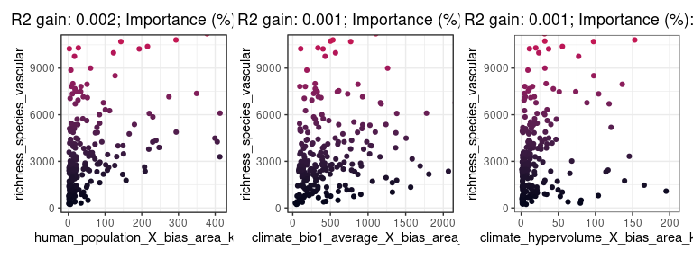

spatialRF: easy spatial regression with Random Forest
================

-   [Introduction](#introduction)
-   [Installing the package](#installing-the-package)
-   [Working with `spatialRF`](#working-with-spatialrf)
    -   [The data](#the-data)
    -   [The workflow](#the-workflow)

<!-- README.md is generated from README.Rmd. Please edit that file -->

# Introduction

The package **spatialRF** facilitates fitting spatial regression models
on regular or irregular data with Random Forest, using the **ranger**
package under the hood [(Wright and Ziegler
2017)](https://arxiv.org/abs/1508.04409), and does so by generating
*spatial predictors* that allow the model to take into account the
spatial structure of the training data. The end goal is minimizing the
spatial autocorrelation of the model residuals as much as possible.
Spatial autocorrelation in the residuals indicate that there is a source
of spatial autocorrelation in the model variance that cannot be
explained by the model predictors, and it is a clear sign that there are
important variables missing from the model. In an ideal model, the
residuals are not autocorrelated, and should be centered around zero,
but this is rarely the case when working with spatial data.

This package implements two main methods to generate *spatial
predictors* from the distance matrix of the data points:

-   Principal coordinate analysis of neighbor matrices [(Dray, Legendre,
    and
    Peres-Neto 2006)](https://www.sciencedirect.com/science/article/abs/pii/S0304380006000925).
-   Distance matrix columns as explanatory variables [(Hengl et
    al. 2018)](https://peerj.com/articles/5518/).

The package also provides a set of tools to identify variable
interactions, tune random forest hyperparameters, assess model
performance on spatially independent data folds, and examine the
resulting models via importance plots, and response curves and surfaces.

# Installing the package

The package is not yet in the CRAN repositories, so at the moment it
must be installed from GitHub as follows.

``` r
remotes::install_github(
  repo = "blasbenito/spatialRF", 
  ref = "main",
  quiet = TRUE
  )
library(spatialRF)
```

There are a few other libraries that will be useful during this
tutorial.

``` r
library(kableExtra)
library(ggplot2)
suppressMessages(library(dplyr))
options(dplyr.summarise.inform = FALSE)
library(magrittr)
library(patchwork)
library(rnaturalearth)
library(rnaturalearthdata)
```

# Working with `spatialRF`

## The data

The package includes an example dataset named **plant\_richness\_df**, a
data frame with plant species richness and predictor variables for 227
ecoregions in the Americas; a distance matrix among the ecoregion edges
named, well, **distance\_matrix**, and **plant\_richness\_sf**, an sf
file containing the centroids of the polygons represented in
**plant\_richness\_df**.

``` r
data(plant_richness_df)
help(plant_richness_df)
data(plant_richness_sf)
data(distance_matrix)

#names of the response variable and the predictors
dependent.variable.name <- "richness_species_vascular"
predictor.variable.names <- colnames(plant_richness_df)[5:21]
```

The response variable of **plant\_richness\_df** is
“richness\_species\_vascular”, with the total count of vascular plant
species found on each ecoregion. The figure below shows the centroids of
each ecoregion along with their associated value of the response
variable.

<!-- -->

The predictors (columns 5 to 21) represent diverse factors such as
sampling bias, climatic variables, human presence and impact,
topography, geographical fragmentation, and features of the neighbors of
each ecoregion. The figure below shows the scatterplots of the response
variable (y axis) against each predictor (x axis).

<!-- -->

## The workflow

The package `spatialRF` provides tools to find potentially interesting
variable interactions, reduce the multicollinearity in the set of
predictors, fit non-spatial and spatial random forest models, assess the
spatial autocorrelation of the residuals, plot variable importance
scores, response curves and surfaces, and evaluate the models through
cross-validation on independent spatial folds.

In this section I describe a typical workflow built with the package
step-by-step.

### Completing the training dataset: finding relevant variable interactions

Random Forests already takes into account variable interactions of the
form “variable `b` becomes important when `a` is higher than x” in every
regression tree of the forest. However, Random Forest we can also use
variable interactions of the form `a * b`, as they are commonly defined
in regression models.

The function `rf_interactions()` tests all possible interactions among
predictors by using each one of them in a separate model, and suggesting
the ones with the higher potential contribution to the model’s R
squared.

``` r
interactions <- rf_interactions(
  data = plant_richness_df,
  dependent.variable.name = dependent.variable.name,
  predictor.variable.names = predictor.variable.names,
  verbose = TRUE
  )
```

    ## Testing 36 candidate interactions.

    ## 4 potential interactions identified.

    ##            ┌─────────────────────────┬────────────┬────────────────┐
    ##            │ Interaction             │ Importance │ R2 improvement │
    ##            ├─────────────────────────┼────────────┼────────────────┤
    ##            │ bias_area_km2_X_bias_sp │      0.153 │          0.043 │
    ##            │ ecies_per_record        │            │                │
    ##            ├─────────────────────────┼────────────┼────────────────┤
    ##            │ climate_bio1_average_X_ │      0.465 │          0.042 │
    ##            │ bias_area_km2           │            │                │
    ##            ├─────────────────────────┼────────────┼────────────────┤
    ##            │ human_footprint_average │      0.098 │          0.014 │
    ##            │ _X_bias_species_per_rec │            │                │
    ##            │ ord                     │            │                │
    ##            ├─────────────────────────┼────────────┼────────────────┤
    ##            │ climate_bio1_average_X_ │      0.120 │          0.013 │
    ##            │ bias_species_per_record │            │                │
    ##            └─────────────────────────┴────────────┴────────────────┘

Here the function suggests four candidate interactions, shows the
variable importance of each interaction within a model, and their
contribution to the model’s R squared (difference in R squared between a
model without the interaction and a model with the interaction). Of
course, the function cannot say whether an interaction *makes sense*,
and it is up to the user to choose wisely (domain expertise is key here)
whether to select an interaction or not.

Here, as an example, I choose `climate_bio1_average::bias_area_km2`
because it is likely that ecoregions with higher area (bias\_area\_km2)
and energy (represented by the annual temperature,
climate\_bio1\_average) will have more species of vascular plants. The
data required to add it ot the dataset is inside the output of
´rf\_interactions()´.

``` r
plant_richness_df[, "climate_bio1_average_X_bias_area_km2"] <- interactions$columns[, "climate_bio1_average_X_bias_area_km2"]
predictor.variable.names <- c(predictor.variable.names, "climate_bio1_average_X_bias_area_km2")
```

### Assessing and reducing multicollinearity

The functions `auto_cor()` and `auto_vif()` help reduce redundancy in
the predictors by using different criteria (bivariate R squared
vs. [variance inflation
factor](https://www.statisticshowto.com/variance-inflation-factor/)),
while allowing the user to define an *order of preference*, which can be
based either on domain expertise or on a quantitative assessment. In the
example below I give preference to the interaction we discovered above
over it’s two components, and prioritize climate over other types of
predictors. These rules are applies to both `auto_cor()` and
`auto_vif()`, that are applied sequentially over the data using the
“%&gt;%” pipe.

``` r
preference.order = c(
    "climate_bio1_average_X_bias_area_km2",
    "climate_aridity_index_average",
    "climate_hypervolume",
    "climate_bio1_average",
    "climate_bio15_minimum",
    "bias_area_km2"
  )

variable.selection <- auto_cor(
  x = plant_richness_df[, predictor.variable.names],
  cor.threshold = 0.5,
  preference.order = preference.order
) %>% 
  auto_vif(
    vif.threshold = 2.5,
    preference.order = preference.order
  )
```

    ## [auto_cor()]: Removed variables: human_population, human_footprint_average

    ## [auto_vif()]: Removed variables: neighbors_area

The slot `variable.selection$selected.variables` contains the names of
the selected predictors, so from here on we can set
`predictor.variable.names <- variable.selection$selected.variables`, or
use `variable.selection` directly as input for other modeling functions.
An example is shown in the next section.

### Tuning Random Forest hyperparameters

The function `rf_tuning()` helps the user to choose sensible values for
three Random Forest hyperparameters that are critical to model
performance:

-   `num.trees`: number of regression trees in the forest.
-   `mtry`: number of variables to choose from on each tree split.
-   `min.node.size`: minimum number of cases on a terminal node.

Model tuning can be done on out-of-bag (`method = "oob"`) or spatial
cross-validation (`method = "spatial.cv"`) R squared values. The example
below shows the out-of-bag approach because I will explain spatial
cross-validation with `rf_evaluate()` later in this document.

``` r
model.tuning <- rf_tuning(
  data = plant_richness_df,
  dependent.variable.name = dependent.variable.name,
  predictor.variable.names = predictor.variable.names,
  method = "oob",
  num.trees = c(500, 1000),
  mtry = c(5, 10),
  min.node.size = c(5, 10)
)
```

    ## Best hyperparameters:

    ##   - num.trees:     1000

    ##   - mtry:          10

    ##   - min.node.size: 5

<!-- --> The
`model.tuning` object can be plugged directly onto the
`ranger.arguments` argument of other modeling functions to use the
hyperparameters that maximize R squared.

### Fitting a non-spatial model

To fit a Random Forest model we use the `rf()` function, that takes the
data, the names of the response and the predictors, the distance matrix,
and a vector of distance thresholds (in the same units as the distances
in **distance\_matrix**). These distance thresholds are the
neighborhoods at which the model will check the spatial autocorrelation
of the residuals. Their values may depend on the spatial scale of the
data, and the ecological system under study.

``` r
model.non.spatial <- rf(
  data = plant_richness_df,
  dependent.variable.name = dependent.variable.name,
  predictor.variable.names = variable.selection, #from auto_cor() and auto_vif()
  distance.matrix = distance_matrix,
  distance.thresholds = c(0, 1500, 3000),
  ranger.arguments = model.tuning,               #from rf_tuning()
  seed = 100,
  verbose = FALSE
)
```

The model output can be printed or plotted with a plethora of functions
such as `print()`, `print_importance()`, `print_performance()`,
`plot_importance()`, `print_moran()`, `plot_response_curves()`,
`plot_response_surfaces)`, or `plot_moran()`, among others.

``` r
plot_response_curves(x = model.non.spatial)
```

<!-- --> The spatial
autocorrelation of the residuals can be plotted with `plot_moran()`

``` r
plot_moran(model.non.spatial)
```

<!-- -->

According to the plot, the spatial autocorrelation of the residuals is
highly positive for the distances 0 and 1500, while it becomes
non-significant (p-value &gt; 0.05, whatever that means) at 3000km. This
model is definitely missing something.

### Fitting a spatial model

The non-spatial model fitted above can be converted into a spatial model
easily with `rf_spatial()` (this is because **model.non.spatial** has a
slot named “ranger.arguments” that contains the model configuration and
the data used to train it).

``` r
model.spatial <- spatialRF::rf_spatial(
  model = model.non.spatial,
  method = "mem.moran.sequential", #default method
  verbose = FALSE
  )
```

The plot below compares the Moran’s I of the residuals of the spatial
(green) and non spatial (purple) models. It shows that `rf_spatial()`
has managed to reduce the spatial autocorrelation (measured via [Moran’s
I](https://en.wikipedia.org/wiki/Moran%27s_I) with the function
`moran_multithreshold()`) of the model residuals for the three selected
distances.

``` r
plot_moran(model.spatial)
```

<!-- -->

It has done so by generating spatial predictors from the distance
matrix, and introducing them into the model one by one until the spatial
autocorrelation of the residuals is reduced as much as possible. If we
compare the variable importance plots of both models, we can see that
the spatial model has an additional set of dots under the name
“spatial\_predictors”, and that the maximum importance of a few of these
spatial predictors matches the importance of the most relevant
non-spatial predictors.

``` r
p1 <- plot_importance(
  model.non.spatial, 
  verbose = FALSE) + 
  ggplot2::ggtitle("Non-spatial model") 
p2 <- plot_importance(
  model.spatial,
  verbose = FALSE) + 
  ggplot2::ggtitle("Spatial model")
p1 | p2 
```

<!-- --> If we take a
look to the five most important variables in **model.spatial** we will
see that a few of them are spatial predictors.

<table class=" lightable-paper lightable-hover" style="font-family: &quot;Arial Narrow&quot;, arial, helvetica, sans-serif; width: auto !important; margin-left: auto; margin-right: auto;">
<thead>
<tr>
<th style="text-align:left;">
variable
</th>
<th style="text-align:right;">
importance
</th>
</tr>
</thead>
<tbody>
<tr>
<td style="text-align:left;">
climate\_bio1\_average\_X\_bias\_area\_km2
</td>
<td style="text-align:right;">
0.3453794
</td>
</tr>
<tr>
<td style="text-align:left;">
climate\_bio1\_average
</td>
<td style="text-align:right;">
0.3138287
</td>
</tr>
<tr>
<td style="text-align:left;">
climate\_hypervolume
</td>
<td style="text-align:right;">
0.2818597
</td>
</tr>
<tr>
<td style="text-align:left;">
spatial\_predictor\_0\_2
</td>
<td style="text-align:right;">
0.2434082
</td>
</tr>
<tr>
<td style="text-align:left;">
spatial\_predictor\_0\_6
</td>
<td style="text-align:right;">
0.2071521
</td>
</tr>
<tr>
<td style="text-align:left;">
bias\_area\_km2
</td>
<td style="text-align:right;">
0.1427539
</td>
</tr>
</tbody>
</table>

Spatial predictors, as shown below, are smooth surfaces representing
neighborhood among records at different spatial scales. But where do
they come from? How are they generated and included in the model?

<!-- -->

### Generation and selection of spatial predictors

The final model includes 32 spatial predictors. In this particular
model, that uses the method “mem.moran.sequential” (Moran’s Eigenvector
Maps as described in [(Dray, Legendre, and Peres-Neto
2006)](https://www.sciencedirect.com/science/article/abs/pii/S0304380006000925)),
the spatial predictors have been generated by the function
`mem_multithreshold()`, for every distance threshold selected by the
user, as follows:

-   `weights_from_distance_matrix()` sets the values of the distance
    matrix below a given distance threshold to 0, computes
    `1/distance_matrix` to convert distances into weights, sets the
    diagonal to 0, and normalizes the weights.
-   `double_center_distance_matrix()` double-centers the distance
    matrix, so the sum of each row and each column is zero.
-   `mem()` computes the positive eigenvectors of the double-centered
    matrix.

The function `rank_spatial_predictors()` ranks the spatial predictors
from higher to lower spatial autocorrelation (computed with `moran()`),
and `select_spatial_predictors_sequential()` introduces them one by one
into the model, and selects the smallest subset that minimizes the
Moran’s I of the residuals while maximizing the R squared of the model,
as shown in the optimization plot below (every dot represents one
spatial predictor, and its size matches their position in the ranking,
and their order of inclusioin in the model).

<!-- --> \#\#
Assessing model performance

Models fitted with `rf()` or `rf_spatial()` have a performance slot with
several performance measures.

``` r
print_performance(model.spatial)
```

    ## 
    ## Model performance 
    ##   - R squared (OOB):                 0.589
    ##   - Pseudo R squared:                0.767
    ##   - RMSE:                            2208.824
    ##   - Normalized RMSE:                 0.638

R squared is computed on the out-of-bag data (fraction of data not used
while training each regression tree in the forest), while the other
three performance measures are computed by comparing observations and
model predictions. These performance scores are not computed on
independent data, and therefore do not represent the model ability to
predict over *unseen* data.

The function `rf_evaluate()` separates the data into a number of
spatially independent training and testing folds, fits a model on each
training fold, predicts over each testing fold, and computes performance
measures, to finally aggregate them across model repetitions. Let’s see
how it works.

``` r
model.spatial <- rf_evaluate(
  model = model.spatial,
  xy = plant_richness_df[, c("x", "y")], #data coordinates
  repetitions = 30,                      #number of folds
  training.fraction = 0.75,              #training data fraction
  verbose = FALSE
)
```

The function generates a new slot in the model named “evaluation” with
several objects that summarize the spatial cross-validation results.

``` r
names(model.spatial$evaluation)
```

    ## [1] "training.fraction" "spatial.folds"     "per.fold"         
    ## [4] "per.model"         "aggregated"

The slot “spatial.folds”, produced by `make_spatial_folds()` contains
the indices of the training and testing cases for each cross-validation
repetition. The maps below show two sets of training and testing spatial
folds.

<!-- -->

The functions `plot_evaluation()` and `print_evaluation()` allow to see
the evaluation results as a plot or as a table. The plot below shows the
performance scores of the “Full” model (original model introduced into
`rf_evaluate()`), the model fitted on the training data (“Training”),
and the results of the Training model predicted over the “Testing” data.
From these performance scores, only the ones labeled as “Testing”
represent model performance on unseen data.

``` r
plot_evaluation(model.spatial, notch = FALSE)
```

<!-- -->
