# Non-Spatial Random Forest Models

## Introduction

This tutorial demonstrates how to fit and interpret non-spatial random
forest models using the `spatialRF` package. You’ll learn how to explore
spatial data, find promising variable interactions, train models,
evaluate performance, and understand variable importance.

If you’re interested in addressing spatial autocorrelation in your model
residuals, see the [Spatial Random Forest
Models](https://blasbenito.github.io/spatialRF/articles/spatial_models.md)
tutorial.

## Setup

The following libraries are required for this tutorial.

``` r
library(spatialRF)
library(ggplot2)
library(dplyr)
library(DT)
library(rnaturalearth)
library(rnaturalearthdata)
library(randomForestExplainer)
library(parallel)
library(patchwork)
```

Many functions in the package also support a parallelization backend to
speed-up execution.

``` r
cluster <- parallel::makeCluster(
  parallel::detectCores() - 1,
  type = "PSOCK"
)
```

The package includes the example dataset
[`plants_df`](https://blasbenito.github.io/spatialRF/reference/plants_df.html)
with plant species richness and predictors for 227 ecoregions in the
Americas. The object
[`plants_distance`](https://blasbenito.github.io/spatialRF/reference/plants_distance.html)
is a matrix of geographical distances between ecoregions.

``` r
data(
  plants_df,         #training data frame
  plants_response,   #response name
  plants_predictors, #predictors names
  plants_distance,   #distance matrix in km
  plants_xy          #case coordinates of plants_df
  )

#distance thresholds (same units as plants_distance, km)
#used to assess spatial correlation at different distances
distance_thresholds <- c(10, 100, 1000, 2000, 4000, 8000)

#a pretty color palette
colors <- grDevices::hcl.colors(
    n = 100,
    palette = "Zissou 1"
    )
```

The figure below shows the response variable *richness_species_vascular*
in space.


The predictors, stored in
[`plants_predictors`](https://blasbenito.github.io/spatialRF/reference/plants_predictors.html)
represent diverse factors that may influence plant richness such as
sampling bias, the area of the ecoregion, climatic variables, human
presence and impact, topography, geographical fragmentation, and
features of the neighbors of each ecoregion.

The figure below shows the scatterplots of the response variable (`y`
axis) against each predictor (`x` axis).

``` r
spatialRF::plot_training_df(
  data = plants_df,
  dependent.variable.name = plants_response,
  predictor.variable.names = plants_predictors,
  point.color = colors,
  ncol = 3
  )
```

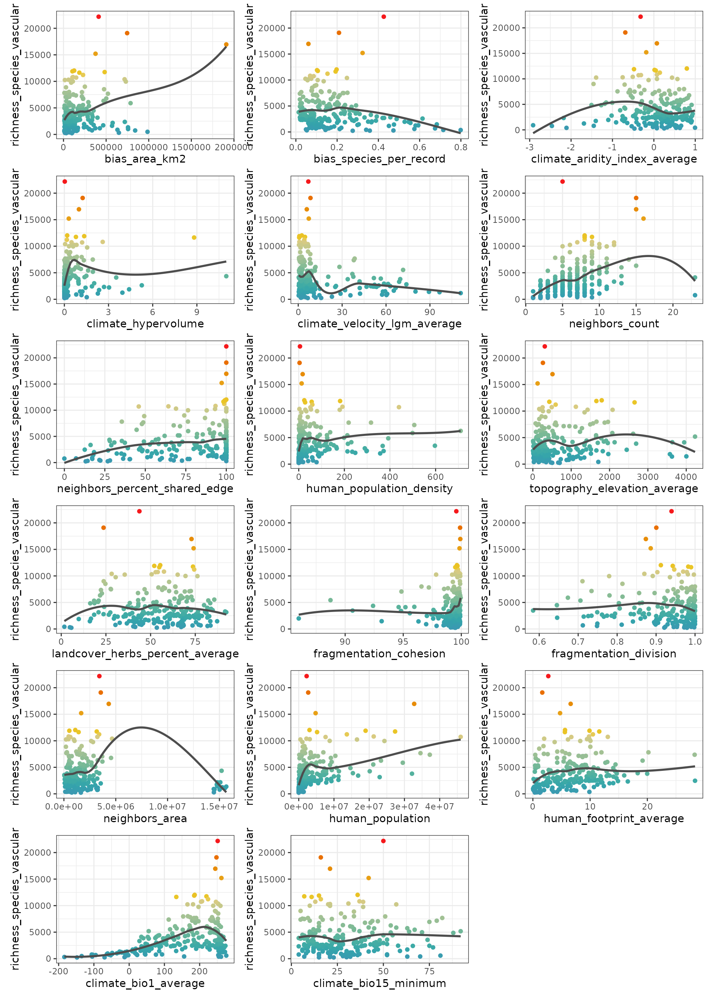

The function
[`plot_training_df_moran()`](https://blasbenito.github.io/spatialRF/reference/plot_training_df_moran.html)
shows the spatial autocorrelation of the response and the predictors
across different distance thresholds. Low Moran’s I and p-values equal
to or larger than 0.05 indicate that there is no spatial autocorrelation
for the given variable and distance threshold.

``` r
spatialRF::plot_training_df_moran(
  data = plants_df,
  dependent.variable.name = plants_response,
  predictor.variable.names = plants_predictors,
  distance.matrix = plants_distance,
  distance.thresholds = distance_thresholds,
  fill.color = colors
)
```

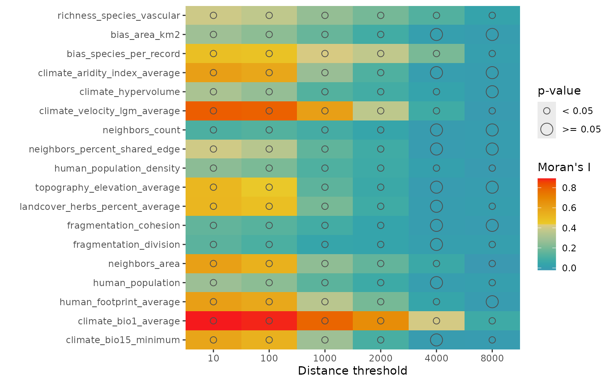

## Finding promising variable interactions

The function
[`the_feature_engineer()`](https://blasbenito.github.io/spatialRF/reference/the_feature_engineer.html)
tests all possible interactions between the most important predictors,
and selects the most promising ones via spatial cross-validation (see
[`rf_evaluate()`](https://blasbenito.github.io/spatialRF/reference/rf_evaluate.html)).

``` r
interactions <- spatialRF::the_feature_engineer(
  data = plants_df,
  dependent.variable.name = plants_response,
  predictor.variable.names = plants_predictors,
  xy = plants_xy,
  cluster = cluster,
  point.color = colors,
  verbose = TRUE
  )
#>  ┌──────────────────┬──────────────────┬──────────────────┬──────────────────┐
#>  │ Interaction      │ Importance (% of │        R-squared │     Max cor with │
#>  │                  │             max) │      improvement │       predictors │
#>  ├──────────────────┼──────────────────┼──────────────────┼──────────────────┤
#>  │ human_population │            100.0 │            0.015 │             0.64 │
#>  │ ..x..bias_area_k │                  │                  │                  │
#>  │ m2               │                  │                  │                  │
#>  ├──────────────────┼──────────────────┼──────────────────┼──────────────────┤
#>  │ climate_bio1_ave │            100.0 │            0.044 │             0.34 │
#>  │ rage..pca..human │                  │                  │                  │
#>  │ _population_dens │                  │                  │                  │
#>  │ ity              │                  │                  │                  │
#>  ├──────────────────┼──────────────────┼──────────────────┼──────────────────┤
#>  │ climate_bio1_ave │             64.4 │            0.014 │             0.74 │
#>  │ rage..pca..clima │                  │                  │                  │
#>  │ te_hypervolume   │                  │                  │                  │
#>  └──────────────────┴──────────────────┴──────────────────┴──────────────────┘
```

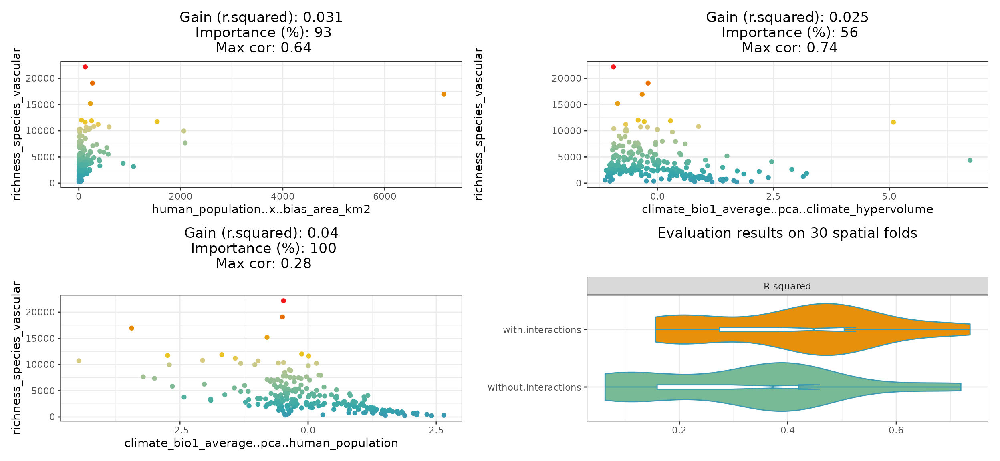

The resulting plot shows the selected interactions against the response,
the model improvement they produce, their importance relative to the
other predictors, and maximum correlation with the other predictors.

The violin-plot shows the cross-validation comparison of the model with
and without the selected interactions.

The function also returns a data frame with the complete screening
results.

| interaction.name                                    | interaction.importance | interaction.metric.gain | max.cor.with.predictors | variable.a.name      | variable.b.name          | selected |
|:----------------------------------------------------|-----------------------:|------------------------:|------------------------:|:---------------------|:-------------------------|:---------|
| human_population..x..bias_area_km2                  |                100.000 |                   0.015 |               0.6373850 | human_population     | bias_area_km2            | TRUE     |
| climate_bio1_average..pca..human_population_density |                100.000 |                   0.044 |               0.3400000 | climate_bio1_average | human_population_density | TRUE     |
| climate_bio1_average..pca..human_population         |                100.000 |                   0.043 |               0.2800000 | climate_bio1_average | human_population         | TRUE     |
| climate_bio1_average..pca..climate_hypervolume      |                 64.430 |                   0.014 |               0.7400000 | climate_bio1_average | climate_hypervolume      | TRUE     |
| climate_hypervolume..pca..bias_area_km2             |                 57.620 |                  -0.012 |               0.7100000 | climate_hypervolume  | bias_area_km2            | FALSE    |
| human_population..pca..climate_hypervolume          |                 65.390 |                  -0.024 |               0.7200000 | human_population     | climate_hypervolume      | FALSE    |
| climate_hypervolume..pca..human_population_density  |                 48.140 |                  -0.015 |               0.7200000 | climate_hypervolume  | human_population_density | FALSE    |
| climate_hypervolume..x..human_population_density    |                 54.276 |                  -0.020 |               0.5599486 | climate_hypervolume  | human_population_density | FALSE    |

``` r
#adding interaction column to the training data
plants_df <- interactions$data

#adding interaction name to predictor.variable.names
plants_predictors <- interactions$predictor.variable.names
```

## Training a non-spatial Random Forest model with `rf()`

The function
[`rf()`](https://blasbenito.github.io/spatialRF/reference/rf.html) is a
convenient wrapper for
[`ranger::ranger()`](http://imbs-hl.github.io/ranger/reference/ranger.md)
used in every modelling function of the *spatialRF* package.

``` r
m <- spatialRF::rf(
  data = plants_df,
  dependent.variable.name = plants_response,
  predictor.variable.names = plants_predictors,
  distance.matrix = plants_distance,
  distance.thresholds = distance_thresholds,
  verbose = FALSE
)
```

The resulting object has its own
[`print()`](https://rdrr.io/r/base/print.html) method.

``` r
m
#> Model type
#>   - Fitted with:                     ranger()
#>   - Response variable:               richness_species_vascular
#> 
#> Random forest parameters
#>   - Type:                            Regression
#>   - Number of trees:                 500
#>   - Sample size:                     227
#>   - Number of predictors:            20
#>   - Mtry:                            4
#>   - Minimum node size:               5
#> 
#> 
#> Model performance 
#>   - R squared (oob):                  0.5872011
#>   - R squared (cor(obs, pred)^2):     0.9515986
#>   - Pseudo R squared (cor(obs, pred)):0.9754991
#>   - RMSE (oob):                       2165.233
#>   - RMSE:                             937.1016
#>   - Normalized RMSE:                  0.2705259
#> 
#> Model residuals 
#>   - Stats: 
#>           ┌──────────┬─────────┬─────────┬────────┬────────┬─────────┐
#>           │ Min.     │ 1st Q.  │ Median  │ Mean   │ 3rd Q. │ Max.    │
#>           ├──────────┼─────────┼─────────┼────────┼────────┼─────────┤
#>           │ -1923.57 │ -482.98 │ -141.46 │ -19.08 │ 105.51 │ 7828.85 │
#>           └──────────┴─────────┴─────────┴────────┴────────┴─────────┘
#>   - Normality: 
#>       - Shapiro-Wilks W: 0.747 
#>       - p-value        : 0 
#>       - Interpretation : Residuals are not normal 
#> 
#>   - Spatial autocorrelation: 
#>              ┌──────────┬───────────┬─────────┬──────────────────┐
#>              │ Distance │ Moran's I │ P value │ Interpretation   │
#>              ├──────────┼───────────┼─────────┼──────────────────┤
#>              │     10.0 │     0.119 │   0.000 │ Positive spatial │
#>              │          │           │         │ correlation      │
#>              ├──────────┼───────────┼─────────┼──────────────────┤
#>              │    100.0 │     0.088 │   0.002 │ Positive spatial │
#>              │          │           │         │ correlation      │
#>              ├──────────┼───────────┼─────────┼──────────────────┤
#>              │   1000.0 │     0.047 │   0.001 │ Positive spatial │
#>              │          │           │         │ correlation      │
#>              ├──────────┼───────────┼─────────┼──────────────────┤
#>              │   2000.0 │     0.010 │   0.146 │ No spatial       │
#>              │          │           │         │ correlation      │
#>              ├──────────┼───────────┼─────────┼──────────────────┤
#>              │   4000.0 │    -0.003 │   0.748 │ No spatial       │
#>              │          │           │         │ correlation      │
#>              ├──────────┼───────────┼─────────┼──────────────────┤
#>              │   8000.0 │    -0.005 │   0.779 │ No spatial       │
#>              │          │           │         │ correlation      │
#>              └──────────┴───────────┴─────────┴──────────────────┘
#> 
#> Variable importance: 
#>              ┌──────────────────────────────────────┬────────────┐
#>              │ Variable                             │ Importance │
#>              ├──────────────────────────────────────┼────────────┤
#>              │ human_population                     │   1656.959 │
#>              ├──────────────────────────────────────┼────────────┤
#>              │ human_population..x..bias_area_km2   │   1617.223 │
#>              ├──────────────────────────────────────┼────────────┤
#>              │ climate_bio1_average..pca..human_pop │   1536.032 │
#>              │ ulation_density                      │            │
#>              ├──────────────────────────────────────┼────────────┤
#>              │ climate_bio1_average                 │   1464.450 │
#>              ├──────────────────────────────────────┼────────────┤
#>              │ climate_hypervolume                  │   1291.841 │
#>              ├──────────────────────────────────────┼────────────┤
#>              │ human_population_density             │   1101.496 │
#>              ├──────────────────────────────────────┼────────────┤
#>              │ bias_area_km2                        │    986.467 │
#>              ├──────────────────────────────────────┼────────────┤
#>              │ climate_bio1_average..pca..climate_h │    958.266 │
#>              │ ypervolume                           │            │
#>              ├──────────────────────────────────────┼────────────┤
#>              │ human_footprint_average              │    892.844 │
#>              ├──────────────────────────────────────┼────────────┤
#>              │ bias_species_per_record              │    820.805 │
#>              ├──────────────────────────────────────┼────────────┤
#>              │ neighbors_count                      │    815.410 │
#>              ├──────────────────────────────────────┼────────────┤
#>              │ neighbors_area                       │    760.857 │
#>              ├──────────────────────────────────────┼────────────┤
#>              │ topography_elevation_average         │    637.265 │
#>              ├──────────────────────────────────────┼────────────┤
#>              │ climate_velocity_lgm_average         │    597.876 │
#>              ├──────────────────────────────────────┼────────────┤
#>              │ climate_aridity_index_average        │    564.928 │
#>              ├──────────────────────────────────────┼────────────┤
#>              │ fragmentation_cohesion               │    549.684 │
#>              ├──────────────────────────────────────┼────────────┤
#>              │ neighbors_percent_shared_edge        │    543.590 │
#>              ├──────────────────────────────────────┼────────────┤
#>              │ climate_bio15_minimum                │    300.262 │
#>              ├──────────────────────────────────────┼────────────┤
#>              │ landcover_herbs_percent_average      │    252.868 │
#>              ├──────────────────────────────────────┼────────────┤
#>              │ fragmentation_division               │    169.370 │
#>              └──────────────────────────────────────┴────────────┘
```

The output is a list with several slots containing the information
required to interpret the model.

``` r
names(m)
#>  [1] "predictions"               "num.trees"                
#>  [3] "num.independent.variables" "mtry"                     
#>  [5] "min.node.size"             "variable.importance"      
#>  [7] "variable.importance.local" "prediction.error"         
#>  [9] "forest"                    "splitrule"                
#> [11] "treetype"                  "r.squared"                
#> [13] "call"                      "importance.mode"          
#> [15] "num.samples"               "replace"                  
#> [17] "dependent.variable.name"   "max.depth"                
#> [19] "ranger.arguments"          "importance"               
#> [21] "performance"               "residuals"
```

The information available in these slots can be plotted (functions named
`plot_...()`), printed (`print_...()`), or extracted for further
analyses (`get_...()`).

## Residuals

The object **residuals** (`m$residuals`) stores the normality and
spatial autocorrelation tests.

``` r
spatialRF::plot_residuals_diagnostics(
  m,
  verbose = FALSE,
  point.color = colors,
  fill.color = colors[1]
  )
```

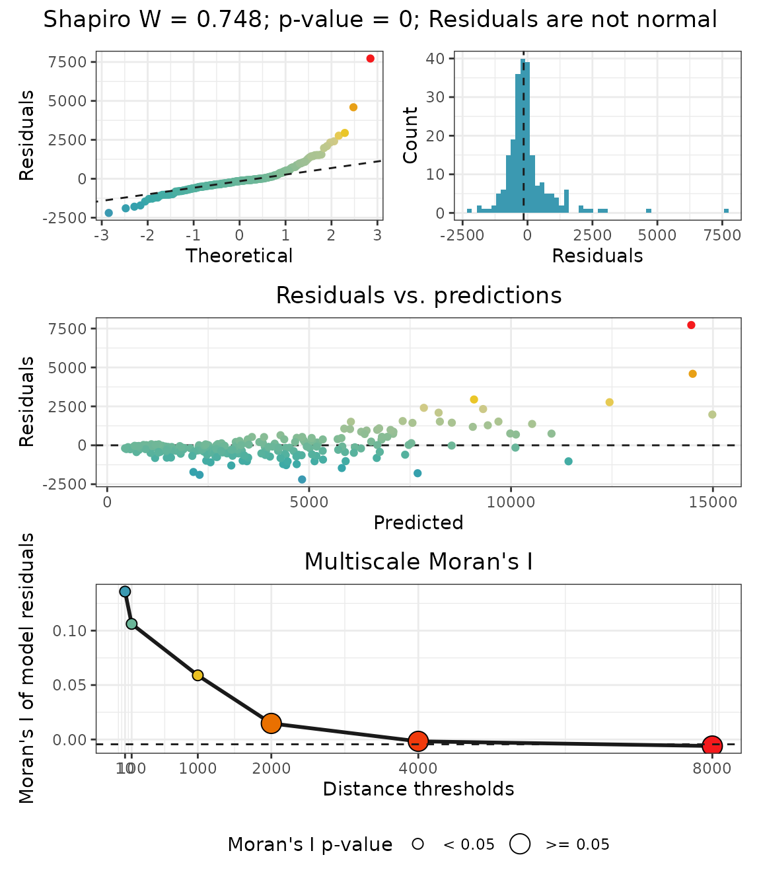 The
plot show that the residuals are highly correlated up to a point between
1000 and 2000 km between observations, indicating that there is a
component of the response not explained by the current predictors.

## Variable importance

### Global variable importance

The object **importance** in `m$importance`) contains the variable
importance scores. These can be plotted with
[`plot_importance()`](https://blasbenito.github.io/spatialRF/reference/plot_importance.html),
printed with
[`print_importance()`](https://blasbenito.github.io/spatialRF/reference/print_importance.html),
and the dataframe retrieved with
[`get_importance()`](https://blasbenito.github.io/spatialRF/reference/get_importance.html)

``` r
spatialRF::plot_importance(
  m,
  verbose = FALSE,
  fill.color = colors
  )
```

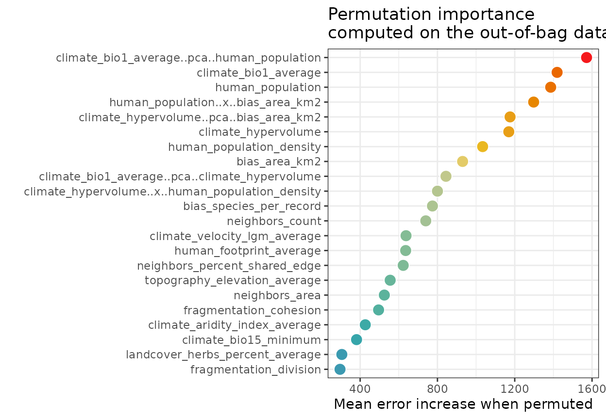

The output of
[`rf()`](https://blasbenito.github.io/spatialRF/reference/rf.md) is also
compatible with
[`randomForestExplainer::measure_importance()`](https://rdrr.io/pkg/randomForestExplainer/man/measure_importance.html),
which helps deepen our understanding on variable importance scores.

``` r
importance.df <- randomForestExplainer::measure_importance(
  m,
  measures = c(
    "mean_min_depth", 
    "no_of_nodes", 
    "times_a_root", 
    "p_value"
    )
  )
```

| variable                                            | mean_min_depth | no_of_nodes | times_a_root | p_value |
|:----------------------------------------------------|---------------:|------------:|-------------:|--------:|
| bias_area_km2                                       |           3.84 |        1835 |           13 |    0.74 |
| bias_species_per_record                             |           3.59 |        2387 |            5 |    0.00 |
| climate_aridity_index_average                       |           4.38 |        1734 |            4 |    1.00 |
| climate_bio1_average                                |           2.84 |        2101 |           62 |    0.00 |
| climate_bio1_average..pca..climate_hypervolume      |           3.76 |        1870 |           25 |    0.42 |
| climate_bio1_average..pca..human_population_density |           2.84 |        1897 |           69 |    0.20 |
| climate_bio15_minimum                               |           4.74 |        1681 |            0 |    1.00 |
| climate_hypervolume                                 |           3.01 |        2116 |           47 |    0.00 |
| climate_velocity_lgm_average                        |           4.24 |        1787 |           11 |    0.96 |
| fragmentation_cohesion                              |           4.51 |        1622 |           14 |    1.00 |
| fragmentation_division                              |           5.16 |        1532 |            1 |    1.00 |
| human_footprint_average                             |           4.62 |        1669 |            8 |    1.00 |
| human_population                                    |           2.72 |        2123 |           67 |    0.00 |
| human_population_density                            |           3.45 |        1855 |           34 |    0.56 |
| human_population..x..bias_area_km2                  |           2.81 |        2115 |           91 |    0.00 |
| landcover_herbs_percent_average                     |           4.78 |        1781 |            0 |    0.97 |
| neighbors_area                                      |           4.25 |        1687 |            1 |    1.00 |
| neighbors_count                                     |           3.30 |        1670 |           41 |    1.00 |
| neighbors_percent_shared_edge                       |           3.95 |        1886 |            7 |    0.28 |
| topography_elevation_average                        |           4.02 |        1874 |            0 |    0.38 |

### Contribution of predictors to model transferability

The function
[`rf_importance()`](https://blasbenito.github.io/spatialRF/reference/rf_importance.html)
assesses how each predictor contributes to model transferability by
combining leave-one-predictor-out with spatial cross-validation, and
comparing a model trained with the given predictor with a model trained
with all other predictors.

``` r
m <- spatialRF::rf_importance(
  model = m,
  xy = plants_xy, #needs coordinates for cross-validation
  cluster = cluster,
  fill.color = colors
  )
```

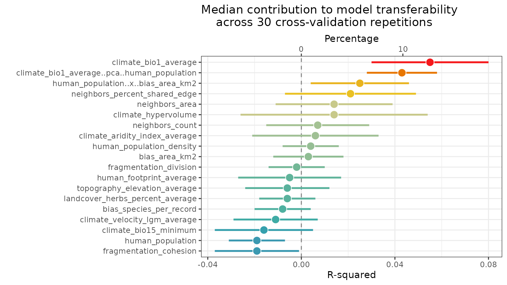 The
values in the plot are added as new columns with the suffix `.cv` in the
dataframe `m$importance$per.variable`.

| variable                                            | importance.oob | importance.cv | importance.cv.mad | importance.cv.percent | importance.cv.percent.mad |
|:----------------------------------------------------|---------------:|--------------:|------------------:|----------------------:|--------------------------:|
| human_population                                    |       1656.959 |         0.001 |             0.019 |                   0.2 |                       7.0 |
| human_population..x..bias_area_km2                  |       1617.223 |         0.037 |             0.034 |                   8.2 |                      12.4 |
| climate_bio1_average..pca..human_population_density |       1536.032 |         0.033 |             0.018 |                   7.3 |                       6.4 |
| climate_bio1_average                                |       1464.450 |         0.027 |             0.015 |                   6.0 |                       5.4 |
| climate_hypervolume                                 |       1291.841 |         0.006 |             0.027 |                   1.3 |                       9.7 |
| human_population_density                            |       1101.496 |        -0.005 |             0.024 |                  -1.1 |                       8.6 |
| bias_area_km2                                       |        986.467 |         0.014 |             0.022 |                   3.1 |                       8.1 |
| climate_bio1_average..pca..climate_hypervolume      |        958.266 |         0.014 |             0.015 |                   3.1 |                       5.4 |
| human_footprint_average                             |        892.844 |         0.005 |             0.022 |                   1.1 |                       8.1 |
| bias_species_per_record                             |        820.805 |         0.000 |             0.022 |                   0.0 |                       8.1 |
| neighbors_count                                     |        815.410 |         0.011 |             0.015 |                   2.4 |                       5.4 |
| neighbors_area                                      |        760.857 |         0.023 |             0.062 |                   5.1 |                      22.6 |
| topography_elevation_average                        |        637.265 |        -0.015 |             0.021 |                  -3.3 |                       7.5 |
| climate_velocity_lgm_average                        |        597.876 |         0.001 |             0.016 |                   0.2 |                       5.9 |
| climate_aridity_index_average                       |        564.928 |         0.002 |             0.024 |                   0.4 |                       8.6 |
| fragmentation_cohesion                              |        549.684 |        -0.021 |             0.024 |                  -4.7 |                       8.6 |
| neighbors_percent_shared_edge                       |        543.590 |         0.011 |             0.033 |                   2.4 |                      11.8 |
| climate_bio15_minimum                               |        300.262 |         0.002 |             0.015 |                   0.4 |                       5.4 |
| landcover_herbs_percent_average                     |        252.868 |        -0.013 |             0.022 |                  -2.9 |                       8.1 |
| fragmentation_division                              |        169.370 |         0.003 |             0.019 |                   0.7 |                       7.0 |

### Local variable importance

The [`rf()`](https://blasbenito.github.io/spatialRF/reference/rf.md)
function computes local importance as a case-by-case average increase in
error when a predictor is permuted.

The dataframe of local importance, stored at `m$importance$local`, can
be retrieved with
[`get_importance_local()`](https://blasbenito.github.io/spatialRF/reference/get_importance_local.html)
to create a local importance map.

``` r
local.importance <- cbind(
  plants_xy,
  spatialRF::get_importance_local(m)
  )
```

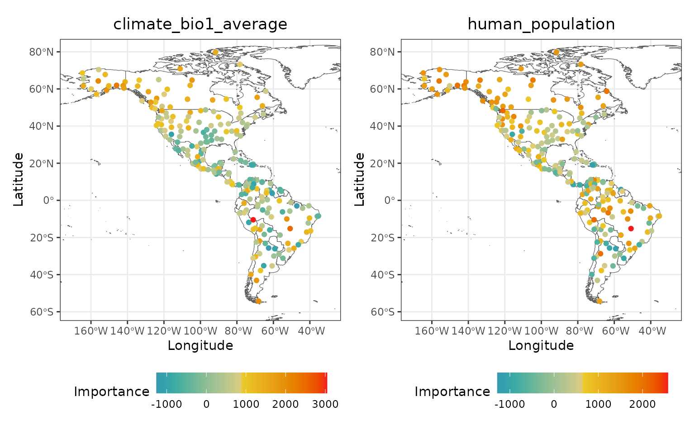

In these maps, a value lower than 0 indicates that the influence of the
predictor on the local prediction is worse than what is expected by
chance.

## Response curves and surfaces

The response curve of a predictor is computed by setting the other
predictors to a given quantile (0.1, 0.5, and 0.9 by default).

``` r
spatialRF::plot_response_curves(
  m,
  quantiles = c(0.1, 0.5, 0.9),
  line.color = colors[c(1, 50, 100)],
  ncol = 3,
  show.data = FALSE
  )
```

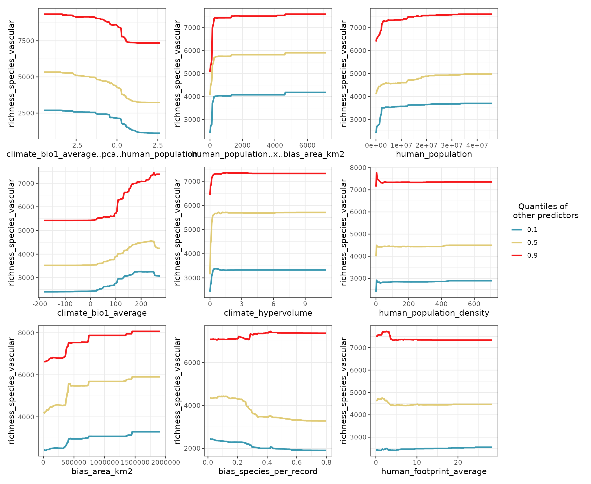

The blue curve (quantile 0.1) shows the point estimate for a predictor
when all other predictors are at their lowest values.

Setting the argument `quantiles` to 0.5 and setting `show.data` to
`FALSE` (default option) accentuates the shape of the response curves.

``` r
spatialRF::plot_response_curves(
  m,
  quantiles = 0.5,
  line.color = colors[100],
  ncol = 3
  )
```

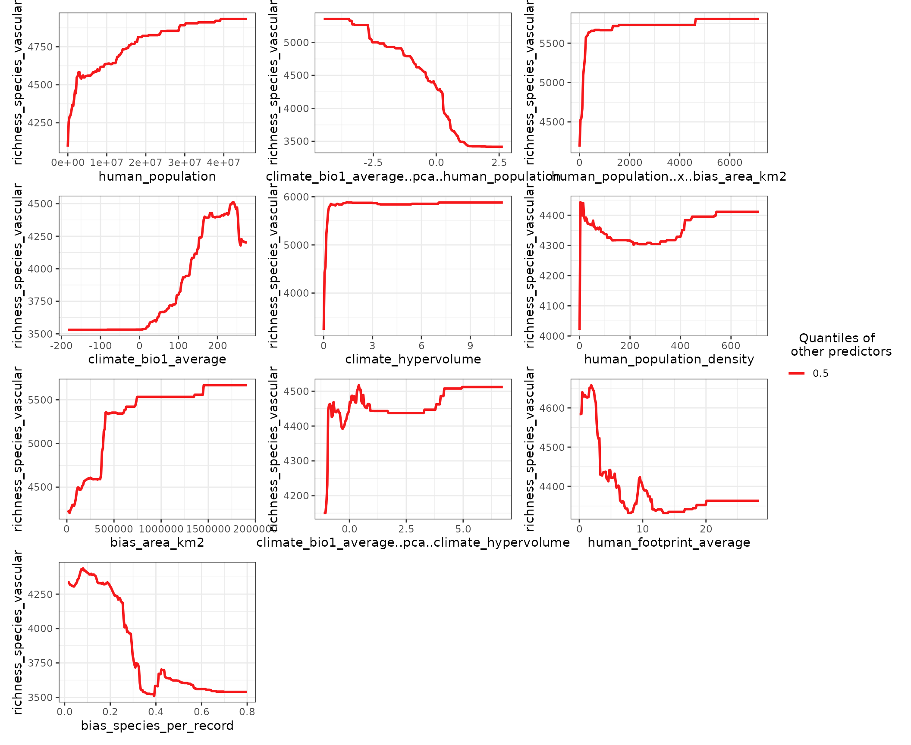

If you need to do your own plots, the function
[`get_response_curves()`](https://blasbenito.github.io/spatialRF/reference/get_response_curves.html)
returns a data frame with the required data.

``` r
response.curves.df <- spatialRF::get_response_curves(m)
```

Interactions between two predictors can be plotted with
[`plot_response_surface()`](https://blasbenito.github.io/spatialRF/reference/plot_response_surface.html).

``` r
spatialRF::plot_response_surface(
  model = m,
  a = "climate_bio1_average",
  b = "neighbors_count",
  fill.color = colors
  )
```

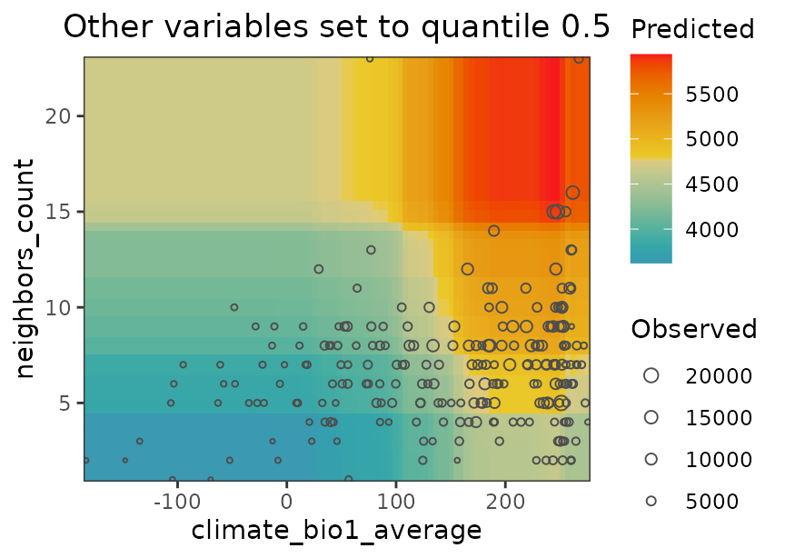

## Performance

The **performance** slot, stored at `m$performance`, contains the values
of several performance measures. It be printed via the function
[`print_performance()`](https://blasbenito.github.io/spatialRF/reference/print_performance.html).

``` r
spatialRF::print_performance(m)
#> 
#> Model performance 
#>   - R squared (oob):                  0.5872011
#>   - R squared (cor(obs, pred)^2):     0.9515986
#>   - Pseudo R squared (cor(obs, pred)):0.9754991
#>   - RMSE (oob):                       2165.233
#>   - RMSE:                             937.1016
#>   - Normalized RMSE:                  0.2705259
```

- `R squared (oob)` and `RMSE (oob)` are computed by
  [`ranger::ranger()`](http://imbs-hl.github.io/ranger/reference/ranger.md)
  on the out-of-bag data (fraction of data not used to train individual
  trees). From all the values available in the `performance` slot, these
  are probably the most honest ones. However, out-of-bag data is not
  fully independent, and therefore will still be inflated, especially if
  the data is highly aggregated in space.
- `R squared` and `pseudo R squared` are computed from comparing all
  observations against predictions. These values will usually be high
  when spatial autocorrelation is high.
- The `RMSE` and its normalized version are linear with `R squared` and
  `pseudo R squared`.

## Hyperparameter tuning

The function
[`rf_tuning()`](https://blasbenito.github.io/spatialRF/reference/rf_tuning.html)
optimizes the values for three critical Random Forest hyperparameters
via spatial cross-validation:

- `num.trees`: number of regression trees in the forest.
- `mtry`: number of variables to choose from on each tree split.
- `min.node.size`: minimum number of cases on a terminal node.

``` r
m <- rf_tuning(
  model = m,
  xy = plants_xy,
  repetitions = 30,
  num.trees = c(100, 200, 300),
  mtry = c(2, 4, 8),
  min.node.size = c(5, 10, 20),
  cluster = cluster,
  verbose = TRUE
)
```

The function returns a tuned model only if the tuning finds a solution
better than the original model. The tuning results can be accessed with
[`plot_tuning()`](https://blasbenito.github.io/spatialRF/reference/plot_tuning.md).

``` r
spatialRF::plot_tuning(
  model = m,
  point.color = colors
)
```


## Spatial cross-validation

The function
[rf_evaluate()](https://blasbenito.github.io/spatialRF/reference/rf_evaluate.html)
provides honest performance scores based on *spatial cross-validation*.
The function separates the data into spatially independent training and
testing folds.

``` r
m <- spatialRF::rf_evaluate(
  model = m,
  xy = plants_xy,           #data coordinates
  repetitions = 30,         #number of spatial folds
  training.fraction = 0.75, #training data fraction on each fold
  metrics = "r.squared",
  cluster = cluster,
  verbose = FALSE
)
```

The function creates `m$evaluation` with several objects that summarize
the spatial cross-validation results.

``` r
names(m$evaluation)
#> [1] "metrics"           "training.fraction" "spatial.folds"    
#> [4] "per.fold"          "per.fold.long"     "per.model"        
#> [7] "aggregated"
```

The slot “spatial.folds”, produced by
[`make_spatial_folds()`](https://blasbenito.github.io/spatialRF/reference/make_spatial_folds.html),
contains the indices of the training and testing cases for each
cross-validation repetition. The maps below show two sets of training
and testing folds.

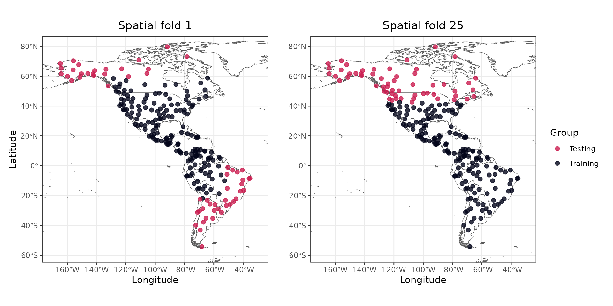

The information available in this new slot can be accessed with the
functions
[`print_evaluation()`](https://blasbenito.github.io/spatialRF/reference/print_evaluation.html),
[`plot_evaluation()`](https://blasbenito.github.io/spatialRF/reference/plot_evaluation.html),
and
[`get_evaluation()`](https://blasbenito.github.io/spatialRF/reference/get_evaluation.html).

``` r
spatialRF::plot_evaluation(
  model = m,
  fill.color = colors,
  notch = FALSE
  )
```

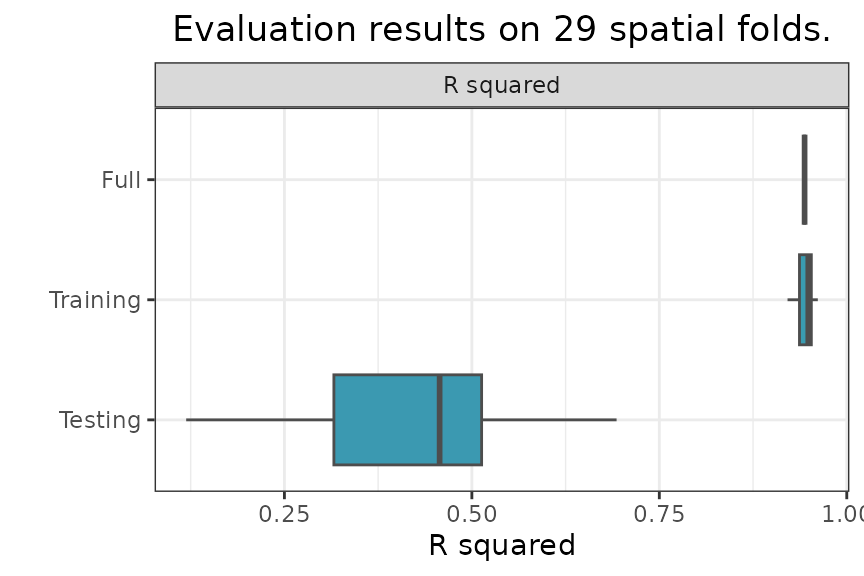

- `Full` is the performance of the model trained on the full dataset.
- `Training` is the performance of the model trained on the training
  folds.
- `Testing` is the performance of the model on the testing folds.

The median, median absolute deviation (MAD), minimum, and maximum
R-squared values on the testing folds can be printed with
[`print_evaluation()`](https://blasbenito.github.io/spatialRF/reference/print_evaluation.md).

``` r
spatialRF::print_evaluation(m)
#> 
#> Spatial evaluation 
#>   - Training fraction:             0.75
#>   - Spatial folds:                 29
#> 
#>     Metric Median   MAD Minimum Maximum
#>  r.squared  0.456 0.136   0.147   0.716
```

## Prediction

Models trained with
[`rf()`](https://blasbenito.github.io/spatialRF/reference/rf.md) can be
predicted as follows.

``` r
predicted <- predict(
  object = m,
  data = plants_df,
  type = "response"
  )$predictions

head(predicted)
#> [1]  4811.463  4453.012  1547.302  7340.347 11615.776  2772.710
```

## Next steps

This tutorial covered non-spatial random forest modeling. To learn how
to address spatial autocorrelation in model residuals using spatial
predictors, see the [Spatial Random Forest
Models](https://blasbenito.github.io/spatialRF/articles/spatial_models.md)
tutorial.
